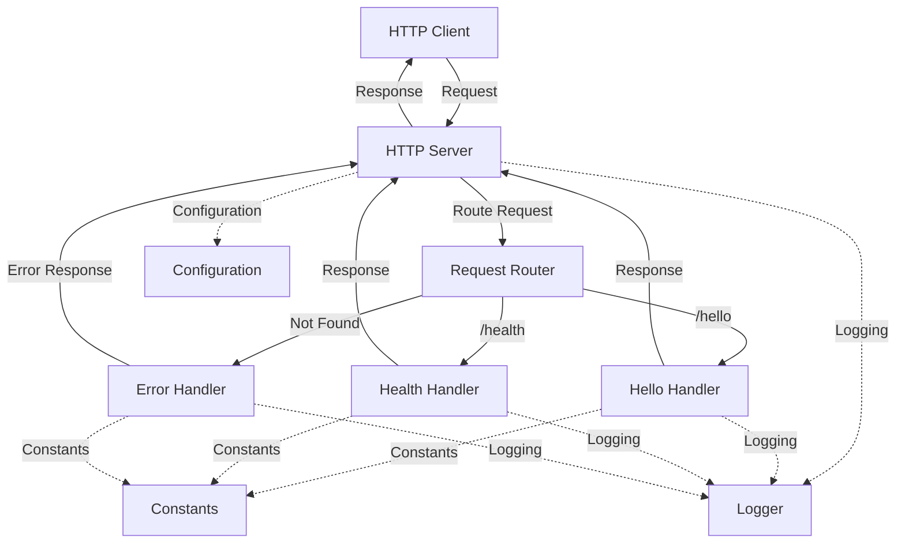

# Node.js Hello World

[](LICENSE)
[](https://nodejs.org/)

A simple Node.js HTTP server application that exposes a single REST endpoint `/hello` which returns "Hello world" to clients.

## Overview

This project demonstrates a minimal, functional example of a Node.js web service that can serve as a learning tool or starter template. It implements a lightweight HTTP server using only Node.js core modules with no external dependencies for the runtime.

### Key Features

- Pure Node.js implementation using only core modules
- Single `/hello` endpoint with proper HTTP method validation, plus `/health` endpoint for server health checks
- Configurable server port via environment variables
- Comprehensive error handling and logging
- Clean separation of concerns with modular architecture
- Complete test coverage with Jest and Supertest
- Detailed documentation for learning and reference

## Architecture

The application follows a simple, modular architecture with clean separation of concerns:



### Core Components

1. **HTTP Server**: Creates and manages the HTTP server using Node.js core `http` module
2. **Request Router**: Routes requests to appropriate handlers based on URL path
3. **Hello Handler**: Processes requests to the `/hello` endpoint
4. **Error Handler**: Centralizes error handling and generates error responses
5. **Configuration**: Manages server settings from environment variables
6. **Logger**: Provides consistent logging throughout the application
7. **Constants**: Defines shared constants for the application

## Prerequisites

- Node.js 18.x LTS or higher
- npm 8.x or higher (included with Node.js)
- Git (optional, for cloning the repository)

## Installation

```bash
# Clone the repository
git clone https://github.com/yourusername/nodejs-hello-world.git
cd nodejs-hello-world

# Install dependencies
npm install
```

### Configuration

The server port can be configured using the `PORT` environment variable. If not specified, it defaults to `3000`.

```bash
# Create a .env file (optional)
echo "PORT=3000" > .env
```

## Usage

### Starting the Server

```bash
# Start the server
npm start

# Start with a custom port
PORT=8080 npm start

# Start in development mode with auto-restart
npm run dev
```

Once started, the server will be available at `http://localhost:3000` (or your configured port).

### Making Requests

```bash
# Using curl
curl http://localhost:3000/hello

# Using a web browser
# Navigate to http://localhost:3000/hello
```

Expected response:
```
Hello world
```

## API Documentation

### GET /hello

Returns a simple "Hello world" text response.

**Request:**
- Method: GET
- Path: `/hello`
- Headers: None required
- Body: None

**Response:**
- Status: 200 OK
- Content-Type: text/plain
- Body: "Hello world"

**Error Responses:**
- 405 Method Not Allowed: If any HTTP method other than GET is used
- 404 Not Found: If the path is not `/hello`

### GET /health

Returns an empty response to indicate server health status.

**Request:**
- Method: GET
- Path: `/health`
- Headers: None required
- Body: None

**Response:**
- Status: 200 OK
- Content-Type: text/plain
- Body: (empty)

**Error Responses:**
- 405 Method Not Allowed: If any HTTP method other than GET is used

## Project Structure

```
.
├── src/
│   └── backend/           # Backend implementation
│       ├── __tests__/     # Test files
│       ├── handlers/      # Request handlers
│       ├── utils/         # Utility modules
│       ├── config.js      # Configuration management
│       ├── errorHandler.js # Error handling utilities
│       ├── index.js       # Application entry point
│       ├── router.js      # Request routing
│       ├── server.js      # HTTP server implementation
│       └── README.md      # Backend-specific documentation
├── infrastructure/        # Infrastructure configuration
│   ├── local/             # Local development setup
│   ├── scripts/           # Utility scripts
│   └── README.md          # Infrastructure documentation
├── .github/               # GitHub configuration
├── .gitignore             # Git ignore file
├── .gitattributes         # Git attributes file
├── .dockerignore          # Docker ignore file
├── CODE_OF_CONDUCT.md     # Code of conduct
├── CONTRIBUTING.md        # Contribution guidelines
├── Dockerfile             # Docker configuration
├── LICENSE                # License file
└── README.md              # This file
```

For more detailed information about specific components:

- [Backend Documentation](src/backend/README.md)
- [Infrastructure Documentation](infrastructure/README.md)

## Development

### Available Scripts

```bash
# Start the server
npm start

# Start with auto-restart on file changes
npm run dev

# Run tests
npm test

# Run tests with coverage report
npm run test:coverage

# Run tests in watch mode
npm run test:watch

# Lint code
npm run lint

# Fix linting issues
npm run lint:fix
```

### Testing

The application uses Jest for unit and integration testing with Supertest for API testing.

```bash
# Run all tests
npm test

# Run tests with coverage report
npm run test:coverage
```

Tests are organized in the `__tests__` directory, mirroring the structure of the source files.

## Docker

The application can be run in a Docker container:

```bash
# Build the Docker image
docker build -t nodejs-hello-world .

# Run the container
docker run -p 3000:3000 nodejs-hello-world

# Run with a custom port
docker run -p 8080:8080 -e PORT=8080 nodejs-hello-world
```

Alternatively, you can use Docker Compose for local development:

```bash
# Start the container
docker-compose -f infrastructure/local/docker-compose.yml up -d

# Stop the container
docker-compose -f infrastructure/local/docker-compose.yml down
```

## Deployment Options

This simple application can be deployed in several ways:

### Local Execution

Run directly on your local machine or server:

```bash
node src/backend/index.js
```

### Platform as a Service (PaaS)

Deploy to platforms like Heroku, Vercel, or Render that support Node.js applications.

### Virtual Private Server (VPS)

Deploy to a VPS with a process manager like PM2:

```bash
# Install PM2
npm install -g pm2

# Start the application with PM2
pm2 start src/backend/index.js --name nodejs-hello-world

# Configure PM2 to start on system boot
pm2 startup
pm2 save
```

See [Infrastructure Documentation](infrastructure/README.md) for more deployment details.

## Performance Considerations

The application is designed for minimal resource usage:

- **Memory Footprint**: Low memory usage with no unnecessary buffers or caches
- **Startup Time**: Fast initialization with minimal dependencies
- **Request Processing**: Efficient routing and response generation
- **Concurrency**: Node.js event loop handles concurrent connections efficiently

For educational purposes, no specific performance optimizations are implemented beyond Node.js defaults.

## Security Considerations

Basic security practices implemented:

- **Input Validation**: Validates HTTP methods
- **Error Handling**: Prevents information disclosure in error messages
- **HTTP Headers**: Sets appropriate security headers
- **Dependency Management**: Uses only core Node.js modules to eliminate supply chain risks

Security headers set on responses:
- `X-Content-Type-Options: nosniff`
- `X-Frame-Options: DENY`
- `Content-Security-Policy: default-src 'none'`
- `Cache-Control: no-store`

## Troubleshooting

### Common Issues

**Port already in use (EADDRINUSE)**

```bash
# Change the port
PORT=3001 npm start
```

**Module not found errors**

```bash
# Ensure dependencies are installed
npm install
```

**Permission denied errors**

```bash
# Check file permissions
chmod +x infrastructure/scripts/*.sh
```

### Debugging

For detailed debugging output:

```bash
# Enable Node.js debug output
NODE_DEBUG=http,net npm start
```

For interactive debugging:

```bash
# Start with inspector
node --inspect src/backend/index.js
```

## Contributing

Contributions are welcome! Please read [CONTRIBUTING.md](CONTRIBUTING.md) for details on our code of conduct and the process for submitting pull requests.

This project is intended to be a safe, welcoming space for collaboration, and contributors are expected to adhere to the [Code of Conduct](CODE_OF_CONDUCT.md).

## License

This project is licensed under the MIT License - see the [LICENSE](LICENSE) file for details.

## Resources

- [Node.js Documentation](https://nodejs.org/docs/latest-v18.x/api/)
- [Node.js HTTP Module](https://nodejs.org/docs/latest-v18.x/api/http.html)
- [Jest Testing Framework](https://jestjs.io/docs/getting-started)
- [Supertest Documentation](https://github.com/visionmedia/supertest#readme)