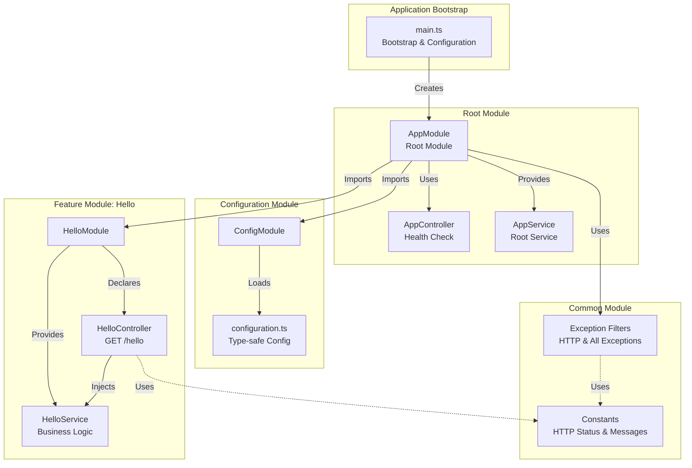
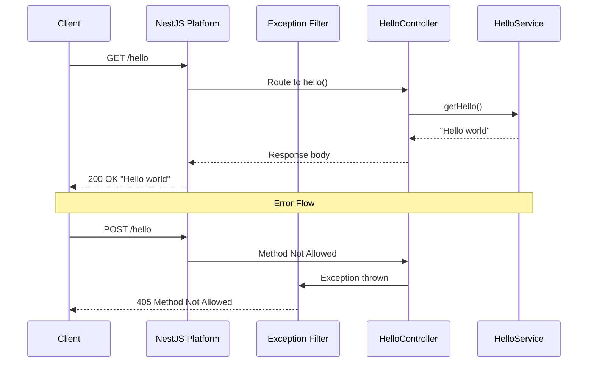

# NestJS Hello World

[](LICENSE)
[](https://nodejs.org/)
[](https://nestjs.com/)
[](https://www.typescriptlang.org/)

A production-ready HTTP server application built with the NestJS framework that exposes a single REST endpoint `/hello` which returns "Hello world" to clients.

## Overview

This project demonstrates a robust, scalable example of a NestJS web service that can serve as a learning tool or starter template for building enterprise-grade Node.js applications. It implements a modern HTTP server using NestJS's powerful decorator-based architecture with full TypeScript support.

### Key Features

- **NestJS Framework**: Enterprise-grade framework with built-in best practices and patterns
- **TypeScript First**: Full type safety with strict mode enabled for reliable code
- **Decorator-Based Routing**: Clean, declarative route handling with `@Controller()` and `@Get()` decorators
- **Dependency Injection**: Modular, testable architecture with NestJS's built-in DI container
- **Modular Architecture**: Well-organized code with feature modules (HelloModule, ConfigModule)
- **Exception Filters**: Centralized error handling with custom exception filters
- **Configuration Management**: Type-safe configuration using `@nestjs/config` module
- **Comprehensive Testing**: Full test coverage with Jest and NestJS testing utilities
- **Production Ready**: Includes health checks, graceful shutdown, and Docker support
- **Detailed Documentation**: Extensive inline comments and architecture documentation

For a comprehensive understanding of the design decisions and architecture, see [Architecture Documentation](architecture.md).

## Architecture

The application follows NestJS's modular architecture pattern with clean separation of concerns and dependency injection throughout:



### Core Components

1. **NestJS Application** (`main.ts`): Bootstraps the application with NestJS factory, configures global filters, and handles graceful shutdown
2. **AppModule** (Root Module): The root module that imports all feature modules and sets up global providers
3. **HelloModule**: Feature module encapsulating the `/hello` endpoint functionality
4. **HelloController**: Handles HTTP requests to `/hello` using decorator-based routing
5. **HelloService**: Contains business logic for generating the hello message (injectable service)
6. **Exception Filters**: Global filters for consistent error handling (404, 405, 500 responses)
7. **ConfigModule**: Manages environment-based configuration with validation
8. **Constants**: TypeScript constants and enums for HTTP status codes and messages

### Request Lifecycle



## Prerequisites

Before getting started, ensure you have the following installed:

- **Node.js**: Version 18.x LTS or higher (required for NestJS 11)
- **npm**: Version 9.x or higher (included with Node.js 18+)
- **TypeScript**: Installed automatically as a dev dependency
- **Git**: Optional, for cloning the repository

You can verify your Node.js and npm versions:

```bash
node --version  # Should be >= 18.0.0
npm --version   # Should be >= 9.0.0
```

## Installation

```bash
# Clone the repository
git clone https://github.com/yourusername/nestjs-hello-world.git
cd nestjs-hello-world

# Navigate to the backend directory
cd src/backend

# Install dependencies (includes NestJS and TypeScript)
npm install

# Build the TypeScript project
npm run build
```

### Configuration

The server can be configured using environment variables. Create a `.env` file in the `src/backend` directory:

```bash
# Create a .env file from the example template
cp .env.example .env

# Edit the configuration as needed
# PORT=3000        - Server port (default: 3000)
# NODE_ENV=development  - Environment mode
# LOG_LEVEL=info   - Logging verbosity
```

## Usage

### Starting the Server

The NestJS application provides several start modes for different use cases:

```bash
# Navigate to the backend directory
cd src/backend

# Development mode with hot-reload (watches for file changes)
npm run start:dev

# Production mode (requires build first)
npm run build
npm run start:prod

# Standard start (useful for debugging)
npm run start

# Start with a custom port
PORT=8080 npm run start:prod
```

Once started, the server will be available at `http://localhost:3000` (or your configured port).

### Making Requests

```bash
# Using curl to call the hello endpoint
curl http://localhost:3000/hello

# Using a web browser
# Navigate to http://localhost:3000/hello

# Check server health
curl http://localhost:3000/health
```

Expected response from `/hello`:
```
Hello world
```

## API Documentation

The API maintains full backward compatibility with the original Node.js implementation.

### GET /hello

Returns a simple "Hello world" text response.

**Request:**
- Method: GET
- Path: `/hello`
- Headers: None required
- Body: None

**Response:**
- Status: 200 OK
- Content-Type: text/plain
- Body: "Hello world"

**Error Responses:**
- 405 Method Not Allowed: If any HTTP method other than GET is used
- 404 Not Found: If the path is not `/hello`

### GET /health

Returns an empty response to indicate server health status.

**Request:**
- Method: GET
- Path: `/health`
- Headers: None required
- Body: None

**Response:**
- Status: 200 OK
- Content-Type: text/plain
- Body: (empty)

**Error Responses:**
- 405 Method Not Allowed: If any HTTP method other than GET is used

## Project Structure

The project follows NestJS's recommended modular structure with TypeScript:

```
.
├── src/
│   └── backend/                    # NestJS Backend Application
│       ├── src/                    # Source code (TypeScript)
│       │   ├── main.ts             # Application bootstrap & entry point
│       │   ├── app.module.ts       # Root application module
│       │   ├── app.controller.ts   # Root controller (health endpoint)
│       │   ├── app.service.ts      # Root service
│       │   ├── hello/              # Hello feature module
│       │   │   ├── hello.module.ts     # Module definition
│       │   │   ├── hello.controller.ts # Route handlers
│       │   │   ├── hello.service.ts    # Business logic
│       │   │   └── dto/                # Data Transfer Objects
│       │   │       └── hello-response.dto.ts
│       │   ├── common/             # Shared resources
│       │   │   ├── constants/      # Application constants
│       │   │   │   └── index.ts
│       │   │   └── filters/        # Exception filters
│       │   │       ├── http-exception.filter.ts
│       │   │       └── all-exceptions.filter.ts
│       │   └── config/             # Configuration module
│       │       ├── config.module.ts
│       │       └── configuration.ts
│       ├── test/                   # Test files
│       │   ├── app.e2e-spec.ts     # End-to-end tests
│       │   ├── jest-e2e.json       # E2E test configuration
│       │   └── unit/               # Unit tests
│       │       ├── app.controller.spec.ts
│       │       ├── app.service.spec.ts
│       │       ├── hello/
│       │       │   ├── hello.controller.spec.ts
│       │       │   └── hello.service.spec.ts
│       │       └── common/
│       │           └── filters/
│       │               └── http-exception.filter.spec.ts
│       ├── dist/                   # Compiled JavaScript output
│       ├── package.json            # Backend dependencies & scripts
│       ├── tsconfig.json           # TypeScript configuration
│       ├── tsconfig.build.json     # Build-specific TS config
│       ├── nest-cli.json           # NestJS CLI configuration
│       ├── jest.config.js          # Jest test configuration
│       ├── .eslintrc.js            # ESLint configuration
│       ├── .prettierrc             # Prettier formatting config
│       ├── .env.example            # Environment template
│       └── README.md               # Backend documentation
├── infrastructure/                 # Infrastructure configuration
│   ├── local/                      # Local development setup
│   │   └── docker-compose.yml
│   ├── scripts/                    # Utility scripts
│   │   ├── setup.sh                # Development setup
│   │   ├── start-server.sh         # Server startup
│   │   └── health-check.sh         # Health monitoring
│   └── README.md                   # Infrastructure documentation
├── .github/                        # GitHub configuration
│   └── workflows/                  # CI/CD pipelines
│       ├── ci.yml                  # Continuous integration
│       └── release.yml             # Release pipeline
├── architecture.md                 # Architecture documentation (NEW)
├── .gitignore                      # Git ignore file
├── .gitattributes                  # Git attributes file
├── .dockerignore                   # Docker ignore file
├── CODE_OF_CONDUCT.md              # Code of conduct
├── CONTRIBUTING.md                 # Contribution guidelines
├── Dockerfile                      # Docker configuration
├── LICENSE                         # License file
└── README.md                       # This file
```

For more detailed information about specific components:

- [Architecture Documentation](architecture.md) - Design decisions and patterns
- [Backend Documentation](src/backend/README.md) - Backend implementation details
- [Infrastructure Documentation](infrastructure/README.md) - Deployment and DevOps

## Development

### Available Scripts

Navigate to `src/backend` and use the following npm scripts:

```bash
# Build the TypeScript project
npm run build

# Start in development mode with hot-reload
npm run start:dev

# Start in debug mode with inspector
npm run start:debug

# Start production build
npm run start:prod

# Run all unit tests
npm test

# Run tests with coverage report
npm run test:cov

# Run tests in watch mode
npm run test:watch

# Run end-to-end tests
npm run test:e2e

# Lint code (ESLint + TypeScript)
npm run lint

# Format code with Prettier
npm run format
```

### Testing

The application uses Jest with NestJS testing utilities for comprehensive test coverage:

```bash
# Navigate to backend directory
cd src/backend

# Run all unit tests
npm test

# Run tests with coverage report
npm run test:cov

# Run end-to-end (E2E) tests
npm run test:e2e

# Run tests in watch mode during development
npm run test:watch
```

Tests are organized in the `test/` directory:
- `test/unit/` - Unit tests for individual components
- `test/app.e2e-spec.ts` - End-to-end API tests

### Code Quality

```bash
# Run ESLint to check for issues
npm run lint

# Format all TypeScript files with Prettier
npm run format
```

## Docker

The application can be run in a Docker container with optimized multi-stage builds for TypeScript compilation:

```bash
# Build the Docker image (includes TypeScript compilation)
docker build -t nestjs-hello-world .

# Run the container
docker run -p 3000:3000 nestjs-hello-world

# Run with a custom port
docker run -p 8080:8080 -e PORT=8080 nestjs-hello-world

# Run in detached mode
docker run -d -p 3000:3000 --name hello-app nestjs-hello-world
```

Alternatively, use Docker Compose for local development:

```bash
# Start the container (builds if needed)
docker-compose -f infrastructure/local/docker-compose.yml up -d

# View logs
docker-compose -f infrastructure/local/docker-compose.yml logs -f

# Stop the container
docker-compose -f infrastructure/local/docker-compose.yml down
```

### Docker Build Process

The Dockerfile uses a multi-stage build:
1. **Build Stage**: Installs dependencies and compiles TypeScript to JavaScript
2. **Production Stage**: Copies only the compiled `dist/` folder and production dependencies

This results in a smaller, more secure production image.

## Deployment Options

This NestJS application can be deployed in several ways:

### Local Execution

Run the compiled application directly:

```bash
# Build first
cd src/backend
npm run build

# Run the compiled JavaScript
node dist/main
```

### Platform as a Service (PaaS)

Deploy to platforms like Heroku, Vercel, Railway, or Render that support Node.js applications. Ensure the build command (`npm run build`) runs before start.

### Virtual Private Server (VPS)

Deploy to a VPS with a process manager like PM2:

```bash
# Install PM2 globally
npm install -g pm2

# Navigate to the backend directory
cd src/backend

# Build the application
npm run build

# Start the application with PM2
pm2 start dist/main.js --name nestjs-hello-world

# Configure PM2 to start on system boot
pm2 startup
pm2 save

# View application status
pm2 status

# View logs
pm2 logs nestjs-hello-world
```

### Kubernetes

For containerized deployments, use the provided Dockerfile and create Kubernetes manifests for deployment, service, and ingress resources.

See [Infrastructure Documentation](infrastructure/README.md) for more deployment details.

## Performance Considerations

NestJS provides excellent performance out of the box:

- **Compiled TypeScript**: TypeScript compiles to optimized JavaScript for production
- **Express Platform**: Built on Express.js with proven performance characteristics
- **Lazy Loading**: Modules can be lazy-loaded for faster startup (not needed for this simple app)
- **Memory Efficient**: Dependency injection creates singletons by default, reducing memory usage
- **Request Processing**: NestJS's pipeline efficiently processes requests through guards, interceptors, and pipes

For production deployments:
- Enable production mode: `NODE_ENV=production`
- Use compiled JavaScript: `npm run start:prod`
- Consider clustering for multi-core utilization

## Security Considerations

Security best practices implemented:

- **Input Validation**: NestJS pipes can validate and transform input (extensible for future DTOs)
- **Exception Filters**: Prevents information disclosure in error messages
- **TypeScript**: Compile-time type checking prevents type-related vulnerabilities
- **Dependency Management**: Using well-maintained NestJS ecosystem packages
- **Environment Variables**: Sensitive configuration kept in environment variables

Security headers set on responses:
- `X-Content-Type-Options: nosniff`
- `X-Frame-Options: DENY`
- `Content-Security-Policy: default-src 'none'`
- `Cache-Control: no-store`

## Troubleshooting

### Common Issues

**Port already in use (EADDRINUSE)**

```bash
# Change the port via environment variable
PORT=3001 npm run start:prod

# Or update .env file
echo "PORT=3001" >> .env
```

**TypeScript compilation errors**

```bash
# Clean the dist folder and rebuild
rm -rf dist/
npm run build
```

**Module not found errors**

```bash
# Ensure dependencies are installed
cd src/backend
npm install

# If issues persist, clear node_modules and reinstall
rm -rf node_modules/
npm install
```

**Permission denied errors**

```bash
# Check file permissions for scripts
chmod +x infrastructure/scripts/*.sh
```

### Debugging

For detailed debugging output:

```bash
# Enable debug logging
LOG_LEVEL=debug npm run start:dev

# Start with Node.js inspector
npm run start:debug

# Then attach your debugger (VS Code, Chrome DevTools) to port 9229
```

For interactive debugging in VS Code, use the provided launch configuration or:

```bash
# Start with inspector, waiting for debugger to attach
node --inspect-brk dist/main.js
```

## Contributing

Contributions are welcome! Please read [CONTRIBUTING.md](CONTRIBUTING.md) for details on our code of conduct and the process for submitting pull requests.

This project is intended to be a safe, welcoming space for collaboration, and contributors are expected to adhere to the [Code of Conduct](CODE_OF_CONDUCT.md).

### Development Workflow

1. Fork the repository
2. Create a feature branch: `git checkout -b feature/my-feature`
3. Make your changes with tests
4. Run tests: `npm test && npm run test:e2e`
5. Run linter: `npm run lint`
6. Commit your changes: `git commit -m 'Add some feature'`
7. Push to the branch: `git push origin feature/my-feature`
8. Submit a pull request

## License

This project is licensed under the MIT License - see the [LICENSE](LICENSE) file for details.

## Resources

### NestJS & TypeScript

- [NestJS Documentation](https://docs.nestjs.com/) - Official NestJS documentation
- [NestJS Fundamentals](https://docs.nestjs.com/first-steps) - Getting started guide
- [TypeScript Documentation](https://www.typescriptlang.org/docs/) - Official TypeScript docs
- [TypeScript Handbook](https://www.typescriptlang.org/docs/handbook/intro.html) - TypeScript language guide

### Node.js & Testing

- [Node.js Documentation](https://nodejs.org/docs/latest-v18.x/api/) - Node.js API reference
- [Jest Testing Framework](https://jestjs.io/docs/getting-started) - Jest documentation
- [Supertest Documentation](https://github.com/visionmedia/supertest#readme) - HTTP assertions for testing

### Additional Resources

- [NestJS CLI Reference](https://docs.nestjs.com/cli/overview) - Command-line interface
- [NestJS Testing](https://docs.nestjs.com/fundamentals/testing) - Testing utilities and patterns
- [Express.js Guide](https://expressjs.com/en/guide/routing.html) - Underlying HTTP platform
