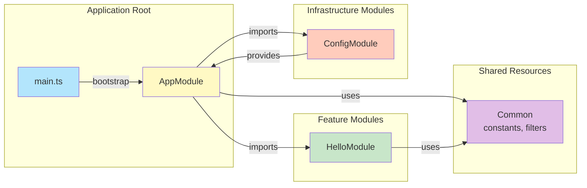
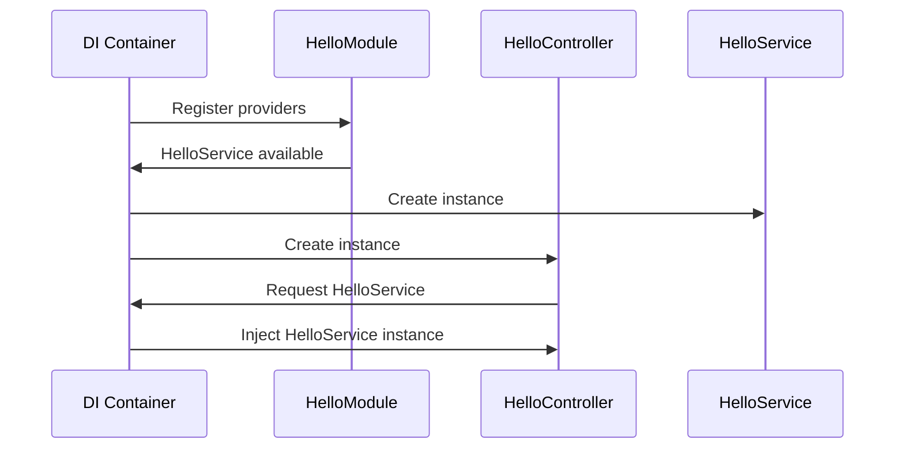
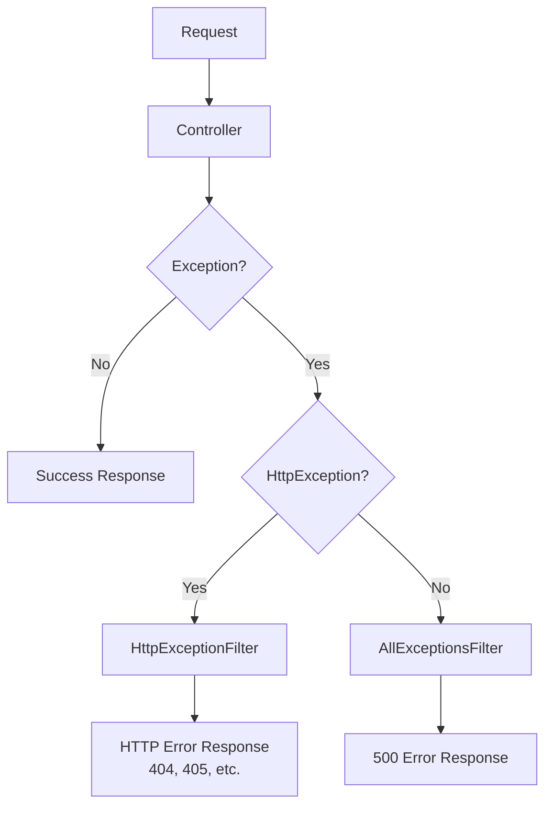
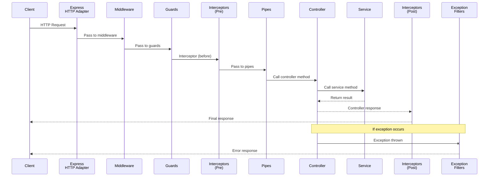
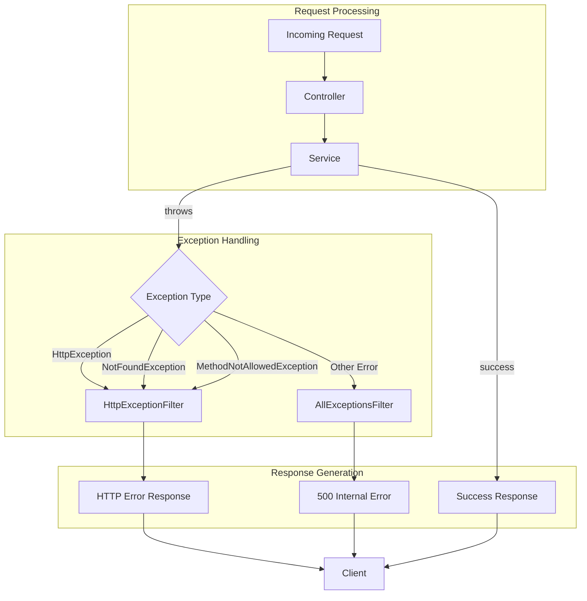
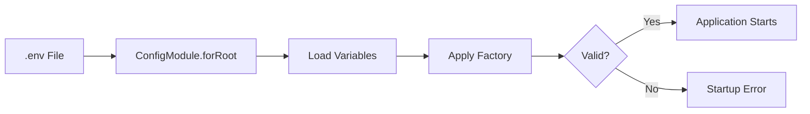
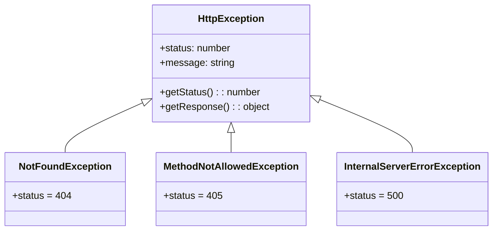

# NestJS Hello World Application Architecture

<!--
================================================================================
ARCHITECTURE DOCUMENTATION
================================================================================
This document provides comprehensive architecture documentation for the NestJS
Hello World application. It covers all important design decisions, module
structure, dependency injection patterns, request lifecycle, configuration
management, error handling, and testing strategies.

This documentation was created as part of the migration from a vanilla Node.js
HTTP server implementation to a full-featured NestJS framework application.
================================================================================
-->

## Table of Contents

1. [Overview](#1-overview)
   - [System Purpose](#11-system-purpose)
   - [Architecture Diagram](#12-architecture-diagram)
   - [Technology Choices](#13-technology-choices)
2. [Module Structure](#2-module-structure)
   - [Module Responsibilities](#21-module-responsibilities)
   - [Module Dependency Diagram](#22-module-dependency-diagram)
   - [Modular Architecture Rationale](#23-modular-architecture-rationale)
3. [Design Patterns](#3-design-patterns)
   - [Dependency Injection](#31-dependency-injection)
   - [Exception Filter Pattern](#32-exception-filter-pattern)
   - [Controller-Service Separation](#33-controller-service-separation)
4. [Request Lifecycle](#4-request-lifecycle)
   - [Request Flow Documentation](#41-request-flow-documentation)
   - [Exception Handling Pipeline](#42-exception-handling-pipeline)
   - [Pattern Comparison](#43-pattern-comparison)
5. [Configuration Management](#5-configuration-management)
   - [Environment Variables](#51-environment-variables)
   - [Configuration Validation](#52-configuration-validation)
   - [Type-Safe Configuration](#53-type-safe-configuration)
6. [Error Handling Strategy](#6-error-handling-strategy)
   - [Exception Hierarchy](#61-exception-hierarchy)
   - [Response Formatting](#62-response-formatting)
   - [Logging Integration](#63-logging-integration)
7. [Testing Strategy](#7-testing-strategy)
   - [Unit Testing Approach](#71-unit-testing-approach)
   - [E2E Testing Patterns](#72-e2e-testing-patterns)
   - [Mock and Stub Strategies](#73-mock-and-stub-strategies)
8. [Migration Notes](#8-migration-notes)
   - [Pattern Transformations](#81-pattern-transformations)
   - [Code Migration Map](#82-code-migration-map)
9. [API Contract Preservation](#9-api-contract-preservation)
   - [Endpoint Behavior](#91-endpoint-behavior)
   - [Response Format Guarantee](#92-response-format-guarantee)

---

## 1. Overview

### 1.1 System Purpose

The NestJS Hello World application is a minimal HTTP service that demonstrates
best practices in building production-ready Node.js applications using the
NestJS framework. The application serves a single endpoint (`GET /hello`) that
returns the message "Hello world" with a 200 OK status.

**Core Objectives:**

- **Demonstrate NestJS Patterns**: Showcase proper use of decorators, modules,
  dependency injection, and exception filters.
- **Maintain API Compatibility**: Preserve the exact API contract from the
  original vanilla Node.js implementation.
- **Production Readiness**: Implement proper error handling, configuration
  management, and graceful shutdown.
- **Testability**: Enable comprehensive testing through dependency injection
  and modular design.

**Application Scope:**

| Feature | Description |
|---------|-------------|
| Hello Endpoint | Returns "Hello world" on GET /hello |
| Method Validation | Returns 405 for non-GET methods |
| Route Validation | Returns 404 for unknown routes |
| Configuration | Environment-based port and settings |
| Graceful Shutdown | Proper SIGTERM/SIGINT handling |

### 1.2 Architecture Diagram

The following diagram illustrates the high-level architecture of the NestJS
Hello World application, showing the relationship between modules and
components:

```mermaid
graph TB
    subgraph "Application Entry"
        MAIN[main.ts<br/>Bootstrap]
    end

    subgraph "Root Module"
        APP_MODULE[AppModule<br/>Root Application Module]
        APP_CONTROLLER[AppController<br/>Root Controller]
        APP_SERVICE[AppService<br/>Root Service]
    end

    subgraph "Feature Modules"
        HELLO_MODULE[HelloModule<br/>Hello Feature]
        HELLO_CONTROLLER[HelloController<br/>GET /hello]
        HELLO_SERVICE[HelloService<br/>Business Logic]
    end

    subgraph "Infrastructure Modules"
        CONFIG_MODULE[ConfigModule<br/>@nestjs/config]
        CONFIGURATION[configuration.ts<br/>Factory Function]
    end

    subgraph "Common Resources"
        CONSTANTS[constants/index.ts<br/>HTTP Constants]
        HTTP_FILTER[HttpExceptionFilter<br/>HTTP Errors]
        ALL_FILTER[AllExceptionsFilter<br/>Catch-All Errors]
    end

    subgraph "External Dependencies"
        NESTJS[NestJS Core<br/>Framework]
        EXPRESS[Express<br/>HTTP Adapter]
    end

    %% Connections
    MAIN --> APP_MODULE
    APP_MODULE --> APP_CONTROLLER
    APP_MODULE --> APP_SERVICE
    APP_MODULE --> HELLO_MODULE
    APP_MODULE --> CONFIG_MODULE

    HELLO_MODULE --> HELLO_CONTROLLER
    HELLO_MODULE --> HELLO_SERVICE
    HELLO_CONTROLLER --> HELLO_SERVICE

    CONFIG_MODULE --> CONFIGURATION

    APP_CONTROLLER -.-> CONSTANTS
    HELLO_CONTROLLER -.-> CONSTANTS
    HTTP_FILTER -.-> CONSTANTS
    ALL_FILTER -.-> CONSTANTS

    APP_MODULE --> HTTP_FILTER
    APP_MODULE --> ALL_FILTER

    NESTJS --> EXPRESS
    MAIN --> NESTJS

    classDef entry fill:#e1f5fe,stroke:#01579b
    classDef module fill:#fff3e0,stroke:#e65100
    classDef controller fill:#e8f5e9,stroke:#2e7d32
    classDef service fill:#fce4ec,stroke:#c2185b
    classDef common fill:#f3e5f5,stroke:#7b1fa2
    classDef external fill:#eceff1,stroke:#455a64

    class MAIN entry
    class APP_MODULE,HELLO_MODULE,CONFIG_MODULE module
    class APP_CONTROLLER,HELLO_CONTROLLER controller
    class APP_SERVICE,HELLO_SERVICE,CONFIGURATION service
    class CONSTANTS,HTTP_FILTER,ALL_FILTER common
    class NESTJS,EXPRESS external
```

### 1.3 Technology Choices

The following technologies were selected for this application, with rationale
for each choice:

| Technology | Version | Rationale |
|------------|---------|-----------|
| **NestJS** | 11.x | Leading Node.js framework with excellent TypeScript support, dependency injection, and modular architecture |
| **TypeScript** | 5.x | Static typing improves code quality, enables better IDE support, and catches errors at compile time |
| **Express** | 5.x | Stable, well-documented HTTP adapter; default NestJS platform |
| **@nestjs/config** | 4.x | Type-safe configuration management with validation support |
| **Jest** | 29.x | Fast, feature-rich testing framework with excellent TypeScript integration |
| **Node.js** | 18+ | LTS version with modern JavaScript features and improved performance |

**Why NestJS Over Vanilla Node.js?**

1. **Structure and Organization**: NestJS enforces a modular architecture that
   scales well as applications grow.

2. **Dependency Injection**: Built-in DI container simplifies testing and
   promotes loose coupling between components.

3. **Decorator-Based Routing**: Cleaner, more declarative route definitions
   compared to manual URL parsing.

4. **Exception Filters**: Centralized, reusable error handling with proper
   HTTP semantics.

5. **Testing Utilities**: `@nestjs/testing` provides powerful tools for
   creating isolated test environments.

6. **TypeScript-First**: Native TypeScript support with decorators and
   metadata emission.

---

## 2. Module Structure

### 2.1 Module Responsibilities

NestJS applications are organized into modules, each encapsulating a specific
feature or functionality. This application uses the following module structure:

#### AppModule (Root Module)

```
Location: src/app.module.ts
Purpose:  Root application module that imports and orchestrates all other modules
```

**Responsibilities:**
- Bootstrap the application by importing all feature modules
- Register global exception filters
- Import the ConfigModule for application-wide configuration
- Import the HelloModule for the /hello endpoint

**Dependencies:**
- HelloModule (feature module)
- ConfigModule (configuration management)

#### HelloModule (Feature Module)

```
Location: src/hello/hello.module.ts
Purpose:  Encapsulates all functionality related to the /hello endpoint
```

**Responsibilities:**
- Provide the HelloController for handling HTTP requests
- Provide the HelloService for business logic
- Export HelloService if needed by other modules (not currently required)

**Components:**
- HelloController: Handles GET /hello requests
- HelloService: Generates the "Hello world" response

#### ConfigModule (Infrastructure Module)

```
Location: src/config/config.module.ts
Purpose:  Application configuration management using @nestjs/config
```

**Responsibilities:**
- Load environment variables from .env files
- Validate configuration at application startup
- Provide type-safe access to configuration values

**Configuration Factory:**
- configuration.ts: Defines the configuration structure and defaults

#### Common Resources (Shared)

```
Location: src/common/
Purpose:  Shared resources used across multiple modules
```

**Contents:**
- `constants/index.ts`: HTTP status codes, messages, and route constants
- `filters/http-exception.filter.ts`: Exception filter for HTTP errors
- `filters/all-exceptions.filter.ts`: Catch-all exception filter

### 2.2 Module Dependency Diagram

The following diagram shows how modules depend on each other:



**Import Flow:**

1. `main.ts` bootstraps the application by calling `NestFactory.create(AppModule)`
2. `AppModule` imports `HelloModule` and `ConfigModule`
3. `HelloModule` registers `HelloController` and `HelloService`
4. `ConfigModule` loads and validates configuration
5. Common resources (constants, filters) are used across modules

### 2.3 Modular Architecture Rationale

**Why Modular Architecture?**

The modular architecture was chosen for several important reasons:

1. **Separation of Concerns**
   
   Each module has a single responsibility:
   - HelloModule handles the /hello endpoint
   - ConfigModule handles configuration
   - Common resources are shared but focused

2. **Testability**
   
   Modules can be tested in isolation:
   ```typescript
   // Test HelloModule without other modules
   const module = await Test.createTestingModule({
     imports: [HelloModule],
   }).compile();
   ```

3. **Maintainability**
   
   Changes to one module don't affect others:
   - Adding a new endpoint? Create a new module
   - Changing configuration? Update ConfigModule only

4. **Scalability**
   
   The pattern scales to larger applications:
   - Add new feature modules as needed
   - Extract common functionality into shared modules
   - Lazy-load modules for performance

5. **Encapsulation**
   
   Modules control what they expose:
   - Internal services remain private by default
   - Explicit exports define the module's public API

**Directory Structure:**

```
src/
├── main.ts                    # Application entry point
├── app.module.ts              # Root module
├── app.controller.ts          # Root controller (health check)
├── app.service.ts             # Root service
├── hello/                     # Hello feature module
│   ├── hello.module.ts        # Module definition
│   ├── hello.controller.ts    # HTTP request handling
│   ├── hello.service.ts       # Business logic
│   └── dto/                   # Data transfer objects
│       └── hello-response.dto.ts
├── config/                    # Configuration module
│   ├── config.module.ts       # Module definition
│   └── configuration.ts       # Configuration factory
└── common/                    # Shared resources
    ├── constants/
    │   └── index.ts           # Application constants
    └── filters/
        ├── http-exception.filter.ts
        └── all-exceptions.filter.ts
```

---

## 3. Design Patterns

### 3.1 Dependency Injection

NestJS uses a powerful dependency injection (DI) system that manages the
creation and lifecycle of application components. This pattern is fundamental
to the framework's architecture.

**How DI Works in This Application:**

1. **Injectable Services**
   
   Services are marked with the `@Injectable()` decorator:
   ```typescript
   @Injectable()
   export class HelloService {
     getHello(): string {
       return 'Hello world';
     }
   }
   ```

2. **Constructor Injection**
   
   Dependencies are injected through constructor parameters:
   ```typescript
   @Controller('hello')
   export class HelloController {
     constructor(private readonly helloService: HelloService) {}

     @Get()
     getHello(): string {
       return this.helloService.getHello();
     }
   }
   ```

3. **Module Providers**
   
   Modules define which services are available:
   ```typescript
   @Module({
     controllers: [HelloController],
     providers: [HelloService],
     exports: [HelloService], // Optional: make available to other modules
   })
   export class HelloModule {}
   ```

**Benefits of DI in This Application:**

| Benefit | Description |
|---------|-------------|
| **Loose Coupling** | Controllers don't create their own services |
| **Testability** | Services can be easily mocked in tests |
| **Lifecycle Management** | NestJS manages service instances |
| **Single Instance** | Services are singletons by default |

**DI Container Flow:**



### 3.2 Exception Filter Pattern

NestJS exception filters provide a centralized mechanism for handling errors
that occur during request processing. This application uses two filters:

**HttpExceptionFilter**

Handles known HTTP exceptions (404, 405, etc.):
```typescript
@Catch(HttpException)
export class HttpExceptionFilter implements ExceptionFilter {
  catch(exception: HttpException, host: ArgumentsHost) {
    const ctx = host.switchToHttp();
    const response = ctx.getResponse<Response>();
    const status = exception.getStatus();
    const message = exception.message;

    response
      .status(status)
      .set('Content-Type', 'text/plain')
      .send(message);
  }
}
```

**AllExceptionsFilter**

Catches any unhandled errors and returns 500:
```typescript
@Catch()
export class AllExceptionsFilter implements ExceptionFilter {
  catch(exception: unknown, host: ArgumentsHost) {
    const ctx = host.switchToHttp();
    const response = ctx.getResponse<Response>();

    response
      .status(500)
      .set('Content-Type', 'text/plain')
      .send('Internal Server Error');
  }
}
```

**Filter Registration:**

Filters are registered globally in `main.ts`:
```typescript
const app = await NestFactory.create(AppModule);
app.useGlobalFilters(
  new AllExceptionsFilter(),
  new HttpExceptionFilter(),
);
```

**Exception Flow:**



### 3.3 Controller-Service Separation

The application strictly separates HTTP handling from business logic:

**Controllers Handle:**
- HTTP request/response orchestration
- Route definition via decorators
- Request validation and parsing
- Response formatting
- HTTP method validation

**Services Handle:**
- Business logic implementation
- Data processing and transformation
- External service integration (if any)
- State management

**Example Implementation:**

```typescript
// Controller: HTTP concerns only
@Controller('hello')
export class HelloController {
  constructor(private readonly helloService: HelloService) {}

  @Get()
  getHello(): string {
    // Delegate to service for actual logic
    return this.helloService.getHello();
  }
}

// Service: Business logic only
@Injectable()
export class HelloService {
  getHello(): string {
    // Pure business logic - no HTTP knowledge
    return MESSAGES.HELLO_RESPONSE;
  }
}
```

**Benefits:**

1. **Single Responsibility**: Each class has one job
2. **Reusability**: Services can be used by multiple controllers
3. **Testability**: Test business logic without HTTP concerns
4. **Maintainability**: Changes to HTTP layer don't affect business logic

---

## 4. Request Lifecycle

### 4.1 Request Flow Documentation

When an HTTP request arrives at the NestJS application, it passes through
several layers before reaching the controller and service:



**Request Lifecycle Stages:**

| Stage | Component | Purpose |
|-------|-----------|---------|
| 1 | Express Adapter | Receives raw HTTP request |
| 2 | Middleware | Cross-cutting concerns (logging, etc.) |
| 3 | Guards | Authorization/authentication |
| 4 | Interceptors (Pre) | Request transformation, logging |
| 5 | Pipes | Validation, transformation |
| 6 | Controller | Route handling |
| 7 | Service | Business logic |
| 8 | Interceptors (Post) | Response transformation |
| 9 | Exception Filters | Error handling |

**Note:** This application uses minimal middleware (none custom), no guards,
no pipes, and no interceptors. The flow is simplified to:

```
Express → Controller → Service → Response
         ↓
    Exception Filters (on error)
```

### 4.2 Exception Handling Pipeline

Exceptions are handled in a specific order:

1. **Service throws exception** → Bubbles up to controller
2. **Controller throws/propagates** → Caught by exception filters
3. **HttpExceptionFilter** → Handles known HTTP exceptions
4. **AllExceptionsFilter** → Catches anything else



### 4.3 Pattern Comparison

The following table compares how requests were handled in the original vanilla
Node.js implementation versus the new NestJS implementation:

| Aspect | Vanilla Node.js | NestJS |
|--------|-----------------|--------|
| **Server Creation** | `http.createServer()` | `NestFactory.create()` |
| **Request Handling** | Manual callback function | Decorator-based methods |
| **URL Parsing** | `url.parse(req.url)` | Automatic via decorators |
| **Routing** | Manual path matching | `@Controller()` + `@Get()` |
| **Method Validation** | `if (req.method === 'GET')` | Built into route decorators |
| **Error Handling** | Manual try/catch | Exception filters |
| **Response Writing** | `res.end('Hello world')` | Return value from method |
| **Status Codes** | `res.statusCode = 200` | Automatic or `@HttpCode()` |
| **Logging** | Custom logger module | NestJS Logger class |
| **Configuration** | Manual `process.env` | `@nestjs/config` module |

**Code Comparison:**

```javascript
// BEFORE: Vanilla Node.js
function handleHelloRequest(req, res) {
  if (req.method === 'GET') {
    res.statusCode = 200;
    res.setHeader('Content-Type', 'text/plain');
    res.end('Hello world');
  } else {
    handle405(res);
  }
}
```

```typescript
// AFTER: NestJS
@Controller('hello')
export class HelloController {
  constructor(private readonly helloService: HelloService) {}

  @Get()
  getHello(): string {
    return this.helloService.getHello();
  }
}
```

---

## 5. Configuration Management

### 5.1 Environment Variables

The application uses environment variables for configuration, following the
twelve-factor app methodology:

| Variable | Default | Description |
|----------|---------|-------------|
| `PORT` | `3000` | HTTP server port |
| `NODE_ENV` | `development` | Environment (development/production) |
| `LOG_LEVEL` | `info` | Logging verbosity |

**Environment File (.env.example):**

```env
# Server Configuration
PORT=3000

# Environment
NODE_ENV=development

# Logging
LOG_LEVEL=info
```

### 5.2 Configuration Validation

Configuration is validated at application startup using the `@nestjs/config`
module. This ensures that required values are present and correctly typed
before the application begins serving requests.

**Configuration Factory:**

```typescript
// src/config/configuration.ts
export default () => ({
  port: parseInt(process.env.PORT, 10) || 3000,
  environment: process.env.NODE_ENV || 'development',
  logLevel: process.env.LOG_LEVEL || 'info',
});
```

**Validation Flow:**



### 5.3 Type-Safe Configuration

The application provides type-safe access to configuration values through
the ConfigService:

**Usage in Services:**

```typescript
@Injectable()
export class SomeService {
  constructor(private configService: ConfigService) {}

  getPort(): number {
    return this.configService.get<number>('port');
  }
}
```

**Configuration Interface:**

```typescript
interface AppConfig {
  port: number;
  environment: string;
  logLevel: string;
}
```

**Benefits:**
- Compile-time type checking
- IntelliSense support in IDEs
- Centralized configuration defaults
- Easy testing with mock configurations

---

## 6. Error Handling Strategy

### 6.1 Exception Hierarchy

NestJS provides a hierarchy of built-in HTTP exceptions that map directly to
HTTP status codes:



**Exceptions Used in This Application:**

| Exception | Status | Usage |
|-----------|--------|-------|
| `NotFoundException` | 404 | Unknown routes |
| `MethodNotAllowedException` | 405 | Non-GET requests to /hello |
| `InternalServerErrorException` | 500 | Unhandled errors |

### 6.2 Response Formatting

Error responses are formatted consistently using exception filters:

**404 Not Found:**
```
HTTP/1.1 404 Not Found
Content-Type: text/plain

Not Found
```

**405 Method Not Allowed:**
```
HTTP/1.1 405 Method Not Allowed
Content-Type: text/plain
Allow: GET

Method Not Allowed
```

**500 Internal Server Error:**
```
HTTP/1.1 500 Internal Server Error
Content-Type: text/plain

Internal Server Error
```

### 6.3 Logging Integration

The application uses NestJS's built-in Logger class for consistent logging:

```typescript
import { Logger } from '@nestjs/common';

@Injectable()
export class HelloService {
  private readonly logger = new Logger(HelloService.name);

  getHello(): string {
    this.logger.log('Generating hello response');
    return 'Hello world';
  }
}
```

**Log Levels:**

| Level | Method | Usage |
|-------|--------|-------|
| `log` | `logger.log()` | General information |
| `error` | `logger.error()` | Error conditions |
| `warn` | `logger.warn()` | Warning conditions |
| `debug` | `logger.debug()` | Debug information |
| `verbose` | `logger.verbose()` | Detailed tracing |

**Log Output Format:**

```
[Nest] 12345  - 12/17/2024, 10:30:00 AM     LOG [HelloService] Generating hello response
[Nest] 12345  - 12/17/2024, 10:30:00 AM   ERROR [HttpExceptionFilter] 404 - Not Found
```

---

## 7. Testing Strategy

### 7.1 Unit Testing Approach

Unit tests verify individual components in isolation using the
`@nestjs/testing` module:

**Test Structure:**

```
test/
├── unit/
│   ├── app.controller.spec.ts
│   ├── app.service.spec.ts
│   ├── hello/
│   │   ├── hello.controller.spec.ts
│   │   └── hello.service.spec.ts
│   └── common/
│       └── filters/
│           └── http-exception.filter.spec.ts
└── app.e2e-spec.ts
```

**Controller Unit Test Example:**

```typescript
import { Test, TestingModule } from '@nestjs/testing';
import { HelloController } from './hello.controller';
import { HelloService } from './hello.service';

describe('HelloController', () => {
  let controller: HelloController;
  let service: HelloService;

  beforeEach(async () => {
    const module: TestingModule = await Test.createTestingModule({
      controllers: [HelloController],
      providers: [HelloService],
    }).compile();

    controller = module.get<HelloController>(HelloController);
    service = module.get<HelloService>(HelloService);
  });

  describe('getHello', () => {
    it('should return "Hello world"', () => {
      expect(controller.getHello()).toBe('Hello world');
    });
  });
});
```

**Service Unit Test Example:**

```typescript
import { Test, TestingModule } from '@nestjs/testing';
import { HelloService } from './hello.service';

describe('HelloService', () => {
  let service: HelloService;

  beforeEach(async () => {
    const module: TestingModule = await Test.createTestingModule({
      providers: [HelloService],
    }).compile();

    service = module.get<HelloService>(HelloService);
  });

  describe('getHello', () => {
    it('should return "Hello world"', () => {
      expect(service.getHello()).toBe('Hello world');
    });
  });
});
```

### 7.2 E2E Testing Patterns

End-to-end tests verify the complete request/response cycle using supertest:

```typescript
import { Test, TestingModule } from '@nestjs/testing';
import { INestApplication } from '@nestjs/common';
import * as request from 'supertest';
import { AppModule } from '../src/app.module';

describe('AppController (e2e)', () => {
  let app: INestApplication;

  beforeEach(async () => {
    const moduleFixture: TestingModule = await Test.createTestingModule({
      imports: [AppModule],
    }).compile();

    app = moduleFixture.createNestApplication();
    await app.init();
  });

  afterEach(async () => {
    await app.close();
  });

  describe('GET /hello', () => {
    it('should return "Hello world" with 200', () => {
      return request(app.getHttpServer())
        .get('/hello')
        .expect(200)
        .expect('Content-Type', /text\/plain/)
        .expect('Hello world');
    });
  });

  describe('POST /hello', () => {
    it('should return 405 Method Not Allowed', () => {
      return request(app.getHttpServer())
        .post('/hello')
        .expect(405);
    });
  });

  describe('GET /unknown', () => {
    it('should return 404 Not Found', () => {
      return request(app.getHttpServer())
        .get('/unknown')
        .expect(404);
    });
  });
});
```

### 7.3 Mock and Stub Strategies

**Mocking Services:**

```typescript
const mockHelloService = {
  getHello: jest.fn().mockReturnValue('Mocked Hello'),
};

const module = await Test.createTestingModule({
  controllers: [HelloController],
  providers: [
    {
      provide: HelloService,
      useValue: mockHelloService,
    },
  ],
}).compile();
```

**Mocking ConfigService:**

```typescript
const mockConfigService = {
  get: jest.fn((key: string) => {
    const config = { port: 3000, environment: 'test' };
    return config[key];
  }),
};
```

**Coverage Targets:**

| Metric | Target |
|--------|--------|
| Statements | ≥90% |
| Branches | ≥85% |
| Functions | ≥95% |
| Lines | ≥90% |

---

## 8. Migration Notes

### 8.1 Pattern Transformations

This section documents how patterns from the vanilla Node.js implementation
were transformed to NestJS patterns:

**Server Bootstrap:**

```javascript
// BEFORE: index.js
const server = http.createServer();
server.listen(port);

// AFTER: main.ts
const app = await NestFactory.create(AppModule);
await app.listen(port);
```

**Request Routing:**

```javascript
// BEFORE: router.js
if (pathname === '/hello') {
  handleHelloRequest(req, res);
} else {
  handle404(res);
}

// AFTER: Implicit via decorators
@Controller('hello')
export class HelloController {
  @Get()
  getHello(): string { ... }
}
```

**Error Handling:**

```javascript
// BEFORE: errorHandler.js
function handle405(res) {
  res.statusCode = 405;
  res.setHeader('Allow', 'GET');
  res.end('Method Not Allowed');
}

// AFTER: Exception filter
@Catch(HttpException)
export class HttpExceptionFilter implements ExceptionFilter {
  catch(exception: HttpException, host: ArgumentsHost) {
    // Centralized error handling
  }
}
```

**Configuration:**

```javascript
// BEFORE: config.js
const port = process.env.PORT || 3000;

// AFTER: configuration.ts + ConfigService
@Module({
  imports: [ConfigModule.forRoot({
    load: [configuration],
  })],
})
```

### 8.2 Code Migration Map

The following table maps original files to their NestJS replacements:

| Original File | NestJS Replacement | Notes |
|---------------|-------------------|-------|
| `index.js` | `main.ts` | Bootstrap and graceful shutdown |
| `server.js` | Built into NestJS | NestFactory handles server |
| `router.js` | Controller decorators | `@Controller()`, `@Get()` |
| `handlers/helloHandler.js` | `hello/hello.controller.ts` + `hello/hello.service.ts` | Split into controller and service |
| `errorHandler.js` | `common/filters/*.ts` | Exception filters |
| `config.js` | `config/configuration.ts` + `config/config.module.ts` | @nestjs/config module |
| `utils/constants.js` | `common/constants/index.ts` | TypeScript constants |
| `utils/logger.js` | NestJS Logger | Built-in logging |

**File Count Comparison:**

| Category | Vanilla Node.js | NestJS |
|----------|-----------------|--------|
| Source Files | 8 | 12 |
| Config Files | 3 | 8 |
| Test Files | 9 | 7 |
| **Total** | **20** | **27** |

**Note:** The increase in file count reflects NestJS's modular architecture.
Each file has a focused responsibility, improving maintainability.

---

## 9. API Contract Preservation

### 9.1 Endpoint Behavior

The API contract is **unchanged** from the original implementation. All
endpoint behaviors are preserved exactly:

**GET /hello**

| Aspect | Specification |
|--------|--------------|
| Method | GET |
| Path | /hello |
| Status Code | 200 OK |
| Content-Type | text/plain |
| Response Body | Hello world |

**Non-GET /hello (405)**

| Aspect | Specification |
|--------|--------------|
| Methods | POST, PUT, DELETE, PATCH, etc. |
| Path | /hello |
| Status Code | 405 Method Not Allowed |
| Content-Type | text/plain |
| Allow Header | GET |
| Response Body | Method Not Allowed |

**Unknown Routes (404)**

| Aspect | Specification |
|--------|--------------|
| Method | Any |
| Path | Any path other than /hello |
| Status Code | 404 Not Found |
| Content-Type | text/plain |
| Response Body | Not Found |

### 9.2 Response Format Guarantee

The following response formats are guaranteed to remain identical:

**Success Response:**

```http
HTTP/1.1 200 OK
Content-Type: text/plain

Hello world
```

**Method Not Allowed:**

```http
HTTP/1.1 405 Method Not Allowed
Content-Type: text/plain
Allow: GET

Method Not Allowed
```

**Not Found:**

```http
HTTP/1.1 404 Not Found
Content-Type: text/plain

Not Found
```

**Internal Server Error:**

```http
HTTP/1.1 500 Internal Server Error
Content-Type: text/plain

Internal Server Error
```

---

## Appendix A: Quick Reference

### Directory Structure

```
src/backend/
├── src/
│   ├── main.ts                          # Entry point
│   ├── app.module.ts                    # Root module
│   ├── app.controller.ts                # Root controller
│   ├── app.service.ts                   # Root service
│   ├── hello/                           # Hello feature module
│   │   ├── hello.module.ts
│   │   ├── hello.controller.ts
│   │   ├── hello.service.ts
│   │   └── dto/
│   │       └── hello-response.dto.ts
│   ├── config/                          # Configuration module
│   │   ├── config.module.ts
│   │   └── configuration.ts
│   └── common/                          # Shared resources
│       ├── constants/
│       │   └── index.ts
│       └── filters/
│           ├── http-exception.filter.ts
│           └── all-exceptions.filter.ts
├── test/
│   ├── app.e2e-spec.ts
│   ├── jest-e2e.json
│   └── unit/
└── [config files]
```

### NPM Scripts

| Script | Command | Description |
|--------|---------|-------------|
| `build` | `nest build` | Compile TypeScript |
| `start` | `nest start` | Start application |
| `start:dev` | `nest start --watch` | Development with hot reload |
| `start:prod` | `node dist/main` | Production mode |
| `test` | `jest` | Run unit tests |
| `test:e2e` | `jest --config ./test/jest-e2e.json` | Run E2E tests |
| `lint` | `eslint "{src,test}/**/*.ts" --fix` | Lint and fix |

### Key Dependencies

| Package | Purpose |
|---------|---------|
| `@nestjs/common` | Core decorators and utilities |
| `@nestjs/core` | Core framework |
| `@nestjs/platform-express` | Express HTTP adapter |
| `@nestjs/config` | Configuration management |
| `@nestjs/testing` | Testing utilities |

---

## Appendix B: References

- [NestJS Documentation](https://docs.nestjs.com/)
- [TypeScript Documentation](https://www.typescriptlang.org/docs/)
- [Jest Documentation](https://jestjs.io/docs/getting-started)
- [Supertest Documentation](https://github.com/visionmedia/supertest)

---

*Document Version: 1.0.0*
*Last Updated: December 2024*
*Generated as part of the NestJS migration project*
