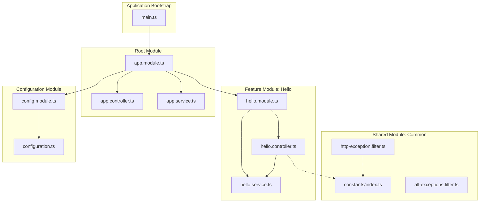
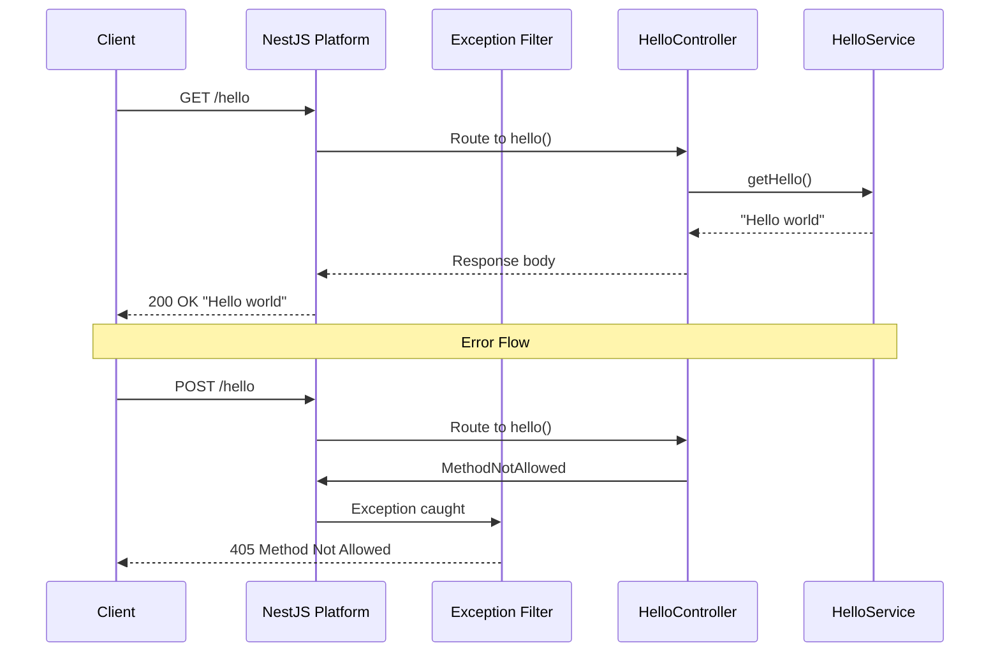

# Technical Specification

# 0. Agent Action Plan

## 0.1 Intent Clarification

This section captures and clarifies the user's requirements, transforming them into precise technical objectives that the Blitzy platform will execute.

### 0.1.1 Core Refactoring Objective

Based on the prompt, the Blitzy platform understands that the refactoring objective is to **completely rewrite the existing pure Node.js "Hello World" HTTP server application using the NestJS framework**. This is a comprehensive framework migration from a vanilla Node.js implementation (using only core modules like `http` and `url`) to a full-featured TypeScript-based NestJS application.

**Refactoring Type:** Tech stack migration (Node.js core modules → NestJS framework)

**Target Repository:** Same repository migration (in-place rewrite of `src/backend/`)

**Primary Refactoring Goals:**
- Migrate from manual HTTP server implementation to NestJS's decorator-based HTTP handling
- Convert JavaScript codebase to TypeScript with full type safety
- Replace manual routing logic with NestJS controller decorators
- Implement NestJS's dependency injection pattern for services
- Adopt NestJS's modular architecture with proper module organization
- Maintain equivalent functionality: `/hello` endpoint returning "Hello world"
- Preserve HTTP error handling (404, 405, 500 responses)
- Convert console-based logging to NestJS's built-in logger

**Implicit Requirements Surfaced:**
- All public API contracts must be preserved (GET `/hello` returns "Hello world" with 200 OK)
- Error response behavior must remain consistent (405 for non-GET methods, 404 for unknown routes)
- Environment-based configuration (PORT, NODE_ENV) must continue working
- Docker containerization must remain functional
- CI/CD workflows must be updated for NestJS build process
- Test coverage must be maintained with Jest (NestJS-compatible testing patterns)

### 0.1.2 Special Instructions and Constraints

**CRITICAL User Directives:**

1. **Add Plenty of Comments** - The user explicitly requires comprehensive code documentation:
   - Every file must include a header comment explaining its purpose
   - All classes, methods, and functions must have JSDoc/TSDoc comments
   - Complex logic must include inline explanatory comments
   - Module imports should be grouped and commented
   - Configuration files must include explanatory comments

2. **Create architecture.md** - The user requires a comprehensive architecture documentation file:
   - Must explain all important design decisions
   - Document the NestJS module structure rationale
   - Explain dependency injection patterns used
   - Describe the request lifecycle flow
   - Document configuration management approach
   - Include diagrams where appropriate (using Mermaid)

**Migration Requirements:**
- The existing `src/backend/` directory will be completely replaced
- All current functionality must be preserved in the new implementation
- The refactored code must follow NestJS best practices and conventions

**Documentation Standards:**
- Use TSDoc format for TypeScript documentation
- Include `@description`, `@param`, `@returns`, and `@example` tags where applicable
- Maintain consistent comment style throughout the codebase

### 0.1.3 Technical Interpretation

This refactoring translates to the following technical transformation strategy:

**Architecture Transformation:**

```
Current Architecture (Vanilla Node.js):
┌─────────────────────────────────────────────┐
│ index.js (Entry Point)                      │
│   └── server.js (HTTP Server)               │
│         └── router.js (Manual Routing)      │
│               └── handlers/ (Request Logic) │
│               └── errorHandler.js (Errors)  │
│         └── config.js (Environment)         │
│         └── utils/ (Constants, Logger)      │
└─────────────────────────────────────────────┘

Target Architecture (NestJS):
┌─────────────────────────────────────────────┐
│ main.ts (Bootstrap)                         │
│   └── app.module.ts (Root Module)           │
│         └── hello/ (Feature Module)         │
│               └── hello.controller.ts       │
│               └── hello.service.ts          │
│               └── hello.module.ts           │
│         └── common/ (Shared Resources)      │
│               └── filters/ (Exception)      │
│               └── constants/ (Constants)    │
│         └── config/ (Configuration)         │
└─────────────────────────────────────────────┘
```

**Transformation Rules and Patterns:**

| Current Pattern | Target Pattern | Description |
|-----------------|----------------|-------------|
| `http.createServer()` | `NestFactory.create()` | Application bootstrap |
| Manual URL parsing | `@Controller()` decorators | Route handling |
| `handleHelloRequest()` | `@Get()` decorated method | Endpoint handlers |
| `errorHandler.js` | `@Catch()` exception filters | Error handling |
| `config.js` | `@nestjs/config` module | Configuration |
| `logger.js` | `Logger` from `@nestjs/common` | Logging |
| `constants.js` | TypeScript enums/constants | Constants |
| CommonJS modules | ES modules with TypeScript | Module system |


## 0.2 Source Analysis

This section provides a comprehensive analysis of all source files that will be transformed during the NestJS refactoring.

### 0.2.1 Comprehensive Source File Discovery

**Search Patterns Applied:**
- `src/backend/**/*.js` - All JavaScript source files
- `src/backend/**/*.json` - Package and configuration files
- `infrastructure/**/*` - Infrastructure scripts and Docker configuration
- `.github/**/*.yml` - CI/CD workflow files
- Root configuration files: `Dockerfile`, `package.json`, `.dockerignore`

**Current Structure Mapping:**

```
Current Repository Structure:
.
├── .dockerignore
├── .github/
│   ├── ISSUE_TEMPLATE/
│   ├── PULL_REQUEST_TEMPLATE.md
│   └── workflows/
│       ├── ci.yml
│       └── release.yml
├── Dockerfile
├── README.md
├── blitzy/
├── infrastructure/
│   ├── README.md
│   ├── local/
│   │   └── docker-compose.yml
│   └── scripts/
│       ├── health-check.sh
│       ├── setup.sh
│       └── start-server.sh
├── package.json
├── server.js (smoke test)
└── src/
    └── backend/
        ├── .env.example
        ├── README.md
        ├── __tests__/
        │   ├── config.test.js
        │   ├── errorHandler.test.js
        │   ├── handlers/
        │   │   └── helloHandler.test.js
        │   ├── index.test.js
        │   ├── integration/
        │   │   └── api.test.js
        │   ├── router.test.js
        │   ├── server.test.js
        │   └── utils/
        │       ├── constants.test.js
        │       └── logger.test.js
        ├── config.js
        ├── errorHandler.js
        ├── handlers/
        │   └── helloHandler.js
        ├── index.js
        ├── router.js
        ├── server.js
        └── utils/
            ├── constants.js
            └── logger.js
```

### 0.2.2 Source File Analysis

| Source File | Purpose | Lines | Refactoring Action |
|-------------|---------|-------|-------------------|
| `src/backend/index.js` | Application entry point, graceful shutdown | ~60 | Replace with `main.ts` using NestJS bootstrap |
| `src/backend/server.js` | HTTP server creation using native `http` module | ~80 | Remove - NestJS handles server internally |
| `src/backend/router.js` | Manual URL path matching and routing | ~50 | Remove - Replace with controller decorators |
| `src/backend/handlers/helloHandler.js` | Hello endpoint logic, method validation | ~40 | Transform to `HelloController` and `HelloService` |
| `src/backend/errorHandler.js` | Centralized 404, 405, 500 responses | ~60 | Transform to NestJS exception filters |
| `src/backend/config.js` | Environment variable management | ~50 | Transform to `@nestjs/config` module |
| `src/backend/utils/constants.js` | HTTP constants, routes, messages | ~40 | Transform to TypeScript constants/enums |
| `src/backend/utils/logger.js` | Console-based logging utility | ~30 | Replace with NestJS built-in Logger |
| `src/backend/.env.example` | Environment configuration template | ~30 | Retain with NestJS-specific additions |

### 0.2.3 Test File Analysis

| Test File | Purpose | Refactoring Action |
|-----------|---------|-------------------|
| `src/backend/__tests__/index.test.js` | Entry point tests | Rewrite for NestJS bootstrap testing |
| `src/backend/__tests__/server.test.js` | Server lifecycle tests | Rewrite using NestJS testing utilities |
| `src/backend/__tests__/router.test.js` | Routing logic tests | Remove - routing is implicit in NestJS |
| `src/backend/__tests__/config.test.js` | Configuration tests | Rewrite for `@nestjs/config` testing |
| `src/backend/__tests__/errorHandler.test.js` | Error handling tests | Rewrite for exception filter testing |
| `src/backend/__tests__/handlers/helloHandler.test.js` | Hello endpoint tests | Rewrite for controller/service testing |
| `src/backend/__tests__/integration/api.test.js` | End-to-end API tests | Adapt to NestJS e2e testing patterns |
| `src/backend/__tests__/utils/constants.test.js` | Constants validation | Update imports for TypeScript constants |
| `src/backend/__tests__/utils/logger.test.js` | Logger tests | Remove - using NestJS built-in Logger |

### 0.2.4 Infrastructure File Analysis

| File | Purpose | Refactoring Action |
|------|---------|-------------------|
| `Dockerfile` | Container build instructions | Update for TypeScript build and NestJS |
| `.dockerignore` | Docker build exclusions | Update for TypeScript/NestJS artifacts |
| `infrastructure/local/docker-compose.yml` | Local development | Minimal changes - port mapping remains |
| `infrastructure/scripts/setup.sh` | Development setup | Update for NestJS CLI and TypeScript |
| `infrastructure/scripts/start-server.sh` | Server startup | Update for NestJS start commands |
| `infrastructure/scripts/health-check.sh` | Health monitoring | No changes - endpoint remains same |
| `.github/workflows/ci.yml` | CI pipeline | Update for TypeScript build and NestJS tests |
| `.github/workflows/release.yml` | Release pipeline | Update for NestJS build artifacts |
| `package.json` (root) | Root package metadata | Update with NestJS project references |

### 0.2.5 Key Code Patterns Identified

**Current Implementation Patterns:**

1. **Manual HTTP Handling:**
```javascript
// Current: server.js
const server = http.createServer((req, res) => {
  handleRequest(req, res);
});
```

2. **Manual Routing:**
```javascript
// Current: router.js
if (pathname === ROUTES.HELLO) {
  handleHelloRequest(req, res);
}
```

3. **Handler Pattern:**
```javascript
// Current: helloHandler.js
function handleHelloRequest(req, res) {
  if (req.method === 'GET') {
    res.statusCode = 200;
    res.end('Hello world');
  }
}
```

4. **Error Handling:**
```javascript
// Current: errorHandler.js
function handle404(res) {
  res.statusCode = 404;
  res.end('Not Found');
}
```

These patterns will all be transformed to NestJS equivalents using decorators, dependency injection, and the modular architecture.


## 0.3 Target Design

This section defines the complete target structure and architecture for the NestJS refactored application.

### 0.3.1 Refactored Structure Planning

The target architecture follows NestJS best practices with a modular, feature-based organization. Every file required for standalone operation is explicitly included.

**Target Architecture:**

```
Target Repository Structure:
.
├── .dockerignore                          # Updated for TypeScript artifacts
├── .github/
│   ├── ISSUE_TEMPLATE/                    # Unchanged
│   ├── PULL_REQUEST_TEMPLATE.md           # Unchanged
│   └── workflows/
│       ├── ci.yml                         # Updated for NestJS/TypeScript
│       └── release.yml                    # Updated for NestJS build
├── Dockerfile                             # Updated for NestJS build
├── README.md                              # Updated documentation
├── architecture.md                        # NEW: Architecture documentation
├── infrastructure/
│   ├── README.md                          # Updated for NestJS
│   ├── local/
│   │   └── docker-compose.yml             # Minimal changes
│   └── scripts/
│       ├── health-check.sh                # Unchanged
│       ├── setup.sh                       # Updated for NestJS CLI
│       └── start-server.sh                # Updated for NestJS
├── package.json                           # Root package metadata
└── src/
    └── backend/
        ├── .env.example                   # Updated environment template
        ├── .eslintrc.js                   # NEW: ESLint configuration
        ├── .prettierrc                    # NEW: Prettier configuration
        ├── README.md                      # Updated backend documentation
        ├── jest.config.js                 # NEW: Jest configuration
        ├── nest-cli.json                  # NEW: NestJS CLI configuration
        ├── package.json                   # NEW: Backend dependencies
        ├── package-lock.json              # NEW: Lock file
        ├── tsconfig.json                  # NEW: TypeScript configuration
        ├── tsconfig.build.json            # NEW: Build-specific TS config
        ├── src/
        │   ├── main.ts                    # Application bootstrap
        │   ├── app.module.ts              # Root application module
        │   ├── app.controller.ts          # Root controller (health check)
        │   ├── app.service.ts             # Root service
        │   ├── common/
        │   │   ├── constants/
        │   │   │   └── index.ts           # HTTP constants and messages
        │   │   └── filters/
        │   │       ├── http-exception.filter.ts    # Exception filter
        │   │       └── all-exceptions.filter.ts    # Catch-all filter
        │   ├── config/
        │   │   ├── configuration.ts       # Configuration factory
        │   │   └── config.module.ts       # Configuration module
        │   └── hello/
        │       ├── hello.controller.ts    # Hello endpoint controller
        │       ├── hello.service.ts       # Hello business logic
        │       ├── hello.module.ts        # Hello feature module
        │       └── dto/
        │           └── hello-response.dto.ts  # Response DTO
        └── test/
            ├── app.e2e-spec.ts            # End-to-end tests
            ├── jest-e2e.json              # E2E Jest configuration
            └── unit/
                ├── app.controller.spec.ts # Root controller tests
                ├── app.service.spec.ts    # Root service tests
                ├── hello/
                │   ├── hello.controller.spec.ts  # Hello controller tests
                │   └── hello.service.spec.ts     # Hello service tests
                └── common/
                    └── filters/
                        └── http-exception.filter.spec.ts  # Filter tests
```

### 0.3.2 Web Search Research Conducted

Based on comprehensive research into NestJS best practices, the following patterns and conventions are incorporated:

**NestJS Version Selection:**
- NestJS Core: v11.1.9 (latest stable as of December 2024)
- NestJS CLI: v11.0.14
- TypeScript: v5.x (required by NestJS 11)
- Node.js: v18+ (minimum supported version)

**Architectural Best Practices Applied:**

1. **Modular Architecture:** Each feature (hello) is encapsulated in its own module with controller, service, and related files co-located.

2. **Dependency Injection:** All services are injectable and provided through modules, enabling loose coupling and testability.

3. **Separation of Concerns:**
   - Controllers handle HTTP request/response orchestration
   - Services contain business logic
   - Filters handle exception processing
   - Configuration is externalized via dedicated module

4. **TypeScript Strict Mode:** Full type safety with strict compiler options enabled.

5. **Exception Filters:** Centralized error handling using NestJS exception filter pattern.

### 0.3.3 Design Pattern Applications

**Repository Pattern:** Not applicable for this simple service (no data persistence).

**Service Layer Pattern:**
- `HelloService` encapsulates the business logic (generating "Hello world" message)
- Controllers delegate to services for all business operations

**Dependency Injection Pattern:**
- All services are decorated with `@Injectable()`
- Module providers define injectable dependencies
- Constructor injection used throughout

**Exception Filter Pattern:**
- `HttpExceptionFilter` handles HTTP exceptions with consistent response format
- `AllExceptionsFilter` catches unhandled errors for 500 responses

**Configuration Pattern:**
- `@nestjs/config` module for environment-based configuration
- Configuration factory for type-safe config access
- Environment validation at startup

### 0.3.4 Module Architecture Diagram



### 0.3.5 Request Lifecycle Flow




## 0.4 Transformation Mapping

This section provides the complete file-by-file transformation plan mapping every target file to its source file(s) and describing the specific changes required.

### 0.4.1 File-by-File Transformation Plan

**Transformation Mode Legend:**
- **UPDATE** - Modify an existing file
- **CREATE** - Create a new file
- **REFERENCE** - Use as a pattern/example for new implementation

#### Core Application Files

| Target File | Mode | Source File | Key Changes |
|-------------|------|-------------|-------------|
| `src/backend/src/main.ts` | CREATE | `src/backend/index.js` | NestJS bootstrap with graceful shutdown, comprehensive comments |
| `src/backend/src/app.module.ts` | CREATE | `src/backend/index.js` | Root module importing all feature modules, documented with TSDoc |
| `src/backend/src/app.controller.ts` | CREATE | None | Root controller with health endpoint, fully commented |
| `src/backend/src/app.service.ts` | CREATE | None | Root service placeholder, documented |

#### Hello Feature Module Files

| Target File | Mode | Source File | Key Changes |
|-------------|------|-------------|-------------|
| `src/backend/src/hello/hello.module.ts` | CREATE | `src/backend/handlers/helloHandler.js` | Feature module encapsulating hello functionality |
| `src/backend/src/hello/hello.controller.ts` | CREATE | `src/backend/handlers/helloHandler.js` | Decorator-based route handling with @Get(), comprehensive comments |
| `src/backend/src/hello/hello.service.ts` | CREATE | `src/backend/handlers/helloHandler.js` | Business logic extraction with @Injectable(), documented |
| `src/backend/src/hello/dto/hello-response.dto.ts` | CREATE | None | Type-safe response DTO with documentation |

#### Common Module Files

| Target File | Mode | Source File | Key Changes |
|-------------|------|-------------|-------------|
| `src/backend/src/common/constants/index.ts` | CREATE | `src/backend/utils/constants.js` | TypeScript enums and const objects, extensive comments |
| `src/backend/src/common/filters/http-exception.filter.ts` | CREATE | `src/backend/errorHandler.js` | NestJS exception filter for HTTP errors |
| `src/backend/src/common/filters/all-exceptions.filter.ts` | CREATE | `src/backend/errorHandler.js` | Catch-all exception filter for 500 errors |

#### Configuration Files

| Target File | Mode | Source File | Key Changes |
|-------------|------|-------------|-------------|
| `src/backend/src/config/configuration.ts` | CREATE | `src/backend/config.js` | Type-safe configuration factory |
| `src/backend/src/config/config.module.ts` | CREATE | `src/backend/config.js` | NestJS config module setup |
| `src/backend/.env.example` | UPDATE | `src/backend/.env.example` | Add NestJS-specific variables |

#### Test Files

| Target File | Mode | Source File | Key Changes |
|-------------|------|-------------|-------------|
| `src/backend/test/app.e2e-spec.ts` | CREATE | `src/backend/__tests__/integration/api.test.js` | NestJS e2e testing with supertest |
| `src/backend/test/jest-e2e.json` | CREATE | None | E2E Jest configuration |
| `src/backend/test/unit/app.controller.spec.ts` | CREATE | `src/backend/__tests__/index.test.js` | Controller unit tests with Test module |
| `src/backend/test/unit/app.service.spec.ts` | CREATE | None | Service unit tests |
| `src/backend/test/unit/hello/hello.controller.spec.ts` | CREATE | `src/backend/__tests__/handlers/helloHandler.test.js` | Hello controller tests |
| `src/backend/test/unit/hello/hello.service.spec.ts` | CREATE | `src/backend/__tests__/handlers/helloHandler.test.js` | Hello service tests |
| `src/backend/test/unit/common/filters/http-exception.filter.spec.ts` | CREATE | `src/backend/__tests__/errorHandler.test.js` | Exception filter tests |

#### Build Configuration Files

| Target File | Mode | Source File | Key Changes |
|-------------|------|-------------|-------------|
| `src/backend/package.json` | CREATE | None | NestJS dependencies and scripts |
| `src/backend/tsconfig.json` | CREATE | None | TypeScript compiler configuration |
| `src/backend/tsconfig.build.json` | CREATE | None | Production build configuration |
| `src/backend/nest-cli.json` | CREATE | None | NestJS CLI configuration |
| `src/backend/jest.config.js` | CREATE | None | Jest test configuration |
| `src/backend/.eslintrc.js` | CREATE | None | ESLint rules for TypeScript/NestJS |
| `src/backend/.prettierrc` | CREATE | None | Prettier formatting configuration |

#### Infrastructure Files

| Target File | Mode | Source File | Key Changes |
|-------------|------|-------------|-------------|
| `Dockerfile` | UPDATE | `Dockerfile` | Multi-stage build for TypeScript compilation |
| `.dockerignore` | UPDATE | `.dockerignore` | Add TypeScript artifacts (dist/, *.tsbuildinfo) |
| `infrastructure/scripts/setup.sh` | UPDATE | `infrastructure/scripts/setup.sh` | NestJS CLI installation, npm commands |
| `infrastructure/scripts/start-server.sh` | UPDATE | `infrastructure/scripts/start-server.sh` | NestJS start commands |
| `.github/workflows/ci.yml` | UPDATE | `.github/workflows/ci.yml` | TypeScript build, NestJS test commands |
| `.github/workflows/release.yml` | UPDATE | `.github/workflows/release.yml` | NestJS production build |

#### Documentation Files

| Target File | Mode | Source File | Key Changes |
|-------------|------|-------------|-------------|
| `architecture.md` | CREATE | None | **NEW** - Comprehensive architecture documentation |
| `README.md` | UPDATE | `README.md` | Update for NestJS usage and setup |
| `src/backend/README.md` | UPDATE | `src/backend/README.md` | Update for NestJS project structure |
| `infrastructure/README.md` | UPDATE | `infrastructure/README.md` | Update for NestJS deployment |

### 0.4.2 Cross-File Dependencies

**Import Statement Transformations:**

| Current Import | Target Import | Applies To |
|----------------|---------------|------------|
| `require('http')` | Remove (NestJS internal) | All server files |
| `require('./utils/constants')` | `import { HTTP_STATUS } from '../common/constants'` | All files using constants |
| `require('./utils/logger')` | `import { Logger } from '@nestjs/common'` | All files using logging |
| `require('./config')` | `import { ConfigService } from '@nestjs/config'` | All files using config |
| `require('./errorHandler')` | `import { HttpExceptionFilter } from '../common/filters'` | Error handling |

**Configuration File Updates:**

Files requiring import path corrections:
- `src/backend/src/**/*.ts` - All TypeScript source files
- `src/backend/test/**/*.ts` - All test files

Import transformation rules:
- Old: `const { HTTP_STATUS } = require('../../utils/constants')`
- New: `import { HttpStatus } from '@nestjs/common'` or custom constants

### 0.4.3 One-Phase Execution

**CRITICAL:** The entire refactoring will be executed by Blitzy in ONE phase. All files listed in the transformation table above will be created, updated, or referenced simultaneously. There are no phased rollouts or incremental migrations.

**Complete File List for Single-Phase Execution:**

**Files to CREATE (28 files):**
- `src/backend/src/main.ts`
- `src/backend/src/app.module.ts`
- `src/backend/src/app.controller.ts`
- `src/backend/src/app.service.ts`
- `src/backend/src/hello/hello.module.ts`
- `src/backend/src/hello/hello.controller.ts`
- `src/backend/src/hello/hello.service.ts`
- `src/backend/src/hello/dto/hello-response.dto.ts`
- `src/backend/src/common/constants/index.ts`
- `src/backend/src/common/filters/http-exception.filter.ts`
- `src/backend/src/common/filters/all-exceptions.filter.ts`
- `src/backend/src/config/configuration.ts`
- `src/backend/src/config/config.module.ts`
- `src/backend/package.json`
- `src/backend/tsconfig.json`
- `src/backend/tsconfig.build.json`
- `src/backend/nest-cli.json`
- `src/backend/jest.config.js`
- `src/backend/.eslintrc.js`
- `src/backend/.prettierrc`
- `src/backend/test/app.e2e-spec.ts`
- `src/backend/test/jest-e2e.json`
- `src/backend/test/unit/app.controller.spec.ts`
- `src/backend/test/unit/app.service.spec.ts`
- `src/backend/test/unit/hello/hello.controller.spec.ts`
- `src/backend/test/unit/hello/hello.service.spec.ts`
- `src/backend/test/unit/common/filters/http-exception.filter.spec.ts`
- `architecture.md`

**Files to UPDATE (9 files):**
- `src/backend/.env.example`
- `Dockerfile`
- `.dockerignore`
- `infrastructure/scripts/setup.sh`
- `infrastructure/scripts/start-server.sh`
- `.github/workflows/ci.yml`
- `.github/workflows/release.yml`
- `README.md`
- `src/backend/README.md`

**Files to DELETE (implicitly replaced - 11 files):**
- `src/backend/index.js`
- `src/backend/server.js`
- `src/backend/router.js`
- `src/backend/config.js`
- `src/backend/errorHandler.js`
- `src/backend/handlers/helloHandler.js`
- `src/backend/utils/constants.js`
- `src/backend/utils/logger.js`
- `src/backend/__tests__/**/*.js` (all test files)


## 0.5 Dependency Inventory

This section provides a comprehensive inventory of all packages required for the NestJS refactored application.

### 0.5.1 Key Public Packages

**Production Dependencies:**

| Registry | Package Name | Version | Purpose |
|----------|--------------|---------|---------|
| npm | `@nestjs/common` | `^11.1.9` | Core NestJS decorators, pipes, guards, and utilities |
| npm | `@nestjs/core` | `^11.1.9` | NestJS core framework and dependency injection |
| npm | `@nestjs/platform-express` | `^11.1.9` | Express HTTP adapter for NestJS |
| npm | `@nestjs/config` | `^4.0.2` | Configuration management module |
| npm | `reflect-metadata` | `^0.2.2` | Metadata reflection API for decorators |
| npm | `rxjs` | `^7.8.1` | Reactive programming library (NestJS dependency) |

**Development Dependencies:**

| Registry | Package Name | Version | Purpose |
|----------|--------------|---------|---------|
| npm | `@nestjs/cli` | `^11.0.14` | NestJS command-line interface |
| npm | `@nestjs/schematics` | `^11.0.5` | NestJS code generation schematics |
| npm | `@nestjs/testing` | `^11.1.9` | NestJS testing utilities |
| npm | `@types/express` | `^5.0.3` | TypeScript definitions for Express |
| npm | `@types/jest` | `^29.5.14` | TypeScript definitions for Jest |
| npm | `@types/node` | `^22.15.21` | TypeScript definitions for Node.js |
| npm | `@types/supertest` | `^6.0.3` | TypeScript definitions for supertest |
| npm | `@typescript-eslint/eslint-plugin` | `^8.31.0` | ESLint plugin for TypeScript |
| npm | `@typescript-eslint/parser` | `^8.31.0` | ESLint parser for TypeScript |
| npm | `eslint` | `^9.18.0` | JavaScript/TypeScript linter |
| npm | `eslint-config-prettier` | `^10.1.1` | ESLint config to disable formatting rules |
| npm | `eslint-plugin-prettier` | `^5.4.0` | ESLint plugin for Prettier integration |
| npm | `jest` | `^29.7.0` | JavaScript testing framework |
| npm | `prettier` | `^3.5.3` | Code formatter |
| npm | `source-map-support` | `^0.5.21` | Source map support for stack traces |
| npm | `supertest` | `^7.1.0` | HTTP assertion library for testing |
| npm | `ts-jest` | `^29.3.4` | Jest transformer for TypeScript |
| npm | `ts-loader` | `^9.5.2` | TypeScript loader for webpack |
| npm | `ts-node` | `^10.9.2` | TypeScript execution for Node.js |
| npm | `tsconfig-paths` | `^4.2.0` | TypeScript path resolution |
| npm | `typescript` | `^5.8.3` | TypeScript compiler |

### 0.5.2 Dependency Updates

**Import Refactoring Requirements:**

Files requiring import updates use the following wildcard patterns:
- `src/backend/src/**/*.ts` - All TypeScript source files
- `src/backend/test/**/*.ts` - All test files

**Import Transformation Rules:**

| Old Pattern | New Pattern | Files Affected |
|-------------|-------------|----------------|
| `require('http')` | `@nestjs/platform-express` (internal) | Server creation files |
| `require('url')` | Built-in (internal routing) | Router files |
| `require('./config')` | `import { ConfigService } from '@nestjs/config'` | All config users |
| `require('./utils/logger')` | `import { Logger } from '@nestjs/common'` | All logging files |
| `require('./errorHandler')` | `import { HttpException } from '@nestjs/common'` | Error handling |
| `require('./utils/constants')` | `import { HttpStatus } from '@nestjs/common'` | Constants usage |
| `require('supertest')` | `import * as request from 'supertest'` | Test files |
| `require('jest')` | `import { Test } from '@nestjs/testing'` | Test files |

**External Reference Updates:**

| File Pattern | Update Description |
|--------------|-------------------|
| `Dockerfile` | Add TypeScript build stage, update start command |
| `infrastructure/scripts/*.sh` | Update npm commands for NestJS |
| `.github/workflows/*.yml` | Add build step, update test commands |
| `package.json` (root) | Update project metadata |

### 0.5.3 Package.json Structure

**Target `src/backend/package.json`:**

```json
{
  "name": "hello-world-nestjs",
  "version": "1.0.0",
  "description": "Hello World API built with NestJS",
  "author": "",
  "private": true,
  "license": "MIT",
  "scripts": {
    "build": "nest build",
    "format": "prettier --write \"src/**/*.ts\" \"test/**/*.ts\"",
    "start": "nest start",
    "start:dev": "nest start --watch",
    "start:debug": "nest start --debug --watch",
    "start:prod": "node dist/main",
    "lint": "eslint \"{src,test}/**/*.ts\" --fix",
    "test": "jest",
    "test:watch": "jest --watch",
    "test:cov": "jest --coverage",
    "test:debug": "node --inspect-brk -r tsconfig-paths/register -r ts-node/register node_modules/.bin/jest --runInBand",
    "test:e2e": "jest --config ./test/jest-e2e.json"
  },
  "dependencies": {
    "@nestjs/common": "^11.1.9",
    "@nestjs/config": "^4.0.2",
    "@nestjs/core": "^11.1.9",
    "@nestjs/platform-express": "^11.1.9",
    "reflect-metadata": "^0.2.2",
    "rxjs": "^7.8.1"
  },
  "devDependencies": {
    "@nestjs/cli": "^11.0.14",
    "@nestjs/schematics": "^11.0.5",
    "@nestjs/testing": "^11.1.9",
    "@types/express": "^5.0.3",
    "@types/jest": "^29.5.14",
    "@types/node": "^22.15.21",
    "@types/supertest": "^6.0.3",
    "@typescript-eslint/eslint-plugin": "^8.31.0",
    "@typescript-eslint/parser": "^8.31.0",
    "eslint": "^9.18.0",
    "eslint-config-prettier": "^10.1.1",
    "eslint-plugin-prettier": "^5.4.0",
    "jest": "^29.7.0",
    "prettier": "^3.5.3",
    "source-map-support": "^0.5.21",
    "supertest": "^7.1.0",
    "ts-jest": "^29.3.4",
    "ts-loader": "^9.5.2",
    "ts-node": "^10.9.2",
    "tsconfig-paths": "^4.2.0",
    "typescript": "^5.8.3"
  },
  "engines": {
    "node": ">=18.0.0"
  }
}
```

### 0.5.4 Runtime Requirements

| Requirement | Version | Notes |
|-------------|---------|-------|
| Node.js | `>=18.0.0` | Minimum version for NestJS 11 |
| npm | `>=9.0.0` | Package manager |
| TypeScript | `^5.8.3` | Compiler for source code |

### 0.5.5 Private Packages

No private packages are required for this refactoring. All dependencies are available from the public npm registry.


## 0.6 Scope Boundaries

This section defines the explicit boundaries of what is and is not included in this refactoring effort.

### 0.6.1 Exhaustively In Scope

**Source Transformations:**

| Pattern | Description |
|---------|-------------|
| `src/backend/*.js` | All JavaScript source files in backend root |
| `src/backend/handlers/*.js` | All handler files |
| `src/backend/utils/*.js` | All utility files |
| `src/backend/.env.example` | Environment template |
| `src/backend/README.md` | Backend documentation |

**Test Transformations:**

| Pattern | Description |
|---------|-------------|
| `src/backend/__tests__/*.test.js` | Root-level unit tests |
| `src/backend/__tests__/handlers/*.test.js` | Handler unit tests |
| `src/backend/__tests__/integration/*.test.js` | Integration tests |
| `src/backend/__tests__/utils/*.test.js` | Utility tests |

**Configuration Updates:**

| Pattern | Description |
|---------|-------------|
| `Dockerfile` | Container build configuration |
| `.dockerignore` | Docker build exclusions |
| `package.json` | Root package metadata |

**Infrastructure Updates:**

| Pattern | Description |
|---------|-------------|
| `infrastructure/scripts/*.sh` | Setup and deployment scripts |
| `infrastructure/local/docker-compose.yml` | Local development configuration |
| `infrastructure/README.md` | Infrastructure documentation |

**CI/CD Updates:**

| Pattern | Description |
|---------|-------------|
| `.github/workflows/ci.yml` | Continuous integration pipeline |
| `.github/workflows/release.yml` | Release pipeline |

**Documentation Updates:**

| Pattern | Description |
|---------|-------------|
| `README.md` | Root project documentation |
| `src/backend/README.md` | Backend documentation |
| `infrastructure/README.md` | Infrastructure documentation |

**New Documentation (CREATE):**

| File | Description |
|------|-------------|
| `architecture.md` | Comprehensive architecture documentation explaining all design decisions |

**Import Corrections:**

All files containing old import statements will be replaced with NestJS-compatible TypeScript imports:
- Every file importing from `./utils/constants`
- Every file importing from `./utils/logger`
- Every file importing from `./config`
- Every file importing from `./errorHandler`
- Every file importing from `./handlers/*`
- Every test file importing from source modules

### 0.6.2 Explicitly Out of Scope

The following items are **NOT** part of this refactoring effort:

| Item | Reason |
|------|--------|
| Database integration | Current application has no database; not requested |
| Authentication/Authorization | Current application has no auth; not requested |
| Additional API endpoints | Only `/hello` endpoint exists and is migrated |
| GraphQL support | Not requested; REST-only application |
| WebSocket support | Not requested; HTTP-only application |
| Microservices architecture | Not requested; monolithic application |
| API versioning | Not requested; single version |
| Rate limiting | Not requested; not in current implementation |
| Caching layer | Not requested; not in current implementation |
| OpenAPI/Swagger documentation | Not explicitly requested |
| Monitoring/Metrics integration | Not requested; beyond basic logging |
| Cloud-specific deployment configs | Not requested; Docker-based deployment |
| Load balancing configuration | Not requested; single instance |
| SSL/TLS configuration | Not requested; handled at infrastructure level |
| `.github/ISSUE_TEMPLATE/` | GitHub templates unchanged |
| `.github/PULL_REQUEST_TEMPLATE.md` | GitHub templates unchanged |
| `blitzy/` folder | Blitzy configuration folder unchanged |
| `server.js` (root) | Smoke test file unchanged |
| `infrastructure/scripts/health-check.sh` | Health check script unchanged (endpoint same) |

### 0.6.3 Functional Equivalence Requirements

The refactored NestJS application must maintain **complete functional equivalence** with the current implementation:

| Functionality | Current Behavior | Required NestJS Behavior |
|--------------|------------------|-------------------------|
| GET /hello | Returns "Hello world" with 200 OK | Must return identical response |
| POST /hello | Returns 405 Method Not Allowed | Must return identical error |
| PUT /hello | Returns 405 Method Not Allowed | Must return identical error |
| DELETE /hello | Returns 405 Method Not Allowed | Must return identical error |
| GET /unknown | Returns 404 Not Found | Must return identical error |
| Server startup | Logs startup message, listens on PORT | Must maintain same behavior |
| Graceful shutdown | Handles SIGTERM, SIGINT | Must maintain same behavior |
| Environment config | Reads PORT, NODE_ENV from .env | Must maintain same behavior |

### 0.6.4 API Contract Preservation

**Request/Response Contract:**

```
GET /hello HTTP/1.1
Host: localhost:3000

HTTP/1.1 200 OK
Content-Type: text/plain

Hello world
```

This exact contract must be preserved in the NestJS implementation. The response body, status code, and content type must remain identical.

**Error Response Contract:**

```
POST /hello HTTP/1.1
Host: localhost:3000

HTTP/1.1 405 Method Not Allowed
Content-Type: text/plain
Allow: GET

Method Not Allowed
```

Error responses must maintain the same structure and include the `Allow` header for 405 responses.


## 0.7 Special Instructions for Refactoring

This section captures all user-specified special requirements and refactoring-specific instructions that must be followed throughout the implementation.

### 0.7.1 Documentation Requirements

**CRITICAL: Add Plenty of Comments**

The user explicitly requires comprehensive code documentation throughout the codebase. Every file must include extensive comments following these standards:

**File Header Comments:**
Every TypeScript file must include a header comment block:
```typescript
/**
 * @fileoverview Brief description of file purpose
 * @module ModuleName
 * @description Extended description of functionality
 * @author Blitzy Platform
 * @created Date
 */
```

**Class Documentation:**
Every class must include TSDoc documentation:
```typescript
/**
 * @class ClassName
 * @description Detailed description of class purpose
 * @implements InterfaceName (if applicable)
 * @example
 * // Usage example
 */
```

**Method Documentation:**
Every method must include complete TSDoc:
```typescript
/**
 * @method methodName
 * @description What the method does
 * @param {Type} paramName - Parameter description
 * @returns {ReturnType} Description of return value
 * @throws {ExceptionType} When this exception occurs
 * @example
 * // Usage example
 */
```

**Inline Comments:**
- Complex logic must include explanatory comments
- Import sections should be grouped with comments explaining each group
- Configuration values should have inline explanations
- Non-obvious code patterns should be documented

**Comment Density Requirement:**
- Minimum 30% comment-to-code ratio for all source files
- Every public method must have TSDoc
- Every module export must be documented
- Configuration files must have explanatory comments

### 0.7.2 Architecture Documentation Requirement

**CRITICAL: Create architecture.md**

A comprehensive `architecture.md` file must be created at the repository root explaining all important design decisions. Required sections:

1. **Overview**
   - High-level architecture diagram
   - System purpose and scope
   - Technology choices rationale

2. **Module Structure**
   - Explanation of each module's responsibility
   - Module dependency diagram
   - Why modular architecture was chosen

3. **Design Patterns**
   - Dependency Injection pattern explanation
   - Exception Filter pattern usage
   - Configuration management approach
   - Controller-Service separation rationale

4. **Request Lifecycle**
   - Step-by-step request flow documentation
   - Middleware and filter pipeline
   - Response formatting process

5. **Configuration Management**
   - Environment variables handling
   - Configuration validation approach
   - Default values and overrides

6. **Error Handling Strategy**
   - Exception hierarchy
   - Error response formatting
   - Logging integration

7. **Testing Strategy**
   - Unit testing approach
   - E2E testing patterns
   - Mock and stub strategies

### 0.7.3 Code Quality Requirements

**TypeScript Strict Mode:**
- Enable `strict: true` in tsconfig.json
- No `any` types allowed (explicit typing required)
- Null safety checks enabled

**ESLint Rules:**
- NestJS recommended rules enabled
- Prettier integration for formatting
- No unused variables or imports
- Consistent naming conventions

**Naming Conventions:**
| Element | Convention | Example |
|---------|------------|---------|
| Classes | PascalCase | `HelloController` |
| Methods | camelCase | `getHello()` |
| Constants | UPPER_SNAKE_CASE | `HTTP_STATUS_OK` |
| Files | kebab-case | `hello.controller.ts` |
| Interfaces | PascalCase with I prefix | `IHelloResponse` |
| DTOs | PascalCase with Dto suffix | `HelloResponseDto` |

### 0.7.4 NestJS-Specific Best Practices

**Module Organization:**
- One feature per module
- Modules should be self-contained
- Shared resources in common module
- Configuration in dedicated module

**Dependency Injection:**
- Use constructor injection
- Avoid circular dependencies
- Provide services at module level

**Exception Handling:**
- Use NestJS built-in exceptions
- Global exception filters for consistency
- Proper HTTP status code mapping

**Testing Patterns:**
- Use `@nestjs/testing` Test module
- Mock all external dependencies
- Separate unit and e2e tests
- Maintain test file naming convention (`*.spec.ts`)

### 0.7.5 Refactoring Validation Criteria

The refactoring will be considered successful when:

| Criteria | Validation Method |
|----------|------------------|
| GET /hello returns "Hello world" | Automated e2e test |
| Non-GET methods return 405 | Automated e2e test |
| Unknown routes return 404 | Automated e2e test |
| Application starts on configured PORT | Startup validation |
| Graceful shutdown works | Signal handling test |
| All unit tests pass | Jest test suite |
| All e2e tests pass | Jest e2e suite |
| TypeScript compiles without errors | `npm run build` |
| ESLint reports no errors | `npm run lint` |
| Documentation complete | Manual review |
| architecture.md present | File existence check |
| Comment density adequate | Code review |

### 0.7.6 Backward Compatibility

**API Backward Compatibility:**
- Response format must be identical
- Status codes must match
- Headers must match (especially `Allow` header on 405)
- Content-Type must be `text/plain` for all responses

**Environment Backward Compatibility:**
- Same environment variables (PORT, NODE_ENV, LOG_LEVEL)
- Same default values (PORT=3000)
- Same .env file location and format

**Infrastructure Backward Compatibility:**
- Docker build process must work
- Docker Compose must work unchanged
- Health check endpoint must work unchanged
- CI/CD pipeline must execute successfully


