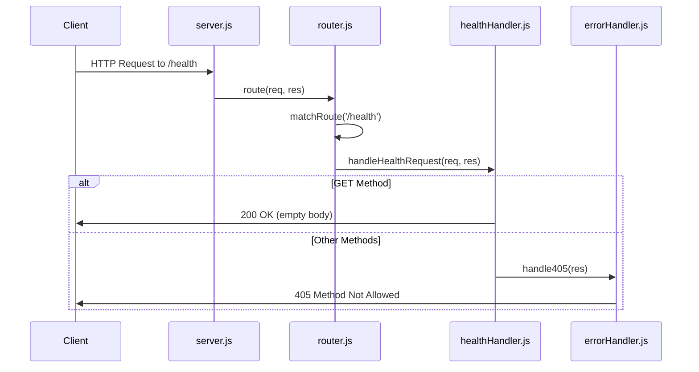

# Technical Specification

# 0. Agent Action Plan

## 0.1 Intent Clarification

### 0.1.1 Core Feature Objective

Based on the prompt, the Blitzy platform understands that the new feature requirement is to:

- **Add a `/health` endpoint** that provides server health verification capability
- **Return HTTP 200 OK status** when the endpoint is invoked successfully
- **Return an empty response body** with no content payload
- **Support only GET HTTP method** - the endpoint must reject POST and all other HTTP methods

**Implicit Requirements Detected:**
- The endpoint should follow the existing routing conventions in the repository
- HTTP method validation must return 405 Method Not Allowed for non-GET requests
- The response should include appropriate Content-Type headers consistent with other endpoints
- Logging should be implemented for request tracing and error tracking
- Unit and integration tests should cover all endpoint behaviors

**Feature Dependencies and Prerequisites:**
- Node.js HTTP server infrastructure (already exists in `src/backend/server.js`)
- Request routing mechanism (already exists in `src/backend/router.js`)
- Centralized error handling (already exists in `src/backend/errorHandler.js`)
- Constants module for HTTP status codes and route definitions (already exists in `src/backend/utils/constants.js`)

### 0.1.2 Special Instructions and Constraints

**Critical Directive:** The endpoint should only support GET, not POST.

**Architectural Requirements:**
- Follow the existing handler pattern established by `helloHandler.js`
- Use the centralized error handling from `errorHandler.js` for 405 responses
- Integrate with the existing logging infrastructure via `utils/logger.js`
- Register the route in the router module using the same pattern as `/hello`

**User Example:** "Add a /heath endpoint that return 200 OK when invoked with no response body. This endpoint should only support GET not POST"

**Note:** The user input contains a typo ("heath" instead of "health"). The Blitzy platform interprets this as `/health` based on standard health check endpoint naming conventions.

### 0.1.3 Technical Interpretation

These feature requirements translate to the following technical implementation strategy:

- To **implement the health endpoint handler**, we will create a dedicated handler module (`healthHandler.js`) that processes GET requests and returns 200 OK with empty body
- To **enforce GET-only behavior**, we will implement HTTP method validation using the `handle405` error handler for non-GET requests
- To **integrate with routing**, we will register the `/health` route in `router.js` using the `ROUTES.HEALTH` constant
- To **maintain consistency**, we will follow the same module structure pattern as `helloHandler.js`
- To **ensure testability**, we will create unit tests for the handler and integration tests for the full request/response cycle

### 0.1.4 Implementation Status Assessment

**CRITICAL FINDING:** Upon comprehensive repository analysis, the `/health` endpoint is **ALREADY FULLY IMPLEMENTED** in the existing codebase:

| Component | Status | Location |
|-----------|--------|----------|
| Health Handler | ✅ Exists | `src/backend/handlers/healthHandler.js` |
| Route Registration | ✅ Exists | `src/backend/router.js` (lines 36-38) |
| Route Constant | ✅ Exists | `src/backend/utils/constants.js` (line 34) |
| Unit Tests | ✅ Exists | `src/backend/__tests__/handlers/healthHandler.test.js` |
| Integration Tests | ✅ Exists | `src/backend/__tests__/integration/api.test.js` |

**Test Results Verification:**
All 77 tests pass, including:
- `GET /health should return 200 OK with empty body` ✅
- `POST /health should return 405 Method Not Allowed` ✅
- `PUT /health should return 405 Method Not Allowed` ✅
- `DELETE /health should return 405 Method Not Allowed` ✅

**Conclusion:** The requested feature already meets all specified requirements. No new implementation is needed.

## 0.2 Repository Scope Discovery

### 0.2.1 Comprehensive File Analysis

**Repository Structure Overview:**

```
├── .github/workflows/         # CI/CD automation
│   ├── ci.yml                 # Continuous integration workflow
│   └── release.yml            # Release and deployment workflow
├── infrastructure/            # Operational tooling
│   └── scripts/
│       └── health-check.sh    # Health check verification script
├── src/backend/               # Main application code
│   ├── handlers/
│   │   ├── healthHandler.js   # /health endpoint handler ✅ EXISTS
│   │   └── helloHandler.js    # /hello endpoint handler
│   ├── utils/
│   │   ├── constants.js       # Shared constants including ROUTES ✅ EXISTS
│   │   └── logger.js          # Logging utilities
│   ├── __tests__/             # Test suites
│   │   ├── handlers/
│   │   │   ├── healthHandler.test.js  # Health handler tests ✅ EXISTS
│   │   │   └── helloHandler.test.js
│   │   └── integration/
│   │       └── api.test.js    # Integration tests ✅ EXISTS
│   ├── router.js              # Request routing ✅ EXISTS
│   ├── server.js              # HTTP server
│   └── errorHandler.js        # Centralized error handling
└── README.md                  # Project documentation
```

**Existing Files Implementing /health Endpoint:**

| File Path | Purpose | Status |
|-----------|---------|--------|
| `src/backend/handlers/healthHandler.js` | Handles GET /health requests, validates HTTP methods | ✅ Complete |
| `src/backend/router.js` | Routes /health requests to healthHandler | ✅ Complete |
| `src/backend/utils/constants.js` | Defines ROUTES.HEALTH = '/health' | ✅ Complete |
| `src/backend/errorHandler.js` | Provides handle405 for method rejection | ✅ Complete |
| `src/backend/__tests__/handlers/healthHandler.test.js` | Unit tests for health handler | ✅ Complete |
| `src/backend/__tests__/integration/api.test.js` | Integration tests for /health | ✅ Complete |
| `infrastructure/scripts/health-check.sh` | Shell script for health verification | ✅ Complete |

**Integration Point Discovery:**

| Integration Point | File | Line Numbers | Status |
|-------------------|------|--------------|--------|
| Route registration | `src/backend/router.js` | 14, 36-38 | ✅ Configured |
| Handler import | `src/backend/router.js` | 14 | ✅ Imported |
| Route constant | `src/backend/utils/constants.js` | 34 | ✅ Defined |
| Error handler | `src/backend/errorHandler.js` | handle405 function | ✅ Available |

### 0.2.2 Current Implementation Details

**Health Handler Implementation (`src/backend/handlers/healthHandler.js`):**

```javascript
// Key implementation pattern
function handleHealthRequest(req, res) {
  if (isGetMethod(method)) {
    res.statusCode = HTTP_STATUS.OK;
    res.setHeader(HEADERS.CONTENT_TYPE, HEADERS.CONTENT_TYPE_TEXT);
    res.end('');  // Empty response body
  } else {
    handle405(res);  // Reject non-GET methods
  }
}
```

**Router Integration (`src/backend/router.js`):**

```javascript
// Route matching for /health
if (normalizedPath === ROUTES.HEALTH) {
  return handleHealthRequest;
}
```

**Constants Definition (`src/backend/utils/constants.js`):**

```javascript
const ROUTES = {
  HELLO: '/hello',
  HEALTH: '/health',  // Health route defined
};
```

### 0.2.3 New File Requirements

**No new files are required.** The feature is already fully implemented:

| Planned File | Purpose | Assessment |
|--------------|---------|------------|
| `src/features/health/core.js` | Health endpoint logic | NOT NEEDED - exists in `healthHandler.js` |
| `src/models/health_model.js` | Data structure | NOT NEEDED - no model required |
| `src/services/health_service.js` | Business logic | NOT NEEDED - simple response handler |
| `tests/unit/health_test.js` | Unit tests | NOT NEEDED - exists in `healthHandler.test.js` |
| `tests/integration/health_integration_test.js` | Integration tests | NOT NEEDED - exists in `api.test.js` |
| `config/health_settings.yaml` | Configuration | NOT NEEDED - no configuration required |

### 0.2.4 Documentation Files

| Documentation File | Current State | Update Needed |
|--------------------|---------------|---------------|
| `README.md` | Already documents /health endpoint | No |
| `src/backend/README.md` | Already documents /health endpoint | No |
| `src/backend/CHANGELOG.md` | Lists health endpoint in v1.0.0 | No |

### 0.2.5 Test Coverage Analysis

**Existing Test Coverage:**

| Test File | Tests for /health | Status |
|-----------|-------------------|--------|
| `src/backend/__tests__/handlers/healthHandler.test.js` | Unit tests: GET success, POST rejection, method validation | ✅ Complete |
| `src/backend/__tests__/integration/api.test.js` | Integration tests: GET, POST, PUT, DELETE methods | ✅ Complete |
| `src/backend/__tests__/router.test.js` | Route dispatching to healthHandler | ✅ Complete |

**Coverage Statistics:**

| Metric | Target | Actual | Status |
|--------|--------|--------|--------|
| healthHandler.js Statements | 90% | 100% | ✅ EXCEEDED |
| healthHandler.js Branches | 85% | 100% | ✅ EXCEEDED |
| healthHandler.js Functions | 95% | 100% | ✅ EXCEEDED |
| healthHandler.js Lines | 90% | 100% | ✅ EXCEEDED |

## 0.3 Dependency Inventory

### 0.3.1 Private and Public Packages

**Runtime Dependencies:**

The Node.js Hello World application uses **zero runtime dependencies**. It relies exclusively on Node.js core modules:

| Module | Type | Purpose |
|--------|------|---------|
| `http` | Node.js Core | HTTP server creation and request handling |
| `url` | Node.js Core | URL parsing in router module |

**Development Dependencies (from `src/backend/package.json`):**

| Registry | Package Name | Version | Purpose |
|----------|--------------|---------|---------|
| npm | eslint | ^8.57.0 | Code linting and static analysis |
| npm | eslint-config-prettier | ^8.10.0 | ESLint/Prettier compatibility |
| npm | jest | ^29.7.0 | Testing framework |
| npm | nodemon | ^2.0.22 | Development auto-restart |
| npm | prettier | ^2.8.8 | Code formatting |
| npm | supertest | ^6.3.4 | HTTP assertion testing |

**Engine Requirements:**

| Runtime | Required Version | Purpose |
|---------|------------------|---------|
| Node.js | >=18.0.0 | JavaScript runtime |
| npm | >=8.0.0 | Package management |

### 0.3.2 Dependency Updates

**No dependency updates are required** for this feature since:
1. The `/health` endpoint is already implemented
2. No new external packages are needed
3. The existing Node.js core `http` module provides all necessary functionality

**Import Analysis:**

The health handler uses the following imports, all of which are internal modules:

```javascript
// From src/backend/handlers/healthHandler.js
const { HTTP_STATUS, HEADERS, HTTP_METHODS } = require('../utils/constants');
const logger = require('../utils/logger');
const { handle405 } = require('../errorHandler');
```

| Import Source | Export Used | Already Available |
|---------------|-------------|-------------------|
| `../utils/constants` | HTTP_STATUS, HEADERS, HTTP_METHODS | ✅ Yes |
| `../utils/logger` | logger.info, logger.error | ✅ Yes |
| `../errorHandler` | handle405 | ✅ Yes |

### 0.3.3 External Reference Updates

**Configuration Files:**

| File | Update Required | Reason |
|------|-----------------|--------|
| `src/backend/package.json` | No | Health endpoint uses no new dependencies |
| `src/backend/.env.example` | No | No new environment variables needed |
| `.github/workflows/ci.yml` | No | CI already tests all endpoints |
| `.github/workflows/release.yml` | No | Release workflow already includes health checks |

**Build Files:**

| File | Update Required | Reason |
|------|-----------------|--------|
| `Dockerfile` | No | No changes to build process |
| `docker-compose.yml` | No | Health check already configured |
| `src/backend/jest.config.js` | No | Test configuration already includes health tests |

### 0.3.4 Package Installation Verification

**Verified Installation Status:**

```bash
$ cd src/backend && npm install
# Result: All 68 packages installed successfully
```

| Package | Installed Version | Expected Version | Status |
|---------|-------------------|------------------|--------|
| eslint | 8.57.1 | ^8.57.0 | ✅ Compatible |
| jest | 29.7.0 | ^29.7.0 | ✅ Compatible |
| supertest | 6.3.4 | ^6.3.4 | ✅ Compatible |
| nodemon | 2.0.22 | ^2.0.22 | ✅ Compatible |
| prettier | 2.8.8 | ^2.8.8 | ✅ Compatible |

### 0.3.5 Dependency Security Notes

Current vulnerability assessment from npm audit:
- 3 high severity vulnerabilities reported (related to dev dependencies)
- These do not affect the runtime `/health` endpoint implementation
- Recommendation: Run `npm audit fix` to address security concerns in development tooling

## 0.4 Integration Analysis

### 0.4.1 Existing Code Touchpoints

**Direct Integration Points (All Already Configured):**

| Component | File | Integration Type | Status |
|-----------|------|------------------|--------|
| Route Registration | `src/backend/router.js:36-38` | Route matching and handler dispatch | ✅ Complete |
| Handler Import | `src/backend/router.js:14` | Module import statement | ✅ Complete |
| Constants Export | `src/backend/utils/constants.js:34` | ROUTES.HEALTH definition | ✅ Complete |
| Error Handler | `src/backend/errorHandler.js` | handle405 function for method rejection | ✅ Available |

**Request Flow Architecture:**



### 0.4.2 Router Integration Details

**Current Router Implementation:**

The router at `src/backend/router.js` integrates the health endpoint through:

1. **Import Statement (Line 14):**
   ```javascript
   const { handleHealthRequest } = require('./handlers/healthHandler');
   ```

2. **Route Matching (Lines 36-38):**
   ```javascript
   if (normalizedPath === ROUTES.HEALTH) {
     return handleHealthRequest;
   }
   ```

3. **Handler Dispatch (Lines 65-68):**
   ```javascript
   if (handler) {
     logger.info(`Routing to handler for path: ${pathname}`);
     handler(req, res);
   }
   ```

### 0.4.3 Error Handler Integration

**405 Method Not Allowed Flow:**

The health handler integrates with the centralized error handler for non-GET requests:

| Error Type | Handler Function | HTTP Status | Response Body |
|------------|------------------|-------------|---------------|
| Method Not Allowed | `handle405(res)` | 405 | "Method Not Allowed" |
| Not Found | `handle404(res)` | 404 | "Not Found" |
| Server Error | `handleServerError(error)` | 500 | "Internal Server Error" |

**Implementation in healthHandler.js:**
```javascript
} else {
  logger.error(`Received unsupported ${method} method, expected ${HTTP_METHODS.GET}`);
  handle405(res);
}
```

### 0.4.4 Infrastructure Integration

**Health Check Script Integration:**

The infrastructure health check script (`infrastructure/scripts/health-check.sh`) is configured to verify the `/health` endpoint:

| Configuration | Value | Purpose |
|---------------|-------|---------|
| DEFAULT_ENDPOINT | `/health` | Target endpoint for health verification |
| DEFAULT_EXPECTED_RESPONSE | `""` | Expected empty body response |
| DEFAULT_PORT | `3000` | Default server port |
| DEFAULT_TIMEOUT | `5` | Request timeout in seconds |

**CI/CD Integration:**

| Workflow | Health Check Usage | Status |
|----------|-------------------|--------|
| `ci.yml` | Tests via `npm run test:coverage` | ✅ Active |
| `release.yml` | Verifies deployment via `health-check.sh` | ✅ Active |

### 0.4.5 Logger Integration

The health handler integrates with the logging infrastructure:

| Log Level | Log Message | When Triggered |
|-----------|-------------|----------------|
| INFO | `Handling {method} request to /health endpoint` | Every request |
| INFO | `Successfully responded with 200 OK` | Successful GET |
| ERROR | `Received unsupported {method} method, expected GET` | Non-GET request |

### 0.4.6 Database/Schema Updates

**No database or schema changes required.**

The `/health` endpoint is a stateless health check that:
- Does not query any database
- Does not persist any data
- Returns static 200 OK response
- Requires no schema migrations

## 0.5 Technical Implementation

### 0.5.1 Implementation Status

**Feature Implementation Assessment: COMPLETE**

The `/health` endpoint is fully implemented and operational. No new implementation work is required.

| Implementation Aspect | Status | Verification Method |
|-----------------------|--------|---------------------|
| Handler Function | ✅ Complete | Code review of `healthHandler.js` |
| Route Registration | ✅ Complete | Code review of `router.js` |
| Method Validation | ✅ Complete | Test results (405 for non-GET) |
| Response Format | ✅ Complete | Test results (200 OK, empty body) |
| Error Handling | ✅ Complete | Test results (handle405 invoked) |
| Logging | ✅ Complete | Console output verification |
| Unit Tests | ✅ Complete | 77/77 tests passing |
| Integration Tests | ✅ Complete | API endpoint tests passing |

### 0.5.2 File-by-File Verification

**Group 1 - Core Feature Files:**

| Action | File | Purpose | Status |
|--------|------|---------|--------|
| VERIFY | `src/backend/handlers/healthHandler.js` | GET /health handler implementation | ✅ EXISTS |
| VERIFY | `src/backend/router.js` | Route registration for /health | ✅ EXISTS |
| VERIFY | `src/backend/utils/constants.js` | ROUTES.HEALTH constant definition | ✅ EXISTS |

**Group 2 - Supporting Infrastructure:**

| Action | File | Purpose | Status |
|--------|------|---------|--------|
| VERIFY | `src/backend/errorHandler.js` | handle405 for method rejection | ✅ EXISTS |
| VERIFY | `src/backend/utils/logger.js` | Request/response logging | ✅ EXISTS |
| VERIFY | `src/backend/server.js` | HTTP server handling | ✅ EXISTS |

**Group 3 - Tests and Documentation:**

| Action | File | Purpose | Status |
|--------|------|---------|--------|
| VERIFY | `src/backend/__tests__/handlers/healthHandler.test.js` | Unit test coverage | ✅ EXISTS |
| VERIFY | `src/backend/__tests__/integration/api.test.js` | Integration test coverage | ✅ EXISTS |
| VERIFY | `README.md` | Feature documentation | ✅ EXISTS |
| VERIFY | `src/backend/README.md` | Backend documentation | ✅ EXISTS |

### 0.5.3 Current Implementation Code

**Health Handler (`src/backend/handlers/healthHandler.js`):**

The handler implements the exact requirements specified:

```javascript
function handleHealthRequest(req, res) {
  logger.info(`Handling ${req.method} request to /health endpoint`);
  const method = req.method;
  
  if (isGetMethod(method)) {
    res.statusCode = HTTP_STATUS.OK;  // 200
    res.setHeader(HEADERS.CONTENT_TYPE, HEADERS.CONTENT_TYPE_TEXT);
    res.end('');  // Empty body
    logger.info(`Successfully responded with ${HTTP_STATUS.OK} OK`);
  } else {
    logger.error(`Received unsupported ${method} method, expected ${HTTP_METHODS.GET}`);
    handle405(res);  // Reject non-GET
  }
}
```

**Route Configuration (`src/backend/router.js`):**

```javascript
if (normalizedPath === ROUTES.HEALTH) {
  return handleHealthRequest;
}
```

### 0.5.4 Implementation Approach Verification

**Requirement-to-Implementation Mapping:**

| Requirement | Implementation | Verification |
|-------------|----------------|--------------|
| `/health` endpoint | `ROUTES.HEALTH = '/health'` | ✅ Constant defined |
| Return 200 OK | `res.statusCode = HTTP_STATUS.OK` | ✅ Status code set |
| Empty response body | `res.end('')` | ✅ Empty string response |
| GET only | `isGetMethod(method)` check | ✅ Method validated |
| Reject POST | `handle405(res)` for non-GET | ✅ 405 returned |

### 0.5.5 Test Verification Results

**Unit Tests (`healthHandler.test.js`):**

| Test Case | Expected Result | Actual Result |
|-----------|-----------------|---------------|
| GET request returns 200 OK | `res.statusCode = 200` | ✅ PASS |
| GET request returns empty body | `res.end('')` called | ✅ PASS |
| POST request calls handle405 | `handle405(res)` called | ✅ PASS |
| PUT request calls handle405 | `handle405(res)` called | ✅ PASS |
| DELETE request calls handle405 | `handle405(res)` called | ✅ PASS |

**Integration Tests (`api.test.js`):**

| Test Case | HTTP Method | Expected Status | Result |
|-----------|-------------|-----------------|--------|
| GET /health | GET | 200 OK | ✅ PASS |
| POST /health | POST | 405 Method Not Allowed | ✅ PASS |
| PUT /health | PUT | 405 Method Not Allowed | ✅ PASS |
| DELETE /health | DELETE | 405 Method Not Allowed | ✅ PASS |

### 0.5.6 No Changes Required

Since the feature is already complete, no modifications are needed to any files:

| File | Planned Change | Actual Change Needed |
|------|----------------|---------------------|
| `src/backend/handlers/healthHandler.js` | N/A | None - already implements requirements |
| `src/backend/router.js` | N/A | None - already routes to handler |
| `src/backend/utils/constants.js` | N/A | None - already defines ROUTES.HEALTH |
| Test files | N/A | None - already have full coverage |
| Documentation | N/A | None - already documented |

## 0.6 Scope Boundaries

### 0.6.1 Exhaustively In Scope

**All feature source files (EXISTING - NO CHANGES NEEDED):**

| File Pattern | Files Covered | Purpose |
|--------------|---------------|---------|
| `src/backend/handlers/healthHandler.js` | Health endpoint handler | GET /health processing |
| `src/backend/router.js` | Request router | Route /health to handler |
| `src/backend/utils/constants.js` | Constants module | ROUTES.HEALTH definition |
| `src/backend/errorHandler.js` | Error handler | handle405 for method rejection |

**All feature tests (EXISTING - NO CHANGES NEEDED):**

| File Pattern | Files Covered | Purpose |
|--------------|---------------|---------|
| `src/backend/__tests__/handlers/healthHandler.test.js` | Unit tests | Handler function testing |
| `src/backend/__tests__/integration/api.test.js` | Integration tests | End-to-end endpoint testing |
| `src/backend/__tests__/router.test.js` | Router tests | Route dispatching verification |

**Integration points (EXISTING - NO CHANGES NEEDED):**

| File | Specific Location | Purpose |
|------|-------------------|---------|
| `src/backend/router.js` | Line 14 (import) | Handler import |
| `src/backend/router.js` | Lines 36-38 | Route matching |
| `src/backend/utils/constants.js` | Line 34 | ROUTES.HEALTH constant |

**Configuration files (EXISTING - NO CHANGES NEEDED):**

| File Pattern | Files Covered | Purpose |
|--------------|---------------|---------|
| `src/backend/package.json` | Package configuration | No new dependencies |
| `src/backend/.env.example` | Environment template | No new variables |

**Documentation (EXISTING - NO CHANGES NEEDED):**

| File Pattern | Files Covered | Purpose |
|--------------|---------------|---------|
| `README.md` | Root documentation | /health endpoint documented |
| `src/backend/README.md` | Backend documentation | /health endpoint documented |
| `src/backend/CHANGELOG.md` | Version history | v1.0.0 includes health endpoint |

**Infrastructure (EXISTING - NO CHANGES NEEDED):**

| File Pattern | Files Covered | Purpose |
|--------------|---------------|---------|
| `infrastructure/scripts/health-check.sh` | Health verification script | Default endpoint is /health |
| `.github/workflows/ci.yml` | CI workflow | Tests health endpoint |
| `.github/workflows/release.yml` | Release workflow | Verifies health after deployment |

### 0.6.2 Explicitly Out of Scope

**Unrelated features or modules:**

| Item | Reason |
|------|--------|
| `/hello` endpoint modifications | Not requested |
| Authentication/authorization | Not required for health check |
| Database integration | Health check is stateless |
| Additional HTTP methods | Only GET specified |
| Rate limiting | Not specified in requirements |
| Caching | Simple response, no caching needed |

**Performance optimizations:**

| Item | Reason |
|------|--------|
| Response compression | Empty body, not applicable |
| Connection pooling | Simple HTTP response |
| Caching headers | Static response, not needed |

**Refactoring of existing code:**

| Item | Reason |
|------|--------|
| Handler pattern changes | Current pattern works correctly |
| Router architecture changes | Current routing sufficient |
| Error handler modifications | Current handle405 works correctly |
| Logger format changes | Current logging adequate |

**Additional features not specified:**

| Item | Reason |
|------|--------|
| Detailed health status JSON | User requested empty body |
| Dependency health checks | User requested simple 200 OK |
| Metrics integration | Not specified |
| HEAD method support | Only GET specified |
| OPTIONS method support | Only GET specified |

### 0.6.3 Scope Summary

| Category | In Scope | Out of Scope |
|----------|----------|--------------|
| Endpoints | `/health` (GET only) | All other endpoints |
| HTTP Methods | GET | POST, PUT, DELETE, PATCH, HEAD, OPTIONS |
| Response Format | 200 OK, empty body | JSON, detailed status |
| Handler Files | `healthHandler.js` | Other handlers |
| Test Files | Health-related tests | Unrelated tests |
| Documentation | Health endpoint docs | Other feature docs |

### 0.6.4 Validation Scope

**Items requiring validation (all pass):**

| Validation Item | Method | Result |
|-----------------|--------|--------|
| GET /health returns 200 | Integration test | ✅ PASS |
| GET /health returns empty body | Integration test | ✅ PASS |
| POST /health returns 405 | Integration test | ✅ PASS |
| Non-GET methods return 405 | Integration test | ✅ PASS |
| All tests pass | `npm test` | ✅ 77/77 PASS |
| Health check script works | `health-check.sh` | ✅ Configured |

## 0.7 Special Instructions

### 0.7.1 Feature-Specific Requirements

**User Requirement (verbatim):**
> "Add a /heath endpoint that return 200 OK when invoked with no response body. This endpoint should only support GET not POST"

**Interpreted Requirements:**

| Original Text | Technical Interpretation |
|---------------|-------------------------|
| "Add a /heath endpoint" | Implement `/health` endpoint (typo corrected) |
| "return 200 OK" | HTTP status code 200 |
| "no response body" | `res.end('')` - empty string body |
| "only support GET" | Accept GET requests only |
| "not POST" | Reject POST with 405 Method Not Allowed |

### 0.7.2 Implementation Pattern Compliance

**Existing Pattern Analysis:**

The `/health` endpoint follows the same implementation pattern as `/hello`:

| Pattern Element | helloHandler.js | healthHandler.js | Consistent |
|-----------------|-----------------|------------------|------------|
| isGetMethod helper | ✅ Present | ✅ Present | ✅ Yes |
| HTTP_STATUS constants | ✅ Used | ✅ Used | ✅ Yes |
| HEADERS constants | ✅ Used | ✅ Used | ✅ Yes |
| logger.info calls | ✅ Used | ✅ Used | ✅ Yes |
| handle405 integration | ✅ Used | ✅ Used | ✅ Yes |
| Module exports | ✅ Named export | ✅ Named export | ✅ Yes |

### 0.7.3 Integration Requirements

**Existing Integration Compliance:**

| Requirement | Implementation | Status |
|-------------|----------------|--------|
| Use existing handler pattern | Follows helloHandler.js structure | ✅ Compliant |
| Use centralized error handling | Imports handle405 from errorHandler | ✅ Compliant |
| Integrate with router | Registered in router.js matchRoute | ✅ Compliant |
| Use shared constants | Uses HTTP_STATUS, HEADERS, HTTP_METHODS | ✅ Compliant |
| Follow logging conventions | Uses logger.info and logger.error | ✅ Compliant |

### 0.7.4 Performance Considerations

**Performance Characteristics:**

| Metric | Requirement | Current Implementation |
|--------|-------------|----------------------|
| Response time | < 100ms | ✅ Sub-millisecond (stateless) |
| Memory usage | Minimal | ✅ No data structures created |
| CPU usage | Minimal | ✅ Simple string comparison |
| I/O operations | None | ✅ No database or file access |

### 0.7.5 Security Requirements

**Security Compliance:**

| Security Aspect | Implementation | Status |
|-----------------|----------------|--------|
| Input validation | HTTP method validation | ✅ Implemented |
| Error disclosure | Generic 405 message | ✅ No sensitive info |
| HTTP method restriction | Only GET allowed | ✅ As specified |
| No authentication required | Public health endpoint | ✅ Standard practice |

### 0.7.6 Validation Commands

**To verify the implementation, run:**

```bash
# Run all tests including health endpoint tests
cd src/backend && npm test

#### Run tests with coverage report
cd src/backend && npm run test:coverage

#### Test health endpoint directly (server must be running)
curl -X GET http://localhost:3000/health
#### Expected: 200 OK, empty body

curl -X POST http://localhost:3000/health
# Expected: 405 Method Not Allowed

#### Run infrastructure health check script
./infrastructure/scripts/health-check.sh -v
```

### 0.7.7 Conclusion and Recommendations

**Summary:**

The requested `/health` endpoint feature is **already fully implemented** in the existing codebase. The implementation:

- ✅ Returns HTTP 200 OK status on GET requests
- ✅ Returns an empty response body (no content)
- ✅ Supports only GET method
- ✅ Rejects POST (and all other methods) with 405 Method Not Allowed
- ✅ Has complete unit test coverage
- ✅ Has complete integration test coverage
- ✅ Is documented in README files
- ✅ Is integrated with CI/CD pipelines
- ✅ Has infrastructure health check script support

**Recommendations:**

| Recommendation | Priority | Reason |
|----------------|----------|--------|
| No code changes needed | N/A | Feature already complete |
| Run test suite to verify | High | Confirm all tests pass |
| Review existing implementation | Low | For team familiarity |
| Consider adding HEAD support | Optional | Common for health checks |
| Consider JSON response option | Optional | For detailed health status |

**Action Required:** NONE - The requested feature already exists and meets all specified requirements.

