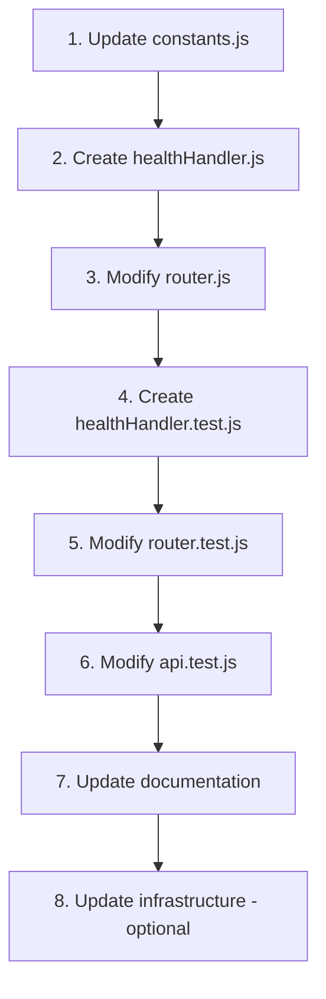

# Technical Specification

# 0. Agent Action Plan

## 0.1 Intent Clarification

### 0.1.1 Core Feature Objective

Based on the prompt, the Blitzy platform understands that the new feature requirement is to:

- **Add a dedicated health check endpoint** at the path `/health` that serves as a lightweight server status indicator
- **Return HTTP 200 OK status code** when the endpoint is successfully invoked, indicating the server is operational
- **Return an empty response body** - no content, message, or payload should be included in the response
- **Support GET HTTP method exclusively** - the endpoint must only respond to GET requests
- **Reject POST method (and all other non-GET methods)** with an appropriate 405 Method Not Allowed response

**Implicit Requirements Detected:**

- The `/health` endpoint must follow the existing architectural patterns established by the `/hello` endpoint
- The endpoint must integrate with the existing router module's route matching system
- Error handling for non-GET methods must use the existing `handle405` function for consistency
- Logging should be integrated using the existing logger utility
- Constants for the new route should be added to the centralized constants module
- The endpoint must not require authentication or special headers
- Response Content-Type should follow the existing pattern (text/plain) even for empty body

**Feature Dependencies and Prerequisites:**

| Prerequisite | Description |
|-------------|-------------|
| F-001: HTTP Server | Health endpoint requires the existing server infrastructure |
| F-006: Request Routing | Health endpoint must be registered in the router |
| F-004: Error Handling | 405 responses for non-GET requests |
| F-007: Logging System | Request/response logging integration |

### 0.1.2 Special Instructions and Constraints

**Critical User Directive:** The user explicitly specified that the endpoint should:

> "Add a /health endpoint that return 200 OK when invoked with no response body. This endpoint should only support GET not POST"

**Architectural Requirements:**

- Follow the existing handler pattern used by `handleHelloRequest` in `src/backend/handlers/helloHandler.js`
- Maintain consistency with existing code style (ESLint/Prettier configuration in place)
- Use the existing constants-based approach for HTTP status codes, routes, and messages
- Integrate with the existing test infrastructure (Jest + Supertest)

**Backward Compatibility:**

- The existing `/hello` endpoint must remain fully functional
- No changes to the existing endpoint's behavior or response format
- Existing tests must continue to pass

**User Example (Corrected):**

Note: The user wrote "/heath" but this appears to be a typo for "/health" - a standard health check endpoint naming convention used in production systems.

### 0.1.3 Technical Interpretation

These feature requirements translate to the following technical implementation strategy:

- **To implement the health endpoint**, we will create a new handler file `src/backend/handlers/healthHandler.js` following the exact same structural pattern as the existing `helloHandler.js`
- **To register the route**, we will modify `src/backend/router.js` to add the `/health` path to the route matching logic and import the new handler
- **To maintain centralized constants**, we will modify `src/backend/utils/constants.js` to add the new `HEALTH` route constant
- **To ensure test coverage**, we will create new test files for unit tests (`__tests__/handlers/healthHandler.test.js`) and update integration tests (`__tests__/integration/api.test.js`)
- **To support infrastructure health checks**, we will optionally update `infrastructure/local/docker-compose.yml` and `infrastructure/scripts/health-check.sh` to use the new dedicated health endpoint
- **To document the feature**, we will update `README.md` and `src/backend/README.md` with API documentation for the new endpoint

**Response Specification:**

| Attribute | Value |
|-----------|-------|
| Path | `/health` |
| Method | GET only |
| Status Code | 200 OK |
| Content-Type | text/plain |
| Response Body | Empty (no content) |
| Error Response | 405 Method Not Allowed for non-GET methods |


## 0.2 Repository Scope Discovery

### 0.2.1 Comprehensive File Analysis

**Existing Files Requiring Modification:**

| File Path | Purpose | Modification Type |
|-----------|---------|-------------------|
| `src/backend/router.js` | Request routing | Add health route handler import and routing logic |
| `src/backend/utils/constants.js` | Centralized constants | Add HEALTH route constant |
| `src/backend/__tests__/router.test.js` | Router unit tests | Add tests for /health routing |
| `src/backend/__tests__/integration/api.test.js` | API integration tests | Add health endpoint tests |
| `README.md` | Project documentation | Add /health API documentation |
| `src/backend/README.md` | Backend documentation | Add health endpoint to module map |
| `infrastructure/local/docker-compose.yml` | Docker health check | Update healthcheck to use /health (optional) |
| `infrastructure/scripts/health-check.sh` | Health check script | Update to support /health endpoint (optional) |

**Integration Point Discovery:**

- **Router Integration (`src/backend/router.js`):**
  - Lines 13-16: Import section - add health handler import
  - Lines 23-36: `matchRoute()` function - add health route condition
  - Route matching follows exact-path pattern with trailing slash normalization

- **Constants Integration (`src/backend/utils/constants.js`):**
  - Lines 29-33: `ROUTES` object - add `HEALTH: '/health'` constant
  
- **Error Handler Integration (`src/backend/errorHandler.js`):**
  - `handle405()` function already exists and will be reused for non-GET method rejection

**Search Patterns Applied:**

| Pattern | Files Found | Relevance |
|---------|-------------|-----------|
| `src/backend/**/*.js` | 7 source files | Core application code |
| `src/backend/handlers/**/*.js` | 1 handler file | Handler patterns to follow |
| `src/backend/__tests__/**/*.test.js` | 8 test files | Test patterns to follow |
| `**/*.md` | 7 documentation files | Documentation updates |
| `infrastructure/**/*` | 5 infrastructure files | Container/script updates |

### 0.2.2 Web Search Research Conducted

The implementation follows established Node.js patterns already present in the codebase:

- **Health check endpoint best practices:** The `/health` endpoint follows industry-standard conventions for Kubernetes liveness probes, Docker health checks, and load balancer health verification
- **HTTP response patterns:** Returning 200 OK with no body is a valid and efficient approach for health checks
- **Method restriction patterns:** Using 405 Method Not Allowed for unsupported methods follows RFC 7231 HTTP semantics

### 0.2.3 New File Requirements

**New Source Files to Create:**

| File Path | Purpose |
|-----------|---------|
| `src/backend/handlers/healthHandler.js` | Health endpoint request handler implementing GET /health -> 200 OK with empty body |

**New Test Files to Create:**

| File Path | Purpose |
|-----------|---------|
| `src/backend/__tests__/handlers/healthHandler.test.js` | Unit tests for health handler: GET returns 200, non-GET calls handle405 |

**File Structure After Implementation:**

```
src/backend/
├── handlers/
│   ├── helloHandler.js          # Existing - unchanged
│   └── healthHandler.js         # NEW - health endpoint handler
├── __tests__/
│   ├── handlers/
│   │   ├── helloHandler.test.js # Existing - unchanged  
│   │   └── healthHandler.test.js # NEW - health handler tests
│   ├── integration/
│   │   └── api.test.js          # MODIFY - add health endpoint tests
│   └── router.test.js           # MODIFY - add health route tests
├── router.js                    # MODIFY - add health route
└── utils/
    └── constants.js             # MODIFY - add HEALTH constant
```

### 0.2.4 Detailed File Inventory

**Handler File Pattern (to follow):**

Based on `src/backend/handlers/helloHandler.js`:
- Export named handler function
- Import constants from `../utils/constants`
- Import logger from `../utils/logger`
- Import error handlers from `../errorHandler`
- Validate HTTP method (GET only)
- Set response status code and headers
- Call `res.end()` with appropriate body

**Test Pattern (to follow):**

Based on `src/backend/__tests__/handlers/helloHandler.test.js`:
- Mock error handler module
- Mock logger module
- Create mock request/response objects in `beforeEach`
- Test GET method success case
- Test non-GET methods call handle405
- Use `jest.clearAllMocks()` in `afterEach`


## 0.3 Dependency Inventory

### 0.3.1 Private and Public Packages

**Key Packages Relevant to Health Endpoint Feature:**

| Registry | Package Name | Version | Purpose |
|----------|--------------|---------|---------|
| Node.js Core | `http` | Built-in | Native HTTP server module (no install needed) |
| Node.js Core | `url` | Built-in | URL parsing for routing (no install needed) |
| npm (devDependency) | `jest` | ^29.5.0 | Testing framework for unit tests |
| npm (devDependency) | `supertest` | ^6.3.3 | HTTP assertion library for integration tests |
| npm (devDependency) | `eslint` | ^8.x | Code linting |
| npm (devDependency) | `prettier` | ^2.x | Code formatting |
| npm (devDependency) | `nodemon` | ^2.x | Development auto-restart |

**Critical Note:** This project uses **zero runtime dependencies** - only Node.js core modules. The health endpoint implementation requires no new packages.

### 0.3.2 Dependency Updates

**No New Dependencies Required:**

The health endpoint feature will be implemented using existing patterns and core modules. No changes to `package.json` or `package-lock.json` are required.

**Import Updates:**

Files requiring import statement updates:

| File | Import Changes |
|------|----------------|
| `src/backend/router.js` | Add: `const { handleHealthRequest } = require('./handlers/healthHandler');` |

**Internal Import Pattern (existing):**

```javascript
// Standard pattern in handlers
const { HTTP_STATUS, MESSAGES, HEADERS, HTTP_METHODS } = require('../utils/constants');
const logger = require('../utils/logger');
const { handle405 } = require('../errorHandler');
```

### 0.3.3 Constants Module Updates

**File:** `src/backend/utils/constants.js`

**ROUTES Object Update:**

Current:
```javascript
const ROUTES = {
  HELLO: '/hello'
};
```

Required Update:
```javascript
const ROUTES = {
  HELLO: '/hello',
  HEALTH: '/health'
};
```

**No Other Constant Changes Required:**

- `HTTP_STATUS.OK` (200) - Already exists
- `HTTP_METHODS.GET` - Already exists
- `HEADERS.CONTENT_TYPE` - Already exists
- `HEADERS.CONTENT_TYPE_TEXT` - Already exists

### 0.3.4 External Reference Updates

**Documentation Files:**

| File | Update Description |
|------|-------------------|
| `README.md` | Add `/health` endpoint to API Documentation section |
| `src/backend/README.md` | Add `healthHandler.js` to module map, document endpoint |
| `src/backend/CHANGELOG.md` | Add entry for new health endpoint feature |

**Infrastructure Files (Optional):**

| File | Update Description |
|------|-------------------|
| `infrastructure/local/docker-compose.yml` | Update healthcheck test command from `/hello` to `/health` |
| `infrastructure/scripts/health-check.sh` | Update DEFAULT_ENDPOINT from `/hello` to `/health` |
| `infrastructure/README.md` | Update health check documentation |

**CI/CD Files:**

No changes required to GitHub Actions workflows - the existing test commands will automatically run the new tests.


## 0.4 Integration Analysis

### 0.4.1 Existing Code Touchpoints

**Direct Modifications Required:**

| File | Location | Change Description |
|------|----------|-------------------|
| `src/backend/router.js` | Line 13 (imports) | Add import for `handleHealthRequest` |
| `src/backend/router.js` | Lines 29-32 (`matchRoute`) | Add conditional for `ROUTES.HEALTH` |
| `src/backend/utils/constants.js` | Lines 30-32 (`ROUTES`) | Add `HEALTH: '/health'` property |
| `src/backend/__tests__/router.test.js` | Import section | Add health handler mock |
| `src/backend/__tests__/router.test.js` | Test cases | Add health route test cases |
| `src/backend/__tests__/integration/api.test.js` | Test cases | Add health endpoint integration tests |

**Router Integration Points:**

The router module (`src/backend/router.js`) uses a pattern-matching approach:

```javascript
// Current matchRoute function structure (lines 23-36)
function matchRoute(path) {
  const normalizedPath = path.endsWith('/') && path.length > 1 
    ? path.slice(0, -1) 
    : path;
  
  if (normalizedPath === ROUTES.HELLO) {
    return handleHelloRequest;
  }
  
  // NEW: Add health route condition here
  // if (normalizedPath === ROUTES.HEALTH) {
  //   return handleHealthRequest;
  // }
  
  return null;
}
```

**Error Handler Integration:**

The existing `handle405` function in `src/backend/errorHandler.js` will be reused without modification:

```javascript
// Already implemented - lines 71-83
function handle405(res) {
  res.statusCode = HTTP_STATUS.METHOD_NOT_ALLOWED;
  res.setHeader(HEADERS.CONTENT_TYPE, HEADERS.CONTENT_TYPE_TEXT);
  res.setHeader(HEADERS.ALLOW, HTTP_METHODS.GET);
  res.end(MESSAGES.METHOD_NOT_ALLOWED);
}
```

### 0.4.2 Dependency Injections

**No New Dependencies to Inject:**

The health handler will use the same dependency pattern as existing handlers:

| Dependency | Source | Usage |
|------------|--------|-------|
| Constants | `../utils/constants` | HTTP_STATUS, HEADERS, HTTP_METHODS |
| Logger | `../utils/logger` | Request logging |
| Error Handler | `../errorHandler` | handle405 for non-GET methods |

### 0.4.3 Test Infrastructure Integration

**Unit Test Integration (`__tests__/handlers/healthHandler.test.js`):**

Follow the established pattern from `helloHandler.test.js`:

| Mock | Purpose |
|------|---------|
| `jest.mock('../../errorHandler')` | Mock handle405 function |
| `jest.mock('../../utils/logger')` | Mock logger.info and logger.error |

**Integration Test Integration (`__tests__/integration/api.test.js`):**

Add test cases following existing pattern:

| Test Case | Expected Behavior |
|-----------|-------------------|
| `GET /health` | 200 OK, empty body, Content-Type: text/plain |
| `POST /health` | 405 Method Not Allowed, Allow: GET header |
| `PUT /health` | 405 Method Not Allowed, Allow: GET header |
| `DELETE /health` | 405 Method Not Allowed, Allow: GET header |

**Router Test Integration (`__tests__/router.test.js`):**

| Test Case | Expected Behavior |
|-----------|-------------------|
| `/health` route | Routes to handleHealthRequest |
| `/health/` route | Normalizes and routes to handleHealthRequest |
| `/health?param=value` | Parses path and routes correctly |

### 0.4.4 Infrastructure Integration

**Docker Compose Health Check (`infrastructure/local/docker-compose.yml`):**

Current:
```yaml
healthcheck:
  test: ["CMD", "curl", "-f", "http://localhost:3000/hello"]
```

Recommended Update:
```yaml
healthcheck:
  test: ["CMD", "curl", "-f", "http://localhost:3000/health"]
```

**Health Check Script (`infrastructure/scripts/health-check.sh`):**

Variables to update:
```bash
# Current
DEFAULT_ENDPOINT="/hello"
DEFAULT_EXPECTED_RESPONSE="Hello world"

#### Recommended Update for health-specific mode
DEFAULT_ENDPOINT="/health"
DEFAULT_EXPECTED_RESPONSE=""
```

### 0.4.5 Logging Integration

The health handler will integrate with the existing logger:

| Log Event | Logger Method | Message Pattern |
|-----------|--------------|-----------------|
| Request received | `logger.info()` | "Handling {method} request to /health endpoint" |
| Success response | `logger.info()` | "Successfully responded with 200 OK" |
| Invalid method | `logger.error()` | "Received unsupported {method} method, expected GET" |


## 0.5 Technical Implementation

### 0.5.1 File-by-File Execution Plan

**CRITICAL: Every file listed here MUST be created or modified**

**Group 1 - Core Feature Files:**

| Action | File | Implementation Details |
|--------|------|----------------------|
| CREATE | `src/backend/handlers/healthHandler.js` | Implement health endpoint handler with GET-only validation |
| MODIFY | `src/backend/router.js` | Add health route to matchRoute function and import handler |
| MODIFY | `src/backend/utils/constants.js` | Add HEALTH route constant to ROUTES object |

**Group 2 - Test Files:**

| Action | File | Implementation Details |
|--------|------|----------------------|
| CREATE | `src/backend/__tests__/handlers/healthHandler.test.js` | Unit tests for health handler (GET success, non-GET rejection) |
| MODIFY | `src/backend/__tests__/router.test.js` | Add test cases for /health route matching |
| MODIFY | `src/backend/__tests__/integration/api.test.js` | Add integration tests for health endpoint HTTP behavior |

**Group 3 - Documentation:**

| Action | File | Implementation Details |
|--------|------|----------------------|
| MODIFY | `README.md` | Add /health endpoint to API Documentation section |
| MODIFY | `src/backend/README.md` | Update module map with healthHandler.js |
| MODIFY | `src/backend/CHANGELOG.md` | Add health endpoint feature entry |

**Group 4 - Infrastructure (Optional):**

| Action | File | Implementation Details |
|--------|------|----------------------|
| MODIFY | `infrastructure/local/docker-compose.yml` | Update healthcheck endpoint from /hello to /health |
| MODIFY | `infrastructure/scripts/health-check.sh` | Update default endpoint and expected response |

### 0.5.2 Implementation Approach per File

**File 1: `src/backend/handlers/healthHandler.js` (CREATE)**

Purpose: Health endpoint request handler

Implementation Pattern:
```javascript
// Import pattern from existing handler
const { HTTP_STATUS, HEADERS, HTTP_METHODS } = require('../utils/constants');
const logger = require('../utils/logger');
const { handle405 } = require('../errorHandler');

function handleHealthRequest(req, res) {
  // Validate GET method, return empty 200 OK
  // Non-GET methods delegate to handle405
}

module.exports = { handleHealthRequest };
```

Key Behaviors:
- Check if `req.method === 'GET'`
- Set `res.statusCode = 200`
- Set `Content-Type: text/plain` header
- Call `res.end()` with empty string (no body)
- Non-GET methods call `handle405(res)`

**File 2: `src/backend/router.js` (MODIFY)**

Purpose: Add health route registration

Changes Required:
- Add import: `const { handleHealthRequest } = require('./handlers/healthHandler');`
- Add condition in `matchRoute()`:
```javascript
if (normalizedPath === ROUTES.HEALTH) {
  return handleHealthRequest;
}
```

**File 3: `src/backend/utils/constants.js` (MODIFY)**

Purpose: Add health route constant

Changes Required:
```javascript
const ROUTES = {
  HELLO: '/hello',
  HEALTH: '/health'  // Add this line
};
```

**File 4: `src/backend/__tests__/handlers/healthHandler.test.js` (CREATE)**

Purpose: Unit tests for health handler

Test Cases:
- GET request returns 200 OK with empty body
- POST request calls handle405
- PUT request calls handle405
- DELETE request calls handle405
- Logger is called appropriately

**File 5: `src/backend/__tests__/router.test.js` (MODIFY)**

Purpose: Add health route tests

Test Cases to Add:
- Route `/health` to handleHealthRequest
- Route `/health/` (with trailing slash) correctly
- Route `/health?param=value` (with query string) correctly

**File 6: `src/backend/__tests__/integration/api.test.js` (MODIFY)**

Purpose: Add health endpoint integration tests

Test Cases to Add:
- `GET /health` returns 200 OK with empty body
- `POST /health` returns 405 Method Not Allowed
- `PUT /health` returns 405 Method Not Allowed
- `DELETE /health` returns 405 Method Not Allowed

### 0.5.3 Implementation Sequence

The implementation should follow this order to ensure proper dependency resolution:



**Rationale:**
1. Constants must be defined first (ROUTES.HEALTH)
2. Handler uses the constant and can be created next
3. Router imports the handler and uses the constant
4. Unit tests can then be written for the handler
5. Router tests verify route registration
6. Integration tests verify end-to-end behavior
7. Documentation reflects the implemented feature
8. Infrastructure updates can be done last as optional enhancement


## 0.6 Scope Boundaries

### 0.6.1 Exhaustively In Scope

**Core Source Files:**

| Pattern/Path | Purpose |
|-------------|---------|
| `src/backend/handlers/healthHandler.js` | NEW: Health endpoint handler implementation |
| `src/backend/router.js` | MODIFY: Add health route registration |
| `src/backend/utils/constants.js` | MODIFY: Add ROUTES.HEALTH constant |

**Test Files:**

| Pattern/Path | Purpose |
|-------------|---------|
| `src/backend/__tests__/handlers/healthHandler.test.js` | NEW: Health handler unit tests |
| `src/backend/__tests__/router.test.js` | MODIFY: Health route matching tests |
| `src/backend/__tests__/integration/api.test.js` | MODIFY: Health endpoint integration tests |

**Documentation Files:**

| Pattern/Path | Purpose |
|-------------|---------|
| `README.md` | MODIFY: Add /health API documentation section |
| `src/backend/README.md` | MODIFY: Add healthHandler to module map |
| `src/backend/CHANGELOG.md` | MODIFY: Add health endpoint feature entry |

**Infrastructure Files (Optional Enhancement):**

| Pattern/Path | Purpose |
|-------------|---------|
| `infrastructure/local/docker-compose.yml` | OPTIONAL: Update healthcheck endpoint |
| `infrastructure/scripts/health-check.sh` | OPTIONAL: Support /health endpoint option |
| `infrastructure/README.md` | OPTIONAL: Update health check documentation |

### 0.6.2 Explicitly Out of Scope

**Features and Functionality NOT Included:**

| Item | Reason |
|------|--------|
| Response body content | User explicitly requested "no response body" |
| Authentication/Authorization | Not specified, health endpoints typically public |
| Rate limiting | Not requested, out of feature scope |
| Detailed health metrics | Simple 200 OK is sufficient per requirements |
| Database connectivity checks | No database in this application |
| Dependency health verification | Not applicable - zero runtime dependencies |
| Custom HTTP headers | Only standard Content-Type required |
| HEAD method support | Only GET explicitly requested |
| OPTIONS method support | Not requested |
| PATCH method support | Not requested |

**Unrelated Files That Should NOT Be Modified:**

| File | Reason |
|------|--------|
| `src/backend/handlers/helloHandler.js` | Unrelated endpoint, must remain unchanged |
| `src/backend/server.js` | Server infrastructure unchanged |
| `src/backend/index.js` | Application bootstrap unchanged |
| `src/backend/config.js` | Configuration module unchanged |
| `src/backend/errorHandler.js` | Already has handle405, no changes needed |
| `src/backend/utils/logger.js` | Logger utility unchanged |
| `.github/workflows/*.yml` | CI/CD unchanged - tests auto-discovered |
| `Dockerfile` | Container build unchanged |
| `.env.example` | No new environment variables |

**Performance Optimizations NOT Included:**

- Response caching
- Connection pooling (not applicable)
- Load testing benchmarks
- Micro-optimization of handler code

**Refactoring NOT Included:**

- Consolidating handlers into single file
- Changing existing route patterns
- Modifying logging format
- Restructuring test organization

### 0.6.3 Boundary Conditions

**Route Path Handling:**

| Input | Expected Behavior | In Scope |
|-------|-------------------|----------|
| `GET /health` | 200 OK, empty body | ✅ Yes |
| `GET /health/` | 200 OK (normalized) | ✅ Yes |
| `GET /health?foo=bar` | 200 OK (query ignored) | ✅ Yes |
| `POST /health` | 405 Method Not Allowed | ✅ Yes |
| `PUT /health` | 405 Method Not Allowed | ✅ Yes |
| `DELETE /health` | 405 Method Not Allowed | ✅ Yes |
| `GET /healthcheck` | 404 Not Found | ✅ Yes (no change) |
| `GET /health/detailed` | 404 Not Found | ✅ Yes (no change) |

**Response Requirements:**

| Attribute | Required Value | Verified By |
|-----------|---------------|-------------|
| Status Code | 200 | Integration test |
| Body | Empty string | Integration test |
| Content-Type | text/plain | Integration test |
| Allow Header (405) | GET | Integration test |


## 0.7 Special Instructions

### 0.7.1 Feature-Specific Requirements

**User-Specified Constraints:**

| Constraint | Implementation Impact |
|------------|----------------------|
| GET method only | Handler must validate `req.method === 'GET'` |
| No POST support | POST requests must return 405, not 404 |
| 200 OK response | `res.statusCode = HTTP_STATUS.OK` |
| No response body | `res.end('')` with empty string |

**Pattern Consistency Requirements:**

The health handler must follow existing patterns in the codebase:

| Pattern | Source Reference | Application |
|---------|-----------------|-------------|
| Handler structure | `src/backend/handlers/helloHandler.js` | Same function signature and export pattern |
| Route registration | `src/backend/router.js` lines 29-32 | Same conditional check pattern |
| Constant usage | `src/backend/utils/constants.js` | Use HTTP_STATUS, HEADERS, ROUTES |
| Test structure | `src/backend/__tests__/handlers/helloHandler.test.js` | Same mocking and assertion patterns |
| Error handling | `src/backend/errorHandler.js` | Reuse existing handle405 function |

### 0.7.2 Code Style Requirements

**ESLint Configuration (enforced via `src/backend/.eslintrc.js`):**

- Single quotes for strings
- Semicolons required
- No var declarations (use const/let)
- Prefer const where possible
- Strict equality (===) required

**Prettier Configuration (enforced via `src/backend/.prettierrc`):**

- Single quotes
- Trailing commas
- 100 character line width
- 2-space indentation
- Semicolons

### 0.7.3 Testing Requirements

**Coverage Targets (from `src/backend/jest.config.js`):**

| Metric | Threshold |
|--------|-----------|
| Statements | 90% |
| Branches | 85% |
| Functions | 95% |
| Lines | 90% |

**Required Test Cases for Health Handler:**

| Test Case | Category | Expected Result |
|-----------|----------|-----------------|
| GET request success | Unit | 200 OK, empty body |
| POST rejection | Unit | handle405 called |
| PUT rejection | Unit | handle405 called |
| DELETE rejection | Unit | handle405 called |
| Logger calls | Unit | info() called with request details |
| Integration GET | Integration | HTTP 200, Content-Type: text/plain, empty body |
| Integration POST | Integration | HTTP 405, Allow: GET header |

### 0.7.4 Documentation Requirements

**README.md Updates:**

Add new section to API Documentation:

```
### GET /health

Returns an empty response to indicate server health status.

**Request:**
- Method: GET
- Path: `/health`
- Headers: None required
- Body: None

**Response:**
- Status: 200 OK
- Content-Type: text/plain
- Body: (empty)

**Error Responses:**
- 405 Method Not Allowed: If any HTTP method other than GET is used
```

**src/backend/README.md Updates:**

Add to module map:
- `handlers/healthHandler.js` - Health check endpoint handler

**src/backend/CHANGELOG.md Updates:**

Add to Unreleased section:
```
### Added
- Health check endpoint (`GET /health`) returning 200 OK with empty body
```

### 0.7.5 Infrastructure Considerations

**Docker Health Check (Optional):**

The new `/health` endpoint is ideal for container health checks because:
- No response body parsing required
- Minimal resource consumption
- Fast response time
- Purpose-built for health verification

**Kubernetes Readiness/Liveness Probes (Future):**

The `/health` endpoint can serve as:
- Liveness probe: Verify server is running
- Readiness probe: Verify server can accept requests

### 0.7.6 Security Considerations

**Public Accessibility:**

The `/health` endpoint should be:
- Publicly accessible without authentication
- Not expose sensitive system information
- Return minimal response data (empty body)

**No Sensitive Data:**

The endpoint must NOT return:
- Server version information
- Internal IP addresses
- Database connection status
- Environment variables
- Stack traces or error details

### 0.7.7 Verification Checklist

After implementation, verify:

- [ ] `GET /health` returns 200 OK
- [ ] Response body is empty
- [ ] Content-Type header is text/plain
- [ ] `POST /health` returns 405 Method Not Allowed
- [ ] Allow header contains "GET" for 405 responses
- [ ] All existing tests still pass
- [ ] New tests achieve required coverage thresholds
- [ ] ESLint reports no errors
- [ ] Prettier formatting is correct
- [ ] Documentation is updated


