# Technical Specifications

## 1. INTRODUCTION

### EXECUTIVE SUMMARY

| Aspect | Description |
|--------|-------------|
| Project Overview | A simple Node.js HTTP server application that exposes a single REST endpoint `/hello` which returns "Hello world" to clients |
| Business Problem | Provides a minimal, functional example of a Node.js web service that can serve as a learning tool or starter template |
| Key Stakeholders | Developers learning Node.js, technical trainers, software engineers requiring a baseline implementation |
| Value Proposition | Demonstrates fundamental Node.js web service concepts with minimal complexity, enabling rapid learning and prototyping |

### SYSTEM OVERVIEW

#### Project Context

The Node.js Hello World service operates as a standalone educational tool that demonstrates:
- Basic HTTP server implementation in Node.js
- RESTful endpoint design and implementation
- Modern JavaScript server-side development practices
- Foundational web service architecture

This project does not replace any existing system but serves as an entry point for Node.js development education.

#### High-Level Description

| Component | Description |
|-----------|-------------|
| Primary Capabilities | HTTP request handling, response generation, and server lifecycle management |
| Major Components | Node.js runtime, HTTP server module, route handler for `/hello` endpoint |
| Technical Approach | Lightweight, dependency-minimal implementation using Node.js core modules |

#### Success Criteria

| Criteria Type | Description |
|---------------|-------------|
| Measurable Objectives | - Server successfully starts and listens on configured port<br>- `/hello` endpoint returns "Hello world" with 200 status code<br>- Documentation enables new developers to understand and run the service |
| Critical Success Factors | - Code simplicity and readability<br>- Proper error handling<br>- Clear documentation |
| Key Performance Indicators | - Time to understand (for new developers)<br>- Time to deploy<br>- Response time under load |

### SCOPE

#### In-Scope

**Core Features and Functionalities:**
- HTTP server implementation using Node.js
- Single `/hello` endpoint returning "Hello world" text response
- Basic error handling for server startup
- Proper HTTP status codes and headers

**Implementation Boundaries:**
- Single-server architecture
- Local development environment support
- Command-line interface for server management
- Standard HTTP protocol support

#### Out-of-Scope

- Authentication and authorization mechanisms
- Database integration
- Multiple endpoints beyond `/hello`
- Production deployment configurations
- Containerization or orchestration
- Logging infrastructure beyond console output
- Performance optimization beyond basic practices
- Client-side application or interface
- Testing frameworks and automated tests
- Continuous integration/deployment pipelines

## 2. PRODUCT REQUIREMENTS

### FEATURE CATALOG

#### Feature Metadata

| ID | Feature Name | Feature Category | Priority Level | Status |
|----|--------------|------------------|----------------|--------|
| F-001 | HTTP Server | Core Infrastructure | Critical | Proposed |
| F-002 | Hello Endpoint | API | Critical | Proposed |
| F-003 | Server Configuration | Infrastructure | High | Proposed |
| F-004 | Error Handling | Reliability | High | Proposed |

#### Feature Descriptions

**F-001: HTTP Server**

| Aspect | Description |
|--------|-------------|
| Overview | A Node.js HTTP server that listens for incoming requests on a configurable port |
| Business Value | Provides the foundation for serving web content and API responses |
| User Benefits | Enables developers to understand basic Node.js server implementation |
| Technical Context | Uses Node.js core HTTP module to create and manage server lifecycle |

**Dependencies:**
- System Dependencies: Node.js runtime environment
- External Dependencies: None
- Integration Requirements: None

**F-002: Hello Endpoint**

| Aspect | Description |
|--------|-------------|
| Overview | REST endpoint at path `/hello` that returns "Hello world" text response |
| Business Value | Demonstrates basic API implementation and request handling |
| User Benefits | Provides a working example of endpoint implementation |
| Technical Context | Implements request routing and response generation |

**Dependencies:**
- Prerequisite Features: F-001 (HTTP Server)
- System Dependencies: None
- External Dependencies: None
- Integration Requirements: None

**F-003: Server Configuration**

| Aspect | Description |
|--------|-------------|
| Overview | Configuration mechanism for server port and basic settings |
| Business Value | Enables flexibility in deployment and operation |
| User Benefits | Allows customization without code changes |
| Technical Context | Environment variables or configuration file for server settings |

**Dependencies:**
- Prerequisite Features: F-001 (HTTP Server)
- System Dependencies: None
- External Dependencies: None
- Integration Requirements: None

**F-004: Error Handling**

| Aspect | Description |
|--------|-------------|
| Overview | Basic error handling for server startup and request processing |
| Business Value | Improves reliability and troubleshooting capabilities |
| User Benefits | Provides clear feedback when errors occur |
| Technical Context | Implements try/catch blocks and error event listeners |

**Dependencies:**
- Prerequisite Features: F-001 (HTTP Server)
- System Dependencies: None
- External Dependencies: None
- Integration Requirements: None

### FUNCTIONAL REQUIREMENTS TABLE

**F-001: HTTP Server**

| Requirement ID | Description | Acceptance Criteria | Priority |
|----------------|-------------|---------------------|----------|
| F-001-RQ-001 | Server must initialize and listen on a specified port | Server starts without errors and listens on configured port | Must-Have |
| F-001-RQ-002 | Server must handle incoming HTTP requests | Server receives and processes HTTP requests | Must-Have |
| F-001-RQ-003 | Server must be stoppable via process signals | Server shuts down gracefully when receiving SIGINT or SIGTERM | Should-Have |

**Technical Specifications:**
- Input Parameters: Port number (default: 3000)
- Output/Response: Running HTTP server instance
- Performance Criteria: Server startup time < 1 second
- Data Requirements: None

**Validation Rules:**
- Business Rules: None
- Data Validation: Port number must be a valid integer between 1024-65535
- Security Requirements: None
- Compliance Requirements: None

**F-002: Hello Endpoint**

| Requirement ID | Description | Acceptance Criteria | Priority |
|----------------|-------------|---------------------|----------|
| F-002-RQ-001 | Implement `/hello` endpoint that returns "Hello world" | GET request to `/hello` returns "Hello world" text with 200 status code | Must-Have |
| F-002-RQ-002 | Endpoint must use proper content type | Response includes `Content-Type: text/plain` header | Must-Have |
| F-002-RQ-003 | Endpoint must handle all HTTP methods | Non-GET methods return appropriate status code (405 Method Not Allowed) | Should-Have |

**Technical Specifications:**
- Input Parameters: HTTP request to `/hello` path
- Output/Response: "Hello world" text with 200 status code
- Performance Criteria: Response time < 50ms
- Data Requirements: None

**Validation Rules:**
- Business Rules: None
- Data Validation: None
- Security Requirements: None
- Compliance Requirements: None

**F-003: Server Configuration**

| Requirement ID | Description | Acceptance Criteria | Priority |
|----------------|-------------|---------------------|----------|
| F-003-RQ-001 | Server port must be configurable | Server uses port from environment variable if available | Should-Have |
| F-003-RQ-002 | Server must have sensible defaults | Server uses default port 3000 if no configuration provided | Must-Have |

**Technical Specifications:**
- Input Parameters: PORT environment variable
- Output/Response: None
- Performance Criteria: None
- Data Requirements: None

**Validation Rules:**
- Business Rules: None
- Data Validation: Port must be a valid number
- Security Requirements: None
- Compliance Requirements: None

**F-004: Error Handling**

| Requirement ID | Description | Acceptance Criteria | Priority |
|----------------|-------------|---------------------|----------|
| F-004-RQ-001 | Server must handle startup errors | Server logs clear error message if it fails to start | Must-Have |
| F-004-RQ-002 | Server must handle request processing errors | Server returns 500 status code when internal errors occur | Should-Have |

**Technical Specifications:**
- Input Parameters: Error events
- Output/Response: Error messages to console
- Performance Criteria: None
- Data Requirements: None

**Validation Rules:**
- Business Rules: None
- Data Validation: None
- Security Requirements: None
- Compliance Requirements: None

### FEATURE RELATIONSHIPS

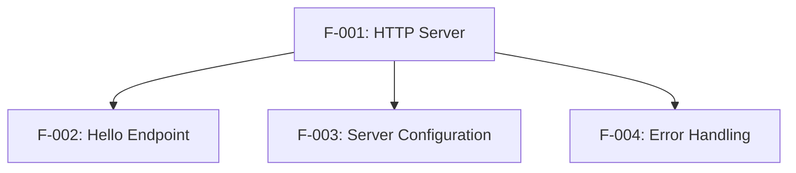
```mermaid
graph TD
    F001[F-001: HTTP Server] --> F002[F-002: Hello Endpoint]
    F001 --> F003[F-003: Server Configuration]
    F001 --> F004[F-004: Error Handling]
```

**Integration Points:**
- The HTTP Server (F-001) provides the foundation for all other features
- Server Configuration (F-003) directly affects HTTP Server initialization
- Error Handling (F-004) is integrated across all server operations

### IMPLEMENTATION CONSIDERATIONS

**F-001: HTTP Server**

| Consideration | Description |
|---------------|-------------|
| Technical Constraints | Use Node.js core modules only |
| Performance Requirements | Low memory footprint, quick startup time |
| Scalability Considerations | None for tutorial project |
| Security Implications | None for basic implementation |
| Maintenance Requirements | Keep Node.js version compatibility in documentation |

**F-002: Hello Endpoint**

| Consideration | Description |
|---------------|-------------|
| Technical Constraints | Implement with minimal code complexity |
| Performance Requirements | Fast response time |
| Scalability Considerations | None for tutorial project |
| Security Implications | None for basic implementation |
| Maintenance Requirements | None |

**F-003: Server Configuration**

| Consideration | Description |
|---------------|-------------|
| Technical Constraints | Use environment variables for configuration |
| Performance Requirements | None |
| Scalability Considerations | None for tutorial project |
| Security Implications | None for basic implementation |
| Maintenance Requirements | Document configuration options |

**F-004: Error Handling**

| Consideration | Description |
|---------------|-------------|
| Technical Constraints | Use standard Node.js error handling patterns |
| Performance Requirements | None |
| Scalability Considerations | None for tutorial project |
| Security Implications | Ensure errors don't expose sensitive information |
| Maintenance Requirements | None |

### TRACEABILITY MATRIX

| Requirement ID | Feature ID | Priority | Status |
|----------------|-----------|----------|--------|
| F-001-RQ-001 | F-001 | Must-Have | Proposed |
| F-001-RQ-002 | F-001 | Must-Have | Proposed |
| F-001-RQ-003 | F-001 | Should-Have | Proposed |
| F-002-RQ-001 | F-002 | Must-Have | Proposed |
| F-002-RQ-002 | F-002 | Must-Have | Proposed |
| F-002-RQ-003 | F-002 | Should-Have | Proposed |
| F-003-RQ-001 | F-003 | Should-Have | Proposed |
| F-003-RQ-002 | F-003 | Must-Have | Proposed |
| F-004-RQ-001 | F-004 | Must-Have | Proposed |
| F-004-RQ-002 | F-004 | Should-Have | Proposed |

## 3. TECHNOLOGY STACK

### PROGRAMMING LANGUAGES

| Component | Language | Version | Justification |
|-----------|----------|---------|---------------|
| Server | JavaScript (Node.js) | Node.js 18.x LTS | Node.js is the ideal choice for this simple HTTP server as it provides built-in HTTP modules, has excellent performance for I/O operations, and is purpose-built for creating web servers with minimal code. The LTS version ensures stability and long-term support. |

### FRAMEWORKS & LIBRARIES

| Component | Framework/Library | Version | Purpose | Justification |
|-----------|-------------------|---------|---------|---------------|
| Core HTTP Server | Node.js HTTP module | Built-in | Server implementation | Using Node.js core HTTP module eliminates external dependencies while providing all necessary functionality for this simple server. This aligns with the minimal complexity requirement stated in the project overview. |

**Compatibility Requirements:**
- Compatible with modern operating systems (Windows, macOS, Linux)
- Requires Node.js 18.x LTS or higher

### OPEN SOURCE DEPENDENCIES

This project intentionally uses no external dependencies beyond the Node.js core modules to maintain simplicity, minimize security risks, and reduce maintenance overhead. This approach aligns with the project's educational purpose and "dependency-minimal implementation" requirement specified in the system overview.

### THIRD-PARTY SERVICES

No third-party services are required for this minimal HTTP server implementation. The server operates as a standalone application without external service dependencies, which aligns with the project's scope limitations.

### DATABASES & STORAGE

No databases or storage solutions are required for this implementation as specified in the out-of-scope section. The application serves static content without data persistence needs.

### DEVELOPMENT & DEPLOYMENT

| Category | Tool/Technology | Version | Purpose |
|----------|-----------------|---------|---------|
| Development Environment | Node.js | 18.x LTS | Runtime environment for JavaScript execution |
| Version Control | Git | 2.x+ | Source code management |
| Package Management | npm | 8.x+ (bundled with Node.js) | Dependency management and script execution |
| Code Editor | Any text editor or IDE | N/A | Development tooling (VS Code recommended) |

**Development Workflow:**
- Local development with direct Node.js execution
- Manual testing with HTTP clients (browser, curl, Postman)

**Deployment Considerations:**
- Simple command-line execution for educational purposes
- No containerization required for basic implementation (listed as out-of-scope)
- No CI/CD pipeline required (listed as out-of-scope)

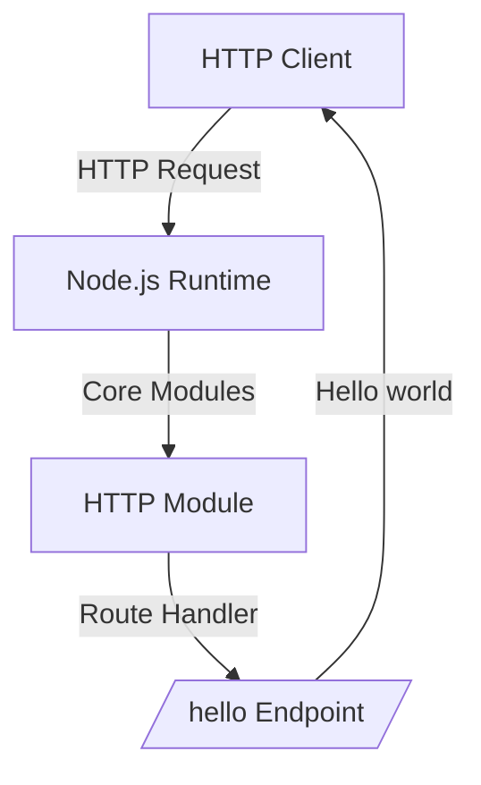
```mermaid
graph TD
    Client[HTTP Client] -->|HTTP Request| NodeJS[Node.js Runtime]
    NodeJS -->|Core Modules| HTTPModule[HTTP Module]
    HTTPModule -->|Route Handler| HelloEndpoint[/hello Endpoint/]
    HelloEndpoint -->|"Hello world"| Client
```

## 4. PROCESS FLOWCHART

### SYSTEM WORKFLOWS

#### Core Business Processes

##### HTTP Request Processing Workflow

```mermaid
flowchart TD
    Start([Client Initiates Request]) --> A[Client sends HTTP request to server]
    A --> B{Server Running?}
    B -->|No| C[Connection Refused]
    C --> ErrorEnd([Request Failed])
    B -->|Yes| D[Server receives request]
    D --> E{Valid Route?}
    E -->|No| F[Generate 404 Not Found]
    F --> J[Send error response]
    J --> End
    E -->|Yes| G{Is /hello endpoint?}
    G -->|No| H[Generate 404 Not Found]
    H --> J
    G -->|Yes| I{HTTP Method?}
    I -->|GET| K[Generate "Hello world" response]
    I -->|Other| L[Generate 405 Method Not Allowed]
    L --> J
    K --> M[Set Content-Type: text/plain]
    M --> N[Set Status Code: 200 OK]
    N --> O[Send response to client]
    O --> End([Request Completed])
```

##### Server Lifecycle Management

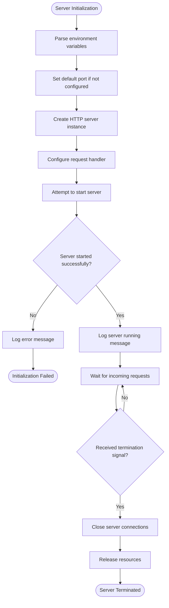
```mermaid
flowchart TD
    Start([Server Initialization]) --> A[Parse environment variables]
    A --> B[Set default port if not configured]
    B --> C[Create HTTP server instance]
    C --> D[Configure request handler]
    D --> E[Attempt to start server]
    E --> F{Server started successfully?}
    F -->|No| G[Log error message]
    G --> ErrorEnd([Initialization Failed])
    F -->|Yes| H[Log server running message]
    H --> I[Wait for incoming requests]
    I --> J{Received termination signal?}
    J -->|No| I
    J -->|Yes| K[Close server connections]
    K --> L[Release resources]
    L --> End([Server Terminated])
```

#### Integration Workflows

##### Client-Server Interaction Flow

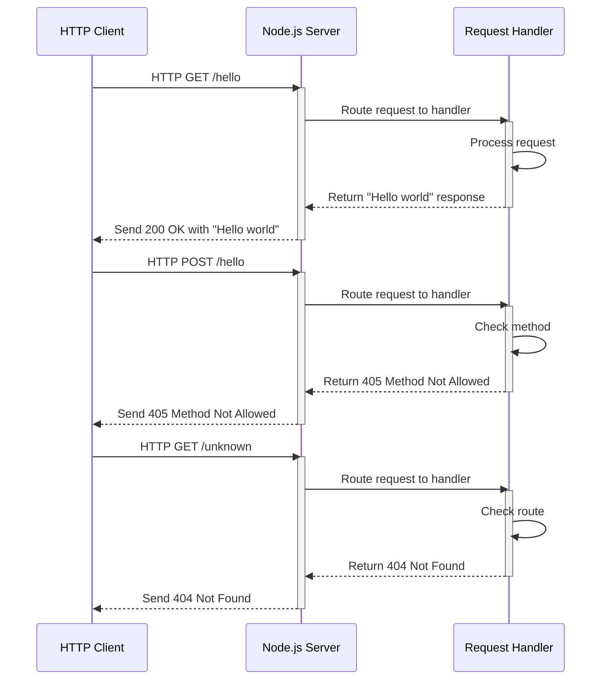
```mermaid
sequenceDiagram
    participant Client as HTTP Client
    participant Server as Node.js Server
    participant Handler as Request Handler
    
    Client->>Server: HTTP GET /hello
    activate Server
    Server->>Handler: Route request to handler
    activate Handler
    Handler->>Handler: Process request
    Handler-->>Server: Return "Hello world" response
    deactivate Handler
    Server-->>Client: Send 200 OK with "Hello world"
    deactivate Server
    
    Client->>Server: HTTP POST /hello
    activate Server
    Server->>Handler: Route request to handler
    activate Handler
    Handler->>Handler: Check method
    Handler-->>Server: Return 405 Method Not Allowed
    deactivate Handler
    Server-->>Client: Send 405 Method Not Allowed
    deactivate Server
    
    Client->>Server: HTTP GET /unknown
    activate Server
    Server->>Handler: Route request to handler
    activate Handler
    Handler->>Handler: Check route
    Handler-->>Server: Return 404 Not Found
    deactivate Handler
    Server-->>Client: Send 404 Not Found
    deactivate Server
```

### FLOWCHART REQUIREMENTS

#### Request Processing Detailed Flow

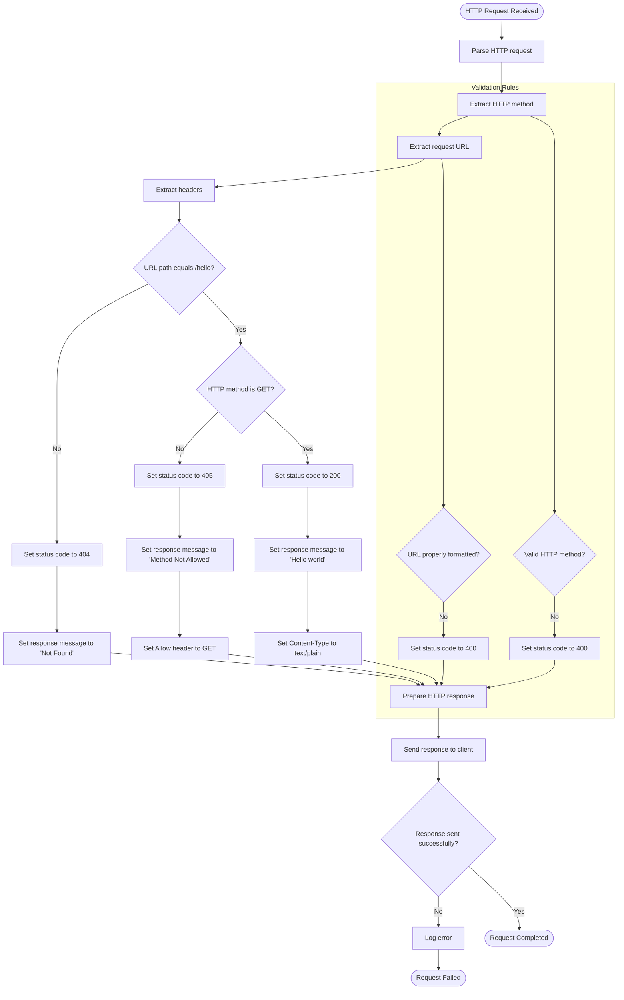
```mermaid
flowchart TD
    Start([HTTP Request Received]) --> A[Parse HTTP request]
    A --> B[Extract HTTP method]
    B --> C[Extract request URL]
    C --> D[Extract headers]
    D --> E{URL path equals /hello?}
    
    E -->|No| F[Set status code to 404]
    F --> G[Set response message to 'Not Found']
    G --> ResponseEnd
    
    E -->|Yes| H{HTTP method is GET?}
    
    H -->|No| I[Set status code to 405]
    I --> J[Set response message to 'Method Not Allowed']
    J --> K[Set Allow header to GET]
    K --> ResponseEnd
    
    H -->|Yes| L[Set status code to 200]
    L --> M[Set response message to 'Hello world']
    M --> N[Set Content-Type to text/plain]
    N --> ResponseEnd[Prepare HTTP response]
    
    ResponseEnd --> O[Send response to client]
    O --> P{Response sent successfully?}
    P -->|No| Q[Log error]
    Q --> ErrorEnd([Request Failed])
    P -->|Yes| End([Request Completed])
    
    subgraph "Validation Rules"
        B --> B1{Valid HTTP method?}
        B1 -->|No| B2[Set status code to 400]
        B2 --> ResponseEnd
        C --> C1{URL properly formatted?}
        C1 -->|No| C2[Set status code to 400]
        C2 --> ResponseEnd
    end
```

#### Error Handling Flow

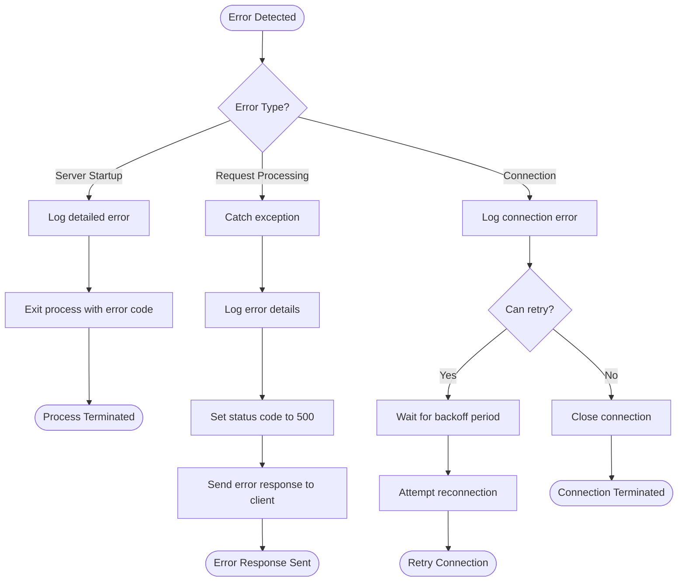
```mermaid
flowchart TD
    Start([Error Detected]) --> A{Error Type?}
    
    A -->|Server Startup| B[Log detailed error]
    B --> C[Exit process with error code]
    C --> End1([Process Terminated])
    
    A -->|Request Processing| D[Catch exception]
    D --> E[Log error details]
    E --> F[Set status code to 500]
    F --> G[Send error response to client]
    G --> End2([Error Response Sent])
    
    A -->|Connection| H[Log connection error]
    H --> I{Can retry?}
    I -->|Yes| J[Wait for backoff period]
    J --> K[Attempt reconnection]
    K --> End3([Retry Connection])
    I -->|No| L[Close connection]
    L --> End4([Connection Terminated])
```

### TECHNICAL IMPLEMENTATION

#### State Management Flow

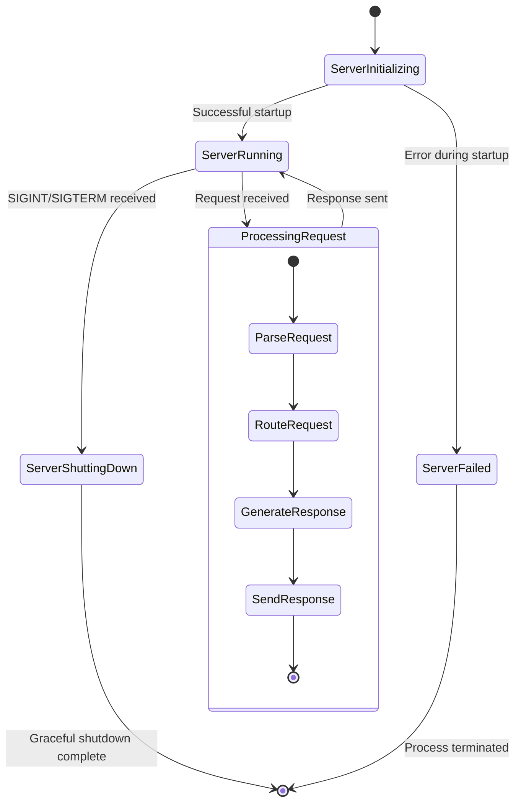
```mermaid
stateDiagram-v2
    [*] --> ServerInitializing
    
    ServerInitializing --> ServerRunning: Successful startup
    ServerInitializing --> ServerFailed: Error during startup
    
    ServerRunning --> ProcessingRequest: Request received
    ProcessingRequest --> ServerRunning: Response sent
    
    ServerRunning --> ServerShuttingDown: SIGINT/SIGTERM received
    ServerShuttingDown --> [*]: Graceful shutdown complete
    
    ServerFailed --> [*]: Process terminated
    
    state ProcessingRequest {
        [*] --> ParseRequest
        ParseRequest --> RouteRequest
        RouteRequest --> GenerateResponse
        GenerateResponse --> SendResponse
        SendResponse --> [*]
    }
```

#### Error Handling Implementation

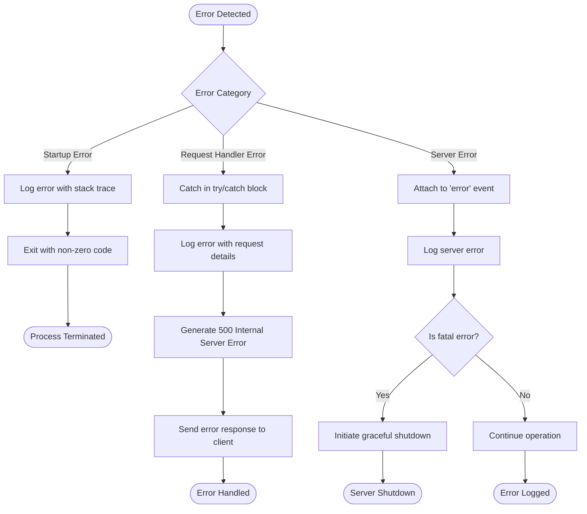
```mermaid
flowchart TD
    Start([Error Detected]) --> A{Error Category}
    
    A -->|Startup Error| B[Log error with stack trace]
    B --> C[Exit with non-zero code]
    C --> End1([Process Terminated])
    
    A -->|Request Handler Error| D[Catch in try/catch block]
    D --> E[Log error with request details]
    E --> F[Generate 500 Internal Server Error]
    F --> G[Send error response to client]
    G --> End2([Error Handled])
    
    A -->|Server Error| H[Attach to 'error' event]
    H --> I[Log server error]
    I --> J{Is fatal error?}
    J -->|Yes| K[Initiate graceful shutdown]
    K --> End3([Server Shutdown])
    J -->|No| L[Continue operation]
    L --> End4([Error Logged])
```

### REQUIRED DIAGRAMS

#### High-Level System Workflow

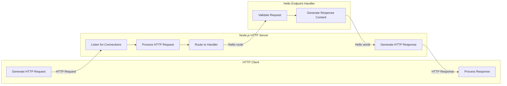
```mermaid
flowchart LR
    subgraph Client["HTTP Client"]
        A[Generate HTTP Request]
        Z[Process Response]
    end
    
    subgraph NodeServer["Node.js HTTP Server"]
        B[Listen for Connections]
        C[Process HTTP Request]
        D[Route to Handler]
        Y[Generate HTTP Response]
    end
    
    subgraph HelloEndpoint["Hello Endpoint Handler"]
        E[Validate Request]
        F[Generate Response Content]
    end
    
    A -->|HTTP Request| B
    B --> C
    C --> D
    D -->|/hello route| E
    E --> F
    F -->|"Hello world"| Y
    Y -->|HTTP Response| Z
```

#### Detailed Process Flow for Hello Endpoint

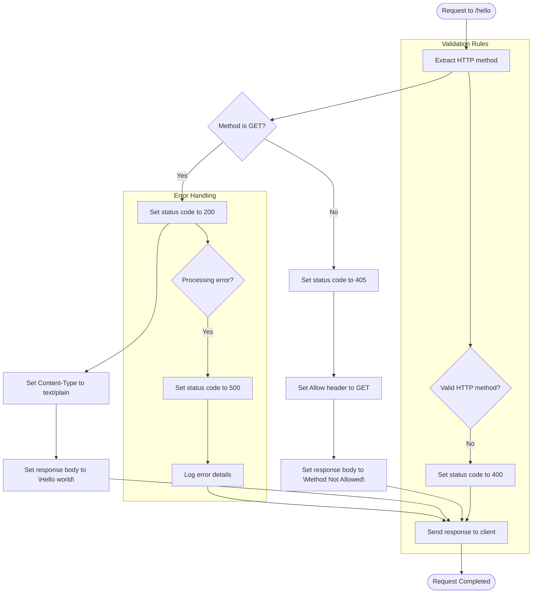
```mermaid
flowchart TD
    Start([Request to /hello]) --> A[Extract HTTP method]
    A --> B{Method is GET?}
    
    B -->|Yes| C[Set status code to 200]
    C --> D[Set Content-Type to text/plain]
    D --> E["Set response body to \"Hello world\""]
    E --> F[Send response to client]
    F --> End([Request Completed])
    
    B -->|No| G[Set status code to 405]
    G --> H[Set Allow header to GET]
    H --> I["Set response body to \"Method Not Allowed\""]
    I --> F
    
    subgraph "Validation Rules"
        A --> V1{Valid HTTP method?}
        V1 -->|No| V2[Set status code to 400]
        V2 --> F
    end
    
    subgraph "Error Handling"
        C --> E1{Processing error?}
        E1 -->|Yes| E2[Set status code to 500]
        E2 --> E3[Log error details]
        E3 --> F
    end
```

#### Integration Sequence Diagram

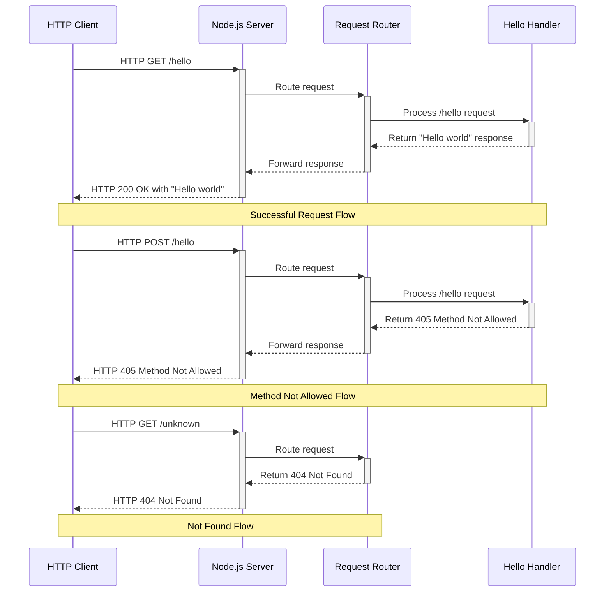
```mermaid
sequenceDiagram
    participant Client as HTTP Client
    participant Server as Node.js Server
    participant Router as Request Router
    participant Handler as Hello Handler
    
    Client->>+Server: HTTP GET /hello
    Server->>+Router: Route request
    Router->>+Handler: Process /hello request
    
    Handler-->>-Router: Return "Hello world" response
    Router-->>-Server: Forward response
    Server-->>-Client: HTTP 200 OK with "Hello world"
    
    Note over Client,Handler: Successful Request Flow
    
    Client->>+Server: HTTP POST /hello
    Server->>+Router: Route request
    Router->>+Handler: Process /hello request
    
    Handler-->>-Router: Return 405 Method Not Allowed
    Router-->>-Server: Forward response
    Server-->>-Client: HTTP 405 Method Not Allowed
    
    Note over Client,Handler: Method Not Allowed Flow
    
    Client->>+Server: HTTP GET /unknown
    Server->>+Router: Route request
    Router-->>-Server: Return 404 Not Found
    Server-->>-Client: HTTP 404 Not Found
    
    Note over Client,Router: Not Found Flow
```

## 5. SYSTEM ARCHITECTURE

### HIGH-LEVEL ARCHITECTURE

#### System Overview

The Node.js Hello World service follows a simple monolithic architecture pattern, which is appropriate for its minimal requirements and educational purpose. The system employs a single-process model using Node.js's built-in HTTP module to handle incoming requests and generate responses.

Key architectural principles include:
- **Simplicity**: Minimizing components and dependencies to create an easily understandable codebase
- **Statelessness**: The server maintains no client state between requests
- **Single Responsibility**: Each component has a clear, focused purpose
- **Dependency Minimization**: Using only Node.js core modules to reduce complexity

System boundaries are clearly defined with a single entry point (the HTTP server) that accepts incoming HTTP requests and returns appropriate responses. The major interface is the `/hello` REST endpoint that clients interact with via standard HTTP methods.

#### Core Components Table

| Component Name | Primary Responsibility | Key Dependencies | Critical Considerations |
|----------------|------------------------|------------------|-------------------------|
| HTTP Server | Listen for and accept incoming HTTP connections | Node.js core HTTP module | Port configuration, error handling |
| Request Router | Parse incoming requests and route to appropriate handler | HTTP Server | URL parsing, method validation |
| Hello Endpoint Handler | Process requests to `/hello` and generate responses | Request Router | Content type, status code selection |
| Configuration Manager | Manage server configuration (port, etc.) | Environment variables | Default values, validation |
| Error Handler | Capture and process errors throughout the system | All components | Appropriate error responses, logging |

#### Data Flow Description

The data flow in this system is straightforward and unidirectional. HTTP requests originate from external clients and are received by the HTTP Server component. The server passes the request to the Request Router, which determines if the requested path matches `/hello`. If matched, the request is forwarded to the Hello Endpoint Handler, which generates a "Hello world" response with appropriate headers. This response flows back through the same components in reverse order until it reaches the client.

No data persistence is required as the system maintains no state between requests. There are no data transformations beyond the basic HTTP request parsing and response generation. The system does not utilize any data stores or caches due to its simplicity and stateless nature.

#### External Integration Points

| System Name | Integration Type | Data Exchange Pattern | Protocol/Format |
|-------------|------------------|------------------------|-----------------|
| HTTP Clients | Synchronous API | Request-Response | HTTP/Plain Text |

### COMPONENT DETAILS

#### HTTP Server Component

**Purpose and Responsibilities:**
- Initialize and manage the HTTP server lifecycle
- Listen for incoming connections on the configured port
- Accept HTTP requests and pass them to the Request Router
- Send HTTP responses back to clients
- Handle server-level errors and shutdown signals

**Technologies and Frameworks:**
- Node.js core `http` module
- JavaScript event handling for error management

**Key Interfaces:**
- Server initialization function
- Request event handler
- Error event handler
- Server shutdown handler

**Scaling Considerations:**
- Single-process model sufficient for educational purposes
- No clustering or load balancing required for this simple implementation

#### Request Router Component

**Purpose and Responsibilities:**
- Parse incoming HTTP request URLs
- Determine if the requested path matches defined routes
- Route requests to the appropriate handler based on URL path
- Return 404 responses for undefined routes

**Technologies and Frameworks:**
- URL parsing using Node.js core modules
- Simple conditional routing logic

**Key Interfaces:**
- Request handling function that accepts request and response objects
- Route matching logic

**Scaling Considerations:**
- Simple direct routing sufficient for single endpoint
- No need for complex routing frameworks

#### Hello Endpoint Handler

**Purpose and Responsibilities:**
- Process requests to the `/hello` endpoint
- Validate HTTP method (accept GET, reject others)
- Generate "Hello world" response with appropriate headers
- Set correct HTTP status codes based on request validity

**Technologies and Frameworks:**
- Plain JavaScript for response generation
- HTTP status code standards

**Key Interfaces:**
- Handler function that accepts request and response objects

**Scaling Considerations:**
- Stateless design requires no special scaling considerations

#### Configuration Manager

**Purpose and Responsibilities:**
- Read environment variables for configuration
- Provide default values when configuration is not specified
- Validate configuration values

**Technologies and Frameworks:**
- Node.js `process.env` for environment variable access

**Key Interfaces:**
- Configuration retrieval functions

**Scaling Considerations:**
- Not applicable for this simple implementation

#### Error Handler

**Purpose and Responsibilities:**
- Catch and process errors throughout the application
- Generate appropriate error responses
- Log error details for troubleshooting

**Technologies and Frameworks:**
- JavaScript try/catch blocks
- Node.js error events

**Key Interfaces:**
- Error handling functions
- Error logging functions

**Scaling Considerations:**
- Centralized error handling simplifies maintenance

#### Component Interaction Diagram

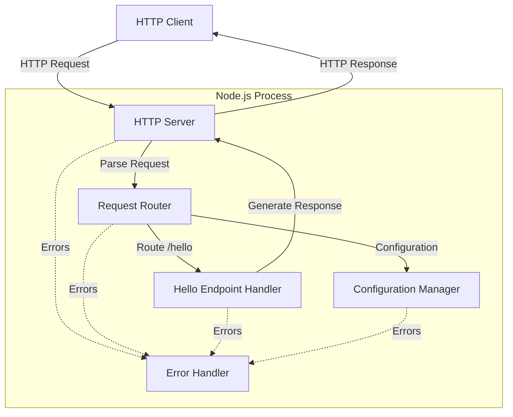
```mermaid
graph TD
    Client[HTTP Client] -->|HTTP Request| Server[HTTP Server]
    Server -->|Parse Request| Router[Request Router]
    Router -->|Route /hello| HelloHandler[Hello Endpoint Handler]
    Router -->|Configuration| Config[Configuration Manager]
    
    HelloHandler -->|Generate Response| Server
    Server -->|HTTP Response| Client
    
    Server -.->|Errors| ErrorHandler[Error Handler]
    Router -.->|Errors| ErrorHandler
    HelloHandler -.->|Errors| ErrorHandler
    Config -.->|Errors| ErrorHandler
    
    subgraph "Node.js Process"
        Server
        Router
        HelloHandler
        Config
        ErrorHandler
    end
```

#### Sequence Diagram for Hello Endpoint

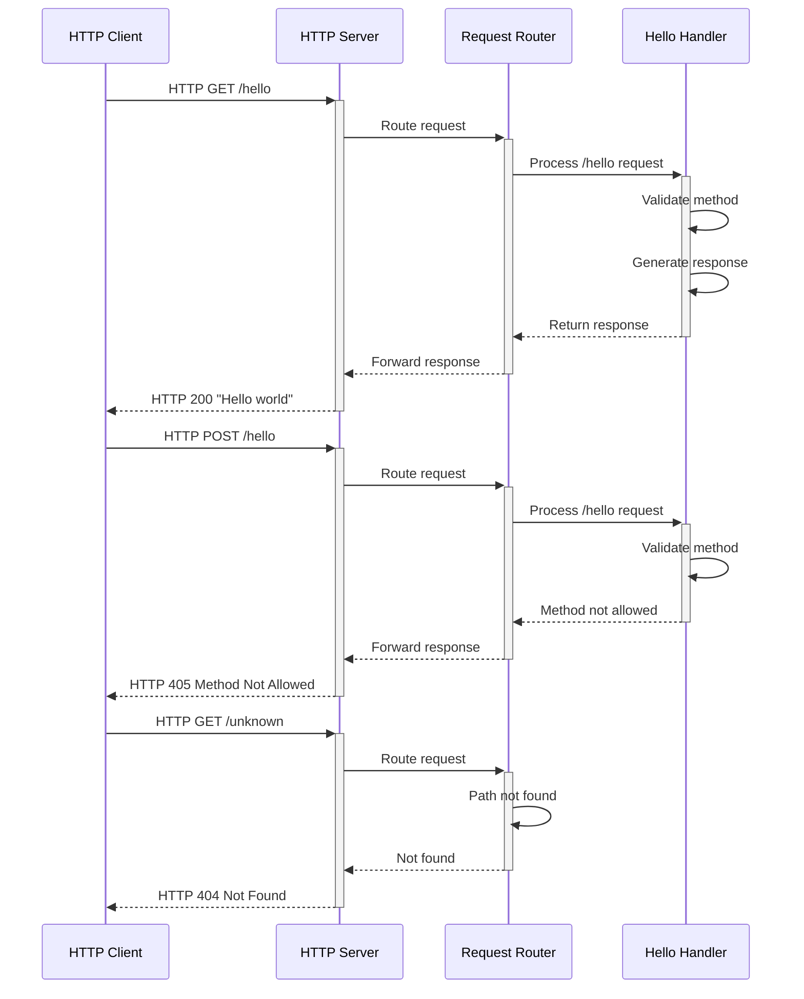
```mermaid
sequenceDiagram
    participant Client as HTTP Client
    participant Server as HTTP Server
    participant Router as Request Router
    participant Handler as Hello Handler
    
    Client->>+Server: HTTP GET /hello
    Server->>+Router: Route request
    Router->>+Handler: Process /hello request
    Handler->>Handler: Validate method
    Handler->>Handler: Generate response
    Handler-->>-Router: Return response
    Router-->>-Server: Forward response
    Server-->>-Client: HTTP 200 "Hello world"
    
    Client->>+Server: HTTP POST /hello
    Server->>+Router: Route request
    Router->>+Handler: Process /hello request
    Handler->>Handler: Validate method
    Handler-->>-Router: Method not allowed
    Router-->>-Server: Forward response
    Server-->>-Client: HTTP 405 Method Not Allowed
    
    Client->>+Server: HTTP GET /unknown
    Server->>+Router: Route request
    Router->>Router: Path not found
    Router-->>-Server: Not found
    Server-->>-Client: HTTP 404 Not Found
```

#### State Transition Diagram

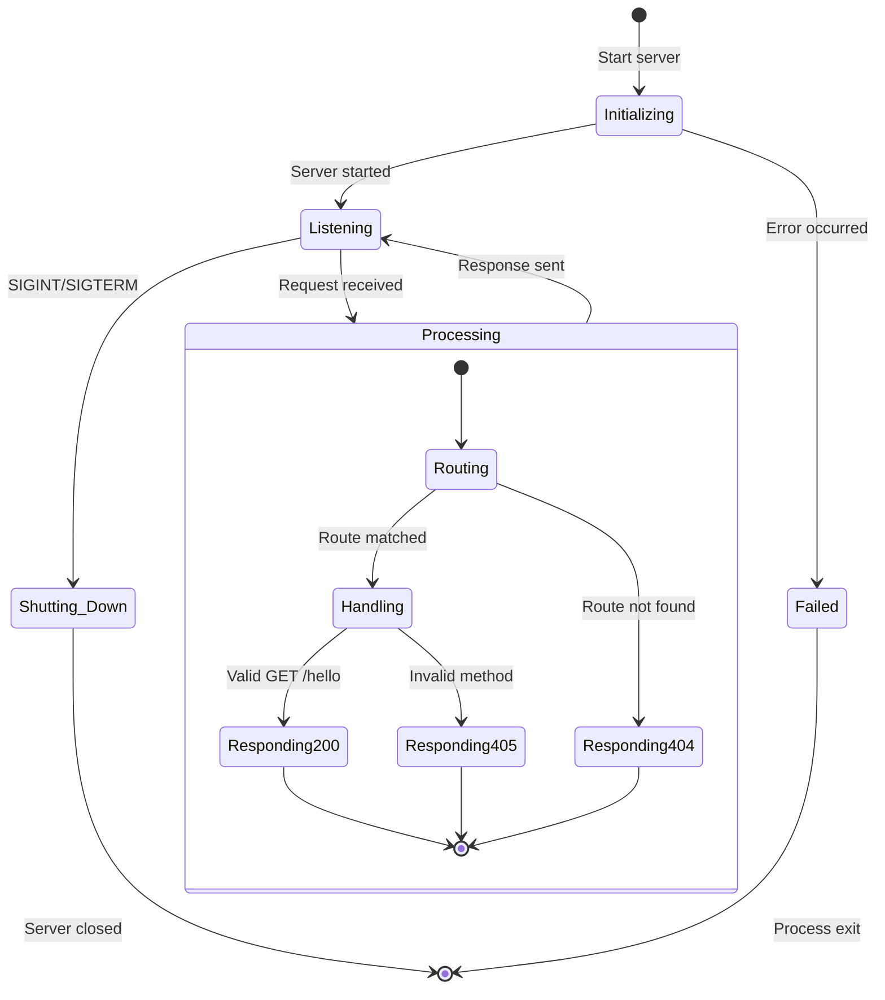
```mermaid
stateDiagram-v2
    [*] --> Initializing: Start server
    Initializing --> Listening: Server started
    Initializing --> Failed: Error occurred
    
    Listening --> Processing: Request received
    Processing --> Listening: Response sent
    
    Listening --> Shutting_Down: SIGINT/SIGTERM
    Shutting_Down --> [*]: Server closed
    
    Failed --> [*]: Process exit
    
    state Processing {
        [*] --> Routing
        Routing --> Handling: Route matched
        Routing --> Responding404: Route not found
        Handling --> Responding200: Valid GET /hello
        Handling --> Responding405: Invalid method
        Responding200 --> [*]
        Responding404 --> [*]
        Responding405 --> [*]
    }
```

### TECHNICAL DECISIONS

#### Architecture Style Decisions

| Decision | Selected Approach | Alternatives Considered | Rationale |
|----------|-------------------|-------------------------|-----------|
| Overall Architecture | Monolithic | Microservices, Serverless | A monolithic design is simplest for educational purposes and minimizes complexity for a single-endpoint service |
| Server Implementation | Node.js HTTP module | Express.js, Fastify, Koa | Using core modules eliminates external dependencies while providing all necessary functionality |
| Request Routing | Simple conditional routing | Router libraries, Framework routing | Direct conditional routing is sufficient for a single endpoint and reduces complexity |
| Configuration | Environment variables | Config files, Command line args | Environment variables provide a standard, cross-platform approach to configuration |

#### Communication Pattern Choices

| Pattern | Implementation | Justification |
|---------|----------------|---------------|
| Request-Response | Synchronous HTTP | Standard web communication pattern that's simple to implement and understand |
| Error Communication | HTTP status codes | Industry standard approach for communicating errors in HTTP services |
| Content Negotiation | Fixed content type | Simplifies implementation for educational purposes |

#### Architecture Decision Record: Core HTTP Module vs Web Frameworks

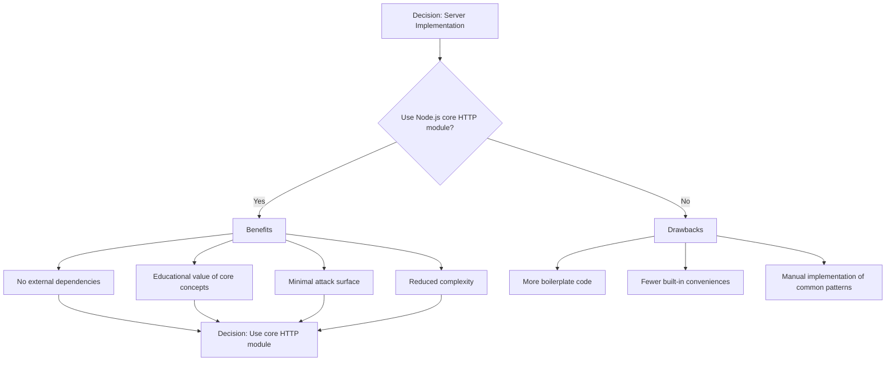
```mermaid
graph TD
    A[Decision: Server Implementation] --> B{Use Node.js core HTTP module?}
    B -->|Yes| C[Benefits]
    B -->|No| D[Drawbacks]
    
    C --> C1[No external dependencies]
    C --> C2[Educational value of core concepts]
    C --> C3[Minimal attack surface]
    C --> C4[Reduced complexity]
    
    D --> D1[More boilerplate code]
    D --> D2[Fewer built-in conveniences]
    D --> D3[Manual implementation of common patterns]
    
    C1 --> E[Decision: Use core HTTP module]
    C2 --> E
    C3 --> E
    C4 --> E
```

### CROSS-CUTTING CONCERNS

#### Error Handling Patterns

The system implements a simple but comprehensive error handling strategy:

- **Server Startup Errors**: Caught during initialization and logged to console with process termination
- **Request Processing Errors**: Caught and converted to appropriate HTTP status codes
- **Unhandled Exceptions**: Global handler to prevent server crashes

Error responses follow HTTP standards with appropriate status codes:
- 404 Not Found for undefined routes
- 405 Method Not Allowed for unsupported HTTP methods
- 500 Internal Server Error for unexpected exceptions

#### Error Handling Flow

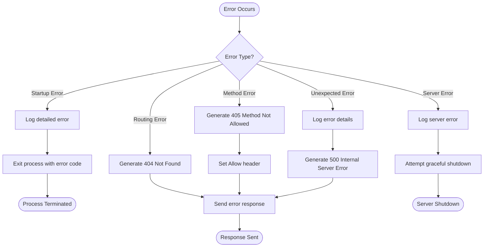
```mermaid
flowchart TD
    Start([Error Occurs]) --> A{Error Type?}
    
    A -->|Startup Error| B[Log detailed error]
    B --> C[Exit process with error code]
    C --> End1([Process Terminated])
    
    A -->|Routing Error| D[Generate 404 Not Found]
    D --> E[Send error response]
    E --> End2([Response Sent])
    
    A -->|Method Error| F[Generate 405 Method Not Allowed]
    F --> G[Set Allow header]
    G --> E
    
    A -->|Unexpected Error| H[Log error details]
    H --> I[Generate 500 Internal Server Error]
    I --> E
    
    A -->|Server Error| J[Log server error]
    J --> K[Attempt graceful shutdown]
    K --> End3([Server Shutdown])
```

#### Logging Strategy

For this simple application, logging is implemented using console methods:
- `console.log` for informational messages (server start, requests)
- `console.error` for error conditions
- Log format includes timestamp, log level, and contextual information

#### Performance Requirements

Given the educational nature of this application, performance requirements are minimal:
- Server startup time < 1 second
- Request processing time < 50ms for the `/hello` endpoint
- Support for concurrent connections based on Node.js defaults

#### Monitoring Approach

For this simple implementation, monitoring is limited to:
- Console logging of server start/stop events
- Basic error logging to console
- Process exit codes to indicate startup success/failure

## 6. SYSTEM COMPONENTS DESIGN

### HTTP SERVER COMPONENT

#### Component Overview

The HTTP Server component serves as the foundation of the application, responsible for handling incoming HTTP connections and managing the server lifecycle.

| Aspect | Description |
|--------|-------------|
| Primary Responsibility | Create and manage an HTTP server that listens for client requests |
| Key Functions | Initialize server, listen on port, handle connections, process shutdown |
| Dependencies | Node.js core HTTP module |
| Interfaces | Server initialization, request handling, error handling |

#### Detailed Design

The HTTP Server component will be implemented using Node.js's built-in `http` module. It will:

1. Create an HTTP server instance
2. Configure the server to listen on the specified port
3. Register handlers for incoming requests
4. Implement proper error handling
5. Support graceful shutdown

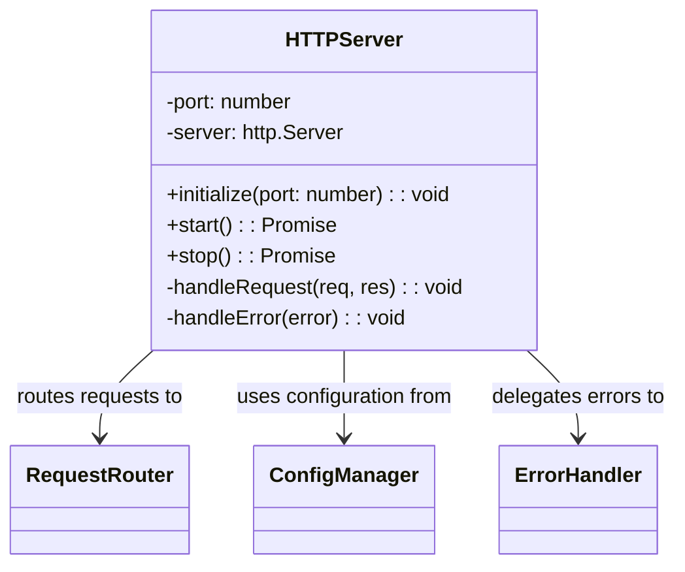
```mermaid
classDiagram
    class HTTPServer {
        -port: number
        -server: http.Server
        +initialize(port: number): void
        +start(): Promise
        +stop(): Promise
        -handleRequest(req, res): void
        -handleError(error): void
    }
    
    HTTPServer --> RequestRouter: routes requests to
    HTTPServer --> ConfigManager: uses configuration from
    HTTPServer --> ErrorHandler: delegates errors to
```

#### Interface Specifications

**Server Initialization Interface:**
- Input: Port number (optional, defaults to 3000)
- Output: Initialized server instance
- Error Handling: Throws error if port is invalid or already in use

**Request Handling Interface:**
- Input: HTTP request object, HTTP response object
- Processing: Routes request to appropriate handler
- Output: None (response handled by router/endpoint)

**Error Handling Interface:**
- Input: Error object
- Processing: Logs error, may terminate server for critical errors
- Output: None

#### State Management

The HTTP Server maintains minimal state:
- Server running status (initialized, running, error, shutdown)
- Active connections (managed by Node.js HTTP module)

No client state is maintained between requests, adhering to RESTful principles.

### REQUEST ROUTER COMPONENT

#### Component Overview

The Request Router component is responsible for examining incoming HTTP requests and directing them to the appropriate handler based on the URL path.

| Aspect | Description |
|--------|-------------|
| Primary Responsibility | Route incoming requests to the correct handler based on URL path |
| Key Functions | Parse URL, match routes, invoke handlers, handle unknown routes |
| Dependencies | HTTP Server component |
| Interfaces | Route handling function |

#### Detailed Design

The Request Router will implement a simple routing mechanism that:

1. Extracts the URL path from the request
2. Determines if the path matches `/hello`
3. Routes to the Hello Endpoint Handler if matched
4. Returns a 404 Not Found response if no match is found

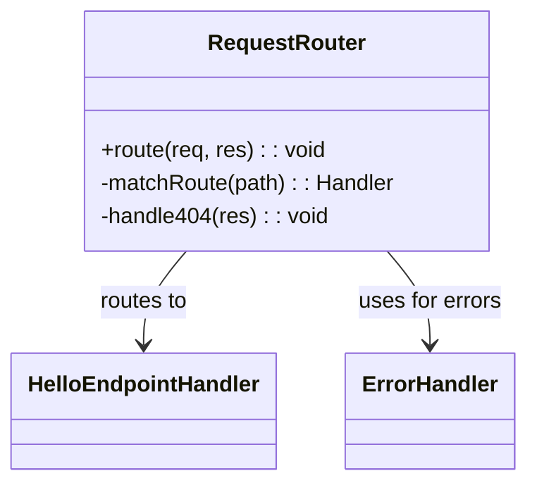
```mermaid
classDiagram
    class RequestRouter {
        +route(req, res): void
        -matchRoute(path): Handler
        -handle404(res): void
    }
    
    RequestRouter --> HelloEndpointHandler: routes to
    RequestRouter --> ErrorHandler: uses for errors
```

#### Interface Specifications

**Route Handling Interface:**
- Input: HTTP request object, HTTP response object
- Processing: Extracts path, matches to handler, invokes handler
- Output: None (response handled by endpoint handler)

**Route Matching Interface:**
- Input: URL path string
- Processing: Compares against known routes
- Output: Handler function or null if no match

#### Routing Logic

The routing logic will be implemented as a simple conditional check:

| Route Pattern | Handler | HTTP Methods Supported |
|---------------|---------|------------------------|
| `/hello` | Hello Endpoint Handler | GET |
| All others | 404 Handler | Any |

### HELLO ENDPOINT HANDLER COMPONENT

#### Component Overview

The Hello Endpoint Handler component processes requests to the `/hello` endpoint and generates appropriate responses.

| Aspect | Description |
|--------|-------------|
| Primary Responsibility | Handle requests to `/hello` endpoint and return "Hello world" response |
| Key Functions | Validate HTTP method, generate response, set headers |
| Dependencies | Request Router component |
| Interfaces | Request handling function |

#### Detailed Design

The Hello Endpoint Handler will:

1. Validate that the HTTP method is GET
2. Return a 405 Method Not Allowed response for non-GET methods
3. Generate a "Hello world" text response with appropriate headers for GET requests

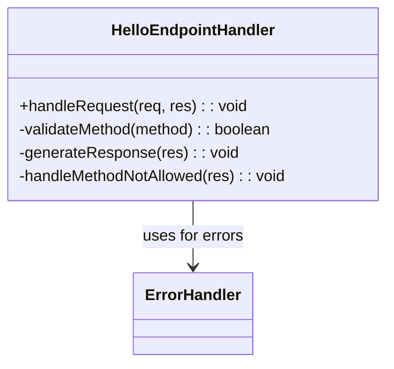
```mermaid
classDiagram
    class HelloEndpointHandler {
        +handleRequest(req, res): void
        -validateMethod(method): boolean
        -generateResponse(res): void
        -handleMethodNotAllowed(res): void
    }
    
    HelloEndpointHandler --> ErrorHandler: uses for errors
```

#### Interface Specifications

**Request Handling Interface:**
- Input: HTTP request object, HTTP response object
- Processing: Validates method, generates response
- Output: HTTP response with "Hello world" or error message

**Method Validation Interface:**
- Input: HTTP method string
- Processing: Checks if method is GET
- Output: Boolean indicating if method is valid

#### Response Specifications

| Scenario | Status Code | Headers | Body | Description |
|----------|------------|---------|------|-------------|
| GET request | 200 OK | Content-Type: text/plain | "Hello world" | Successful response |
| Non-GET request | 405 Method Not Allowed | Content-Type: text/plain<br>Allow: GET | "Method Not Allowed" | Method validation failure |

### CONFIGURATION MANAGER COMPONENT

#### Component Overview

The Configuration Manager component handles server configuration, primarily the port number on which the server listens.

| Aspect | Description |
|--------|-------------|
| Primary Responsibility | Manage and provide configuration values |
| Key Functions | Read environment variables, provide defaults, validate values |
| Dependencies | None |
| Interfaces | Configuration retrieval functions |

#### Detailed Design

The Configuration Manager will:

1. Read configuration from environment variables
2. Provide default values when configuration is not specified
3. Validate configuration values

```mermaid
classDiagram
    class ConfigManager {
        +getPort(): number
        -readEnvVar(name, defaultValue): any
        -validatePort(port): number
    }
```

#### Interface Specifications

**Port Configuration Interface:**
- Input: None
- Processing: Reads PORT environment variable, validates, defaults to 3000 if not set
- Output: Valid port number

#### Configuration Parameters

| Parameter | Source | Default | Validation | Description |
|-----------|--------|---------|------------|-------------|
| Port | PORT environment variable | 3000 | Integer between 1024-65535 | The port on which the HTTP server listens |

### ERROR HANDLER COMPONENT

#### Component Overview

The Error Handler component provides centralized error handling for the application.

| Aspect | Description |
|--------|-------------|
| Primary Responsibility | Process and respond to errors throughout the application |
| Key Functions | Log errors, generate error responses, handle server errors |
| Dependencies | All other components |
| Interfaces | Error handling functions |

#### Detailed Design

The Error Handler will:

1. Provide functions for handling different types of errors
2. Log error details to the console
3. Generate appropriate HTTP error responses
4. Handle server-level errors

```mermaid
classDiagram
    class ErrorHandler {
        +handleRequestError(error, res): void
        +handleServerError(error): void
        +handle404(res): void
        +handle405(res): void
        -logError(error, context): void
    }
```

#### Interface Specifications

**Request Error Handling Interface:**
- Input: Error object, HTTP response object
- Processing: Logs error, generates error response
- Output: HTTP response with appropriate error status and message

**Server Error Handling Interface:**
- Input: Error object
- Processing: Logs error, may initiate server shutdown
- Output: None

#### Error Response Specifications

| Error Type | Status Code | Headers | Body | Description |
|------------|------------|---------|------|-------------|
| Not Found | 404 Not Found | Content-Type: text/plain | "Not Found" | Resource not found |
| Method Not Allowed | 405 Method Not Allowed | Content-Type: text/plain<br>Allow: GET | "Method Not Allowed" | Invalid HTTP method |
| Internal Error | 500 Internal Server Error | Content-Type: text/plain | "Internal Server Error" | Unexpected server error |

### COMPONENT INTERACTIONS

#### Request Processing Flow

```mermaid
sequenceDiagram
    participant Client as HTTP Client
    participant Server as HTTP Server
    participant Router as Request Router
    participant Handler as Hello Handler
    participant Error as Error Handler
    
    Client->>+Server: HTTP Request
    Server->>+Router: Route request
    
    alt Path is /hello
        Router->>+Handler: Process request
        
        alt Method is GET
            Handler-->>-Router: 200 "Hello world"
        else Other method
            Handler->>Error: Handle 405
            Error-->>Handler: 405 response
            Handler-->>Router: 405 Method Not Allowed
        end
        
    else Unknown path
        Router->>Error: Handle 404
        Error-->>Router: 404 response
        Router-->>Server: 404 Not Found
    end
    
    Router-->>-Server: Forward response
    Server-->>-Client: HTTP Response
    
    note over Server,Error: Error handling can occur at any point
```

#### Server Lifecycle Flow

```mermaid
sequenceDiagram
    participant App as Application
    participant Config as Config Manager
    participant Server as HTTP Server
    participant Error as Error Handler
    
    App->>+Config: Get port
    Config-->>-App: Port number
    
    App->>+Server: Initialize(port)
    
    alt Initialization successful
        Server-->>App: Server initialized
        App->>Server: Start()
        Server-->>-App: Server running
        
        note over App,Server: Server running, handling requests
        
        App->>+Server: Stop()
        Server-->>-App: Server stopped
    else Initialization error
        Server->>+Error: Handle error
        Error-->>-Server: Log error
        Server-->>App: Initialization failed
    end
```

### COMPONENT DEPENDENCIES

```mermaid
graph TD
    A[HTTP Server] --> B[Request Router]
    A --> C[Configuration Manager]
    A --> D[Error Handler]
    
    B --> E[Hello Endpoint Handler]
    B --> D
    
    E --> D
    
    subgraph "Core Components"
        A
        B
        C
    end
    
    subgraph "Handler Components"
        E
    end
    
    subgraph "Cross-Cutting Components"
        D
    end
```

### DESIGN PATTERNS APPLIED

| Pattern | Component | Implementation | Justification |
|---------|-----------|----------------|---------------|
| Singleton | Configuration Manager | Single instance for configuration | Ensures consistent configuration across components |
| Chain of Responsibility | Request Router | Routes requests to appropriate handlers | Decouples request processing from handling |
| Factory | HTTP Server | Creates and configures server instance | Encapsulates server creation details |
| Observer | Error Handler | Components subscribe to error handling | Centralizes error management |

### 6.1 CORE SERVICES ARCHITECTURE

Core Services Architecture is not applicable for this system in its traditional sense. The Node.js Hello World application is intentionally designed as a simple, monolithic application with a single endpoint rather than a distributed system of microservices. This architectural choice aligns with the project's educational purpose and minimal complexity requirements.

#### Rationale for Monolithic Approach

| Aspect | Justification |
|--------|---------------|
| System Complexity | A single HTTP endpoint does not warrant the overhead of a microservices architecture |
| Educational Purpose | The project aims to demonstrate fundamental Node.js concepts without introducing distributed systems complexity |
| Operational Simplicity | A monolithic design simplifies deployment, monitoring, and troubleshooting for learning purposes |
| Resource Efficiency | A single process is more resource-efficient for this minimal functionality |

#### Alternative Architecture Considerations

While microservices are not implemented, the application is designed with clean separation of concerns that would facilitate future evolution:

```mermaid
graph TD
    subgraph "Node.js Process"
        A[HTTP Server Component] --> B[Request Router Component]
        B --> C[Hello Endpoint Handler]
        A --> D[Configuration Component]
        A --> E[Error Handler Component]
    end
    
    F[HTTP Client] <--> A
```

#### Simplified Scaling Approach

For this minimal application, scaling considerations are limited to:

| Scaling Aspect | Implementation |
|----------------|----------------|
| Process Scaling | Node.js's single-threaded event loop efficiently handles concurrent connections |
| Deployment Scaling | If needed, multiple instances could be deployed behind a simple load balancer |
| Resource Utilization | Minimal memory and CPU footprint per instance |

#### Basic Resilience Considerations

While complex resilience patterns are not implemented, the application includes:

| Resilience Aspect | Implementation |
|-------------------|----------------|
| Error Handling | Comprehensive error catching prevents crashes |
| Process Recovery | Process managers like PM2 could restart the service if needed |
| Graceful Shutdown | Signal handlers ensure clean termination |

#### Future Architecture Evolution

If the application were to grow beyond its educational purpose, the following architectural evolution could be considered:

```mermaid
graph TD
    subgraph "Future Potential Architecture"
        LB[Load Balancer]
        
        subgraph "Instance 1"
            A1[HTTP Server]
        end
        
        subgraph "Instance 2"
            A2[HTTP Server]
        end
        
        subgraph "Instance N"
            AN[HTTP Server]
        end
        
        LB --> A1
        LB --> A2
        LB --> AN
    end
    
    Client[HTTP Clients] --> LB
```

This simple application demonstrates that not all systems require complex distributed architectures. By focusing on a clean, well-structured monolithic design, the Hello World service achieves its educational goals while maintaining simplicity and clarity.

### 6.2 DATABASE DESIGN

Database Design is not applicable to this system. The Node.js Hello World application with a single `/hello` endpoint that returns "Hello world" does not require any database or persistent storage for the following reasons:

#### Rationale for No Database Requirement

| Aspect | Justification |
|--------|---------------|
| Stateless Operation | The application operates in a completely stateless manner, with no need to persist data between requests |
| Static Response | The endpoint returns a fixed "Hello world" string that doesn't depend on stored data |
| No User Data | The application doesn't collect, process, or store any user information |
| Educational Purpose | The project's primary goal is to demonstrate basic HTTP server functionality without introducing database complexity |

#### Alternative Approaches to State Management

While this application doesn't require a database, it's worth noting the alternatives that could be considered if minimal state were needed in the future:

| Approach | Description | When Appropriate |
|----------|-------------|------------------|
| Memory-based Storage | In-memory variables or objects | For temporary session data with no persistence requirements |
| File System Storage | Simple JSON or text files | For basic configuration or minimal logging needs |
| Environment Variables | Configuration stored in environment | For deployment-specific settings |

#### Data Flow Without Persistence

```mermaid
graph TD
    Client[HTTP Client] -->|HTTP Request| Server[Node.js Server]
    Server -->|Process Request| Handler[Request Handler]
    Handler -->|Generate Static Response| Server
    Server -->|"Hello world" Response| Client
    
    style Handler fill:#f9f,stroke:#333,stroke-width:2px
    note right of Handler: No database interaction occurs
```

#### Future Considerations

If the application were to evolve beyond its current scope and require data persistence, the following considerations would become relevant:

| Consideration | Potential Approach |
|---------------|-------------------|
| User Tracking | Simple document database for user sessions |
| Request Logging | Time-series database or structured log files |
| Configuration Management | Key-value store for dynamic configuration |
| Content Customization | Relational database for content templates |

However, for the current requirements of a simple HTTP server returning a static "Hello world" response, introducing a database would add unnecessary complexity and resource overhead without providing any functional benefit. The application achieves its educational and demonstration goals most effectively with its current stateless, database-free design.

### 6.3 INTEGRATION ARCHITECTURE

Integration Architecture is not applicable for this system in its traditional sense. The Node.js Hello World application with a single `/hello` endpoint is designed as a standalone educational example that intentionally avoids external dependencies and integrations.

#### Rationale for No Integration Requirements

| Aspect | Justification |
|--------|---------------|
| Educational Purpose | The project aims to demonstrate fundamental Node.js HTTP server concepts without the complexity of external integrations |
| Minimal Scope | A single endpoint returning static text doesn't require integration with other systems |
| Self-Contained | The application operates independently with no dependencies on external services |
| Simplicity Focus | External integrations would contradict the project's goal of minimal complexity |

#### API Implementation

While not integrating with external systems, the application does implement a minimal API:

| API Aspect | Implementation |
|------------|----------------|
| Protocol | HTTP/1.1 |
| Endpoint | `/hello` |
| Method | GET |
| Response Format | Plain text ("Hello world") |

```mermaid
graph LR
    Client[HTTP Client] -->|GET /hello| Server[Node.js Server]
    Server -->|"Hello world"| Client
    
    style Server fill:#d0e0ff,stroke:#333,stroke-width:2px
    style Client fill:#f9f9f9,stroke:#333,stroke-width:1px
```

#### Simplified Request-Response Flow

```mermaid
sequenceDiagram
    participant Client as HTTP Client
    participant Server as Node.js Server
    
    Client->>+Server: GET /hello HTTP/1.1
    Server->>Server: Process request
    Server-->>-Client: HTTP/1.1 200 OK<br/>Content-Type: text/plain<br/><br/>Hello world
    
    note over Server: No external system<br/>integration occurs
```

#### Future Integration Considerations

If the application were to evolve beyond its educational purpose, the following integration patterns could be considered:

| Integration Type | Potential Implementation |
|------------------|--------------------------|
| Authentication | Simple API key or JWT-based authentication |
| External Data | REST API calls to data services |
| Monitoring | Integration with logging and metrics services |
| Deployment | CI/CD pipeline integration |

```mermaid
graph TD
subgraph "Potential Future Architecture"
    Server[Node.js Server]
    Auth[Authentication Service]
    Logging[Logging Service]
    Metrics[Metrics Service]
    
    Server -->|Authenticate| Auth
    Server -->|Log Events| Logging
    Server -->|Report Metrics| Metrics
end

Client[HTTP Clients] -->|Authenticated Requests| Server

style Server fill:#d0e0ff,stroke:#333,stroke-width:2px
style Auth fill:#ffe0e0,stroke:#333,stroke-width:1px
style Logging fill:#e0ffe0,stroke:#333,stroke-width:1px
style Metrics fill:#fff0e0,stroke:#333,stroke-width:1px

ServerNote["Future potential<br/>integrations"]
Server --- ServerNote
style ServerNote fill:#f9f9f9,stroke:#999,stroke-width:1px,stroke-dasharray:5 5
```

#### Conclusion

The Node.js Hello World application intentionally avoids integration with external systems to maintain its educational value through simplicity. This design choice allows new developers to focus on core Node.js HTTP server concepts without the additional complexity of external integrations. The application achieves its goals most effectively as a self-contained, standalone service.

### 6.4 SECURITY ARCHITECTURE

Detailed Security Architecture is not applicable for this system. The Node.js Hello World application with a single `/hello` endpoint that returns "Hello world" is designed as a minimal educational example that intentionally avoids complexity, including advanced security mechanisms.

#### Rationale for Simplified Security Approach

| Aspect | Justification |
|--------|---------------|
| Educational Purpose | The project aims to demonstrate fundamental Node.js HTTP server concepts without the complexity of comprehensive security controls |
| Public Data | The "Hello world" response contains no sensitive information |
| No Authentication Needs | The endpoint is designed to be publicly accessible without user identification |
| No User Data | The application doesn't collect, process, or store any user information |
| Minimal Attack Surface | Single endpoint with no parameters limits potential attack vectors |

#### Standard Security Practices to be Implemented

While comprehensive security architecture is not required, the following standard security practices will be implemented:

| Security Practice | Implementation Approach |
|-------------------|-------------------------|
| Input Validation | Validate HTTP method (GET only) |
| Error Handling | Prevent information disclosure in error messages |
| HTTP Headers | Set appropriate security headers |
| Dependency Management | Use only core Node.js modules to eliminate supply chain risks |

#### Basic Security Flow

```mermaid
flowchart TD
    A[Client Request] --> B{Validate Method}
    B -->|GET| C[Process Request]
    B -->|Other| D[Return 405 Method Not Allowed]
    C --> E[Generate Response]
    E --> F[Set Security Headers]
    F --> G[Return Response]
    
    style B fill:#ffe0e0,stroke:#333,stroke-width:2px
    style F fill:#ffe0e0,stroke:#333,stroke-width:2px
```

#### Security Headers Implementation

| Header | Value | Purpose |
|--------|-------|---------|
| X-Content-Type-Options | nosniff | Prevent MIME type sniffing |
| X-Frame-Options | DENY | Prevent clickjacking attacks |
| Content-Security-Policy | default-src 'none' | Restrict resource loading |
| Cache-Control | no-store | Prevent response caching |

#### Security Zones

```mermaid
graph TD
    subgraph PublicZone["Public Zone"]
        Client[HTTP Client]
    end
    
    subgraph ApplicationZone["Application Zone"]
        Server[Node.js Server]
        Router[Request Router]
        Handler[Hello Handler]
    end
    
    Client <-->|HTTP Request/Response| Server
    Server --> Router
    Router --> Handler
    
    style PublicZone fill:#f9f9f9,stroke:#999,stroke-width:1px
    style ApplicationZone fill:#e6f3ff,stroke:#333,stroke-width:2px
```

#### Security Considerations for Future Evolution

If the application were to evolve beyond its educational purpose, the following security enhancements should be considered:

| Security Area | Future Consideration |
|---------------|----------------------|
| Authentication | Implement API key or JWT-based authentication |
| Rate Limiting | Add request rate limiting to prevent abuse |
| Logging | Implement security event logging |
| HTTPS | Require secure communication |
| Dependency Scanning | Implement automated vulnerability scanning |

#### Security Control Matrix

| Control Category | Control | Implementation | Priority |
|------------------|---------|----------------|----------|
| Input Validation | Method Validation | Validate HTTP method is GET | High |
| Output Encoding | Content Type | Set appropriate content type header | Medium |
| Error Handling | Generic Errors | Return appropriate status codes without details | Medium |
| HTTP Security | Security Headers | Implement basic security headers | Medium |

#### Conclusion

The Node.js Hello World application intentionally implements a simplified security approach appropriate for its educational purpose and minimal functionality. By focusing on fundamental security practices without introducing complex authentication and authorization mechanisms, the application maintains its value as a clear, accessible learning tool while still adhering to basic security principles.

### 6.5 MONITORING AND OBSERVABILITY

Detailed Monitoring Architecture is not applicable for this system. The Node.js Hello World application with a single `/hello` endpoint is designed as a minimal educational example that intentionally avoids complexity, including comprehensive monitoring and observability infrastructure.

#### Rationale for Simplified Monitoring Approach

| Aspect | Justification |
|--------|---------------|
| Educational Purpose | The project aims to demonstrate fundamental Node.js HTTP server concepts without the complexity of advanced monitoring systems |
| Minimal Functionality | A single endpoint returning static text has limited monitoring needs |
| Development Focus | The application is primarily intended for local development and learning |
| Resource Efficiency | Complex monitoring would add unnecessary overhead to a simple application |

#### Basic Monitoring Practices

While comprehensive monitoring architecture is not required, the following basic monitoring practices will be implemented:

| Monitoring Practice | Implementation Approach |
|---------------------|-------------------------|
| Console Logging | Log server startup, shutdown, and errors to console |
| Request Logging | Basic logging of incoming requests and response status |
| Error Tracking | Capture and log unhandled exceptions |
| Process Monitoring | Exit with appropriate status codes on critical errors |

#### Simple Health Check Implementation

A basic health check can be implemented by using the existing `/hello` endpoint:

```mermaid
flowchart LR
    A[Monitoring Tool] -->|GET /hello| B[Node.js Server]
    B -->|"Hello world" + 200 Status| A
    A -->|Analyze Response| C{Health Status}
    C -->|200 OK| D[Server Healthy]
    C -->|Other/Timeout| E[Server Unhealthy]
```

#### Basic Logging Pattern

```mermaid
sequenceDiagram
    participant Client as HTTP Client
    participant Server as Node.js Server
    participant Console as Console Output
    
    Server->>Console: Log server startup
    Note over Console: [INFO] Server started on port 3000
    
    Client->>Server: GET /hello
    Server->>Console: Log request
    Note over Console: [INFO] GET /hello
    Server->>Client: 200 "Hello world"
    Server->>Console: Log response
    Note over Console: [INFO] 200 OK - 11 bytes
    
    Client->>Server: GET /unknown
    Server->>Console: Log request
    Note over Console: [INFO] GET /unknown
    Server->>Client: 404 Not Found
    Server->>Console: Log response
    Note over Console: [INFO] 404 Not Found
    
    Client->>Server: POST /hello
    Server->>Console: Log request
    Note over Console: [INFO] POST /hello
    Server->>Client: 405 Method Not Allowed
    Server->>Console: Log response
    Note over Console: [INFO] 405 Method Not Allowed
```

#### Simple Metrics Collection

For local development and educational purposes, the following basic metrics can be tracked:

| Metric | Description | Collection Method |
|--------|-------------|-------------------|
| Request Count | Total number of requests received | In-memory counter |
| Response Time | Time to process requests | Timing in request handler |
| Error Count | Number of errors by type | In-memory counter |
| Server Uptime | Time since server start | Track start timestamp |

#### Basic Dashboard Layout

For educational purposes, a simple console-based dashboard can be implemented:

```mermaid
graph TD
    subgraph "Console Dashboard"
        A[Server Status: Running]
        B[Uptime: 00:10:15]
        C[Total Requests: 42]
        D[Success Rate: 95%]
        E[Avg Response Time: 5ms]
        F[Error Count: 2]
    end
```

#### Recommendations for Production Evolution

If the application were to evolve for production use, the following monitoring enhancements should be considered:

| Monitoring Area | Future Consideration |
|-----------------|----------------------|
| Metrics Collection | Implement Prometheus metrics for request counts, latency, and errors |
| Log Management | Integrate structured logging with a log aggregation system |
| Health Checks | Add a dedicated `/health` endpoint with component status |
| Alerting | Configure alerts for error rates and response time thresholds |
| Dashboards | Create Grafana dashboards for visualizing application metrics |

#### Potential Production Monitoring Architecture

```mermaid
graph TD
    subgraph "Application Environment"
        A[Node.js Server]
        B[Prometheus Client]
        C[Structured Logger]
    end
    
    subgraph "Monitoring Infrastructure"
        D[Prometheus Server]
        E[Grafana]
        F[Log Aggregator]
        G[Alert Manager]
    end
    
    A -->|Expose Metrics| B
    B -->|Scrape Metrics| D
    A -->|Generate Logs| C
    C -->|Forward Logs| F
    D -->|Visualize Metrics| E
    D -->|Trigger Alerts| G
    F -->|Log Dashboards| E
    
    style A fill:#d0e0ff,stroke:#333,stroke-width:2px
    style B fill:#ffe0e0,stroke:#333,stroke-width:1px
    style C fill:#e0ffe0,stroke:#333,stroke-width:1px
    style D fill:#fff0e0,stroke:#333,stroke-width:1px
    
    Note["Future potential<br/>monitoring setup"]
    A --- Note
    style Note fill:#f9f9f9,stroke:#999,stroke-width:1px,stroke-dasharray:5 5
```

#### Conclusion

The Node.js Hello World application intentionally implements a simplified monitoring approach appropriate for its educational purpose and minimal functionality. By focusing on basic console logging and simple metrics tracking, the application maintains its value as a clear, accessible learning tool while still providing visibility into its operation. For production use cases, the monitoring approach would need to be expanded significantly, but such enhancements would contradict the project's goal of minimal complexity for educational purposes.

### 6.6 TESTING STRATEGY

#### TESTING APPROACH

While this Node.js Hello World application is intentionally simple, a basic testing strategy is still important to ensure reliability and demonstrate good development practices. The testing approach will focus primarily on unit testing with minimal integration testing appropriate for a single-endpoint application.

##### Unit Testing

| Aspect | Implementation |
|--------|----------------|
| Testing Framework | Jest - lightweight JavaScript testing framework with built-in assertion library and mocking capabilities |
| Test Organization | Tests organized in a `__tests__` directory mirroring the structure of source files |
| Test File Naming | `[filename].test.js` pattern for all test files |
| Test Structure | Describe-It pattern for organizing test suites and cases |

**Test Organization Structure:**

```
project-root/
├── src/
│   ├── server.js
│   ├── router.js
│   └── handlers/
│       └── helloHandler.js
├── __tests__/
│   ├── server.test.js
│   ├── router.test.js
│   └── handlers/
│       └── helloHandler.test.js
└── package.json
```

**Mocking Strategy:**

| Component | Mocking Approach |
|-----------|------------------|
| HTTP Module | Jest mock functions to simulate request/response objects |
| Server | Mock server instance for testing request handling |
| Environment Variables | Mock process.env for configuration testing |

**Code Coverage Requirements:**

| Coverage Type | Target |
|---------------|--------|
| Statement Coverage | 90% |
| Branch Coverage | 85% |
| Function Coverage | 95% |
| Line Coverage | 90% |

**Test Naming Conventions:**

```
describe('Component/Function Name', () => {
  it('should behave in expected way when condition', () => {
    // Test implementation
  });
});
```

**Example Test Pattern:**

```
describe('Hello Endpoint Handler', () => {
  it('should return 200 status with Hello world for GET requests', () => {
    // Test implementation
  });
  
  it('should return 405 Method Not Allowed for non-GET requests', () => {
    // Test implementation
  });
});
```

##### Integration Testing

| Aspect | Implementation |
|--------|----------------|
| API Testing | Supertest for HTTP assertions against running server |
| Test Scope | Verify endpoint returns correct status codes and response body |
| Environment | Local test environment with ephemeral server instance |

**Integration Test Focus Areas:**

| Test Area | Description |
|-----------|-------------|
| Server Startup | Verify server starts and listens on configured port |
| Endpoint Response | Verify `/hello` returns "Hello world" with 200 status |
| Error Handling | Verify 404 for unknown routes and 405 for invalid methods |

##### End-to-End Testing

Detailed End-to-End testing is not applicable for this system due to its minimal functionality and lack of UI components. The integration tests using Supertest will effectively serve as lightweight E2E tests by verifying the complete request-response cycle.

#### TEST AUTOMATION

| Aspect | Implementation |
|--------|----------------|
| Test Execution | npm test script configured in package.json |
| Coverage Reports | Jest coverage reporter with console and HTML output |
| Pre-commit Hooks | Husky to run tests before commits (optional) |

**Test Execution Flow:**

```mermaid
flowchart TD
    A[Developer runs npm test] --> B[Jest initializes]
    B --> C[Unit tests execute]
    C --> D[Integration tests execute]
    D --> E[Coverage report generated]
    E --> F{All tests pass?}
    F -->|Yes| G[Test success reported]
    F -->|No| H[Test failures reported]
    G --> I[Coverage thresholds checked]
    I -->|Met| J[Process exits with code 0]
    I -->|Not met| K[Process exits with non-zero code]
    H --> K
```

**Test Environment Architecture:**

```mermaid
graph TD
    subgraph "Test Environment"
        A[Jest Test Runner]
        B[Node.js Runtime]
        C[Mock HTTP Requests/Responses]
        D[Ephemeral Server Instance]
    end
    
    A -->|Executes tests in| B
    A -->|Creates| C
    A -->|Starts| D
    C -->|Sent to| D
    D -->|Responses analyzed by| A
    
    style A fill:#f9f,stroke:#333,stroke-width:2px
    style D fill:#bbf,stroke:#333,stroke-width:2px
```

**Test Data Flow:**

```mermaid
flowchart LR
    A[Test Case] -->|Creates| B[Mock Request]
    B -->|Sent to| C[Server Under Test]
    C -->|Processes| D[Request Handler]
    D -->|Generates| E[Response]
    E -->|Returned to| C
    C -->|Returns| E
    E -->|Validated by| F[Assertions]
    F -->|Reports| G[Test Result]
```

#### QUALITY METRICS

| Metric | Target | Measurement Tool |
|--------|--------|------------------|
| Code Coverage | 90% overall | Jest coverage reporter |
| Test Success Rate | 100% | Jest test runner |
| Lint Compliance | 100% | ESLint (optional) |

**Quality Gates:**

| Gate | Requirement | When Checked |
|------|-------------|--------------|
| All Tests Pass | No failing tests | During test execution |
| Coverage Thresholds Met | Meets minimum coverage targets | After test execution |
| No Lint Errors | Code follows style guidelines | Pre-commit (optional) |

#### TEST CASES MATRIX

| Component | Test Scenario | Expected Result | Priority |
|-----------|---------------|-----------------|----------|
| HTTP Server | Server initialization | Server starts on specified port | High |
| HTTP Server | Server handles request | Request routed to correct handler | High |
| Router | Route `/hello` | Request sent to hello handler | High |
| Router | Route unknown path | 404 Not Found response | Medium |
| Hello Handler | GET request | 200 OK with "Hello world" | High |
| Hello Handler | POST request | 405 Method Not Allowed | Medium |
| Config Manager | Read port from env | Uses specified port | Medium |
| Config Manager | Default port | Uses port 3000 when not specified | Medium |
| Error Handler | Handle 404 | Proper 404 response | Medium |
| Error Handler | Handle 500 | Proper 500 response | Medium |

#### SECURITY TESTING

Basic security testing will be implemented through:

| Test Type | Implementation |
|-----------|----------------|
| HTTP Method Validation | Verify only GET method is allowed on `/hello` endpoint |
| Error Handling | Verify errors don't expose sensitive information |
| Header Validation | Verify appropriate security headers are set |

#### RESOURCE REQUIREMENTS

| Resource | Requirement |
|----------|-------------|
| Development Environment | Node.js 18.x LTS |
| Testing Tools | Jest, Supertest |
| Memory | Minimal (<100MB) |
| Execution Time | <10 seconds for full test suite |

#### CONCLUSION

This testing strategy is intentionally lightweight and focused on the essential verification of the Node.js Hello World application's functionality. The approach emphasizes unit testing with basic integration testing, which is appropriate for the application's educational purpose and minimal complexity. The testing framework and approach can serve as a learning example alongside the application itself, demonstrating testing best practices without unnecessary complexity.

## 7. USER INTERFACE DESIGN

No user interface required. This project is a simple Node.js HTTP server application that exposes a single REST endpoint `/hello` which returns "Hello world" to clients. It is designed to be accessed programmatically via HTTP requests and does not include any graphical user interface components.

The application is intended to be used as:
1. A backend service that responds to HTTP requests
2. A learning tool for Node.js HTTP server implementation
3. A minimal example of RESTful API design

Clients will interact with the service through HTTP requests using tools such as browsers, curl, Postman, or programmatic HTTP clients.

## 8. INFRASTRUCTURE

Detailed Infrastructure Architecture is not applicable for this system. The Node.js Hello World application with a single `/hello` endpoint is designed as a minimal educational example that intentionally avoids complex infrastructure requirements for the following reasons:

1. **Educational Purpose**: The project aims to demonstrate fundamental Node.js HTTP server concepts without the complexity of production deployment infrastructure
2. **Minimal Functionality**: A single endpoint returning static text has limited infrastructure needs
3. **Local Development Focus**: The application is primarily intended for local development and learning
4. **Dependency Minimization**: The project explicitly aims to minimize external dependencies as stated in the system overview

### MINIMAL BUILD AND DISTRIBUTION REQUIREMENTS

#### Development Environment

| Requirement | Specification | Purpose |
|-------------|---------------|---------|
| Node.js | v18.x LTS | Runtime environment for JavaScript execution |
| npm | v8.x+ (bundled with Node.js) | Package management and script execution |
| Git | v2.x+ | Source code management (optional) |

#### Local Execution Requirements

| Resource | Minimum Requirement | Recommended |
|----------|---------------------|-------------|
| CPU | 1 core | 2 cores |
| Memory | 128MB RAM | 256MB RAM |
| Disk Space | 50MB | 100MB |
| Network | Port 3000 available | Port configurable via environment |

#### Build Process

```mermaid
flowchart TD
    A[Clone Repository] --> B[Install Dependencies]
    B --> C[Run npm install]
    C --> D[Start Server]
    D --> E[npm start]
    E --> F[Server Running on Port 3000]
```

#### Distribution Options

| Method | Description | Use Case |
|--------|-------------|----------|
| Git Repository | Clone source code directly | Educational use, code review |
| npm Package | Publish as npm package | Reuse as dependency in other projects |
| Source Archive | ZIP/TAR of source code | Offline distribution |

#### Execution Instructions

```mermaid
flowchart LR
    A[Clone Repository] --> B[Navigate to Directory]
    B --> C[Install Dependencies]
    C --> D[Start Server]
    D --> E[Access Endpoint]
    
    subgraph "Terminal Commands"
    C1[npm install]
    D1[npm start]
    end
    
    subgraph "Browser/Client"
    E1[GET http://localhost:3000/hello]
    end
    
    C --- C1
    D --- D1
    E --- E1
```

### SIMPLE DEPLOYMENT OPTIONS

While detailed infrastructure is not required, the following simple deployment options could be considered for demonstration purposes:

#### Basic Hosting Options

| Option | Advantages | Considerations | Relative Cost |
|--------|------------|----------------|---------------|
| Local Development | Zero cost, simplest setup | Limited to local machine | Free |
| Static File Hosting | Simple, often free tier available | Requires serverless function support | $0-5/month |
| Platform as a Service | Easy deployment, managed runtime | Higher cost than needed for simplicity | $5-25/month |
| Virtual Private Server | Full control, can host multiple apps | Requires server management knowledge | $5-10/month |

#### Simple Deployment Workflow

```mermaid
flowchart TD
    A[Local Development] --> B[Manual Testing]
    B --> C{Deployment Option}
    C -->|PaaS| D[Deploy to Platform]
    C -->|VPS| E[SSH to Server]
    D --> F[Platform Builds and Runs App]
    E --> G[Clone Repository]
    G --> H[Install Dependencies]
    H --> I[Configure Process Manager]
    I --> J[Start Application]
```

#### Basic Process Management

For simple VPS deployments, a minimal process manager could be used:

| Tool | Purpose | Configuration |
|------|---------|---------------|
| PM2 | Process management, auto-restart | Simple ecosystem.config.js file |
| systemd | System service management | Basic unit file |
| Docker | Simple containerization | Minimal Dockerfile |

#### Example PM2 Configuration

```
module.exports = {
  apps: [{
    name: "hello-world",
    script: "src/server.js",
    env: {
      PORT: 3000
    }
  }]
}
```

#### Example Dockerfile

```
FROM node:18-alpine
WORKDIR /app
COPY package*.json ./
RUN npm install --production
COPY . .
ENV PORT=3000
EXPOSE 3000
CMD ["node", "src/server.js"]
```

### MAINTENANCE CONSIDERATIONS

| Aspect | Recommendation |
|--------|----------------|
| Updates | Keep Node.js version current with LTS releases |
| Security | Regularly update dependencies if any are added |
| Monitoring | Use simple console logging for educational purposes |
| Backup | Source control serves as primary backup mechanism |

### CONCLUSION

This Node.js Hello World application intentionally avoids complex infrastructure requirements to maintain its value as a clear, accessible learning tool. The minimal build and distribution requirements outlined above are sufficient for its educational purpose. If deployed beyond local development, simple and cost-effective options should be prioritized over complex infrastructure that would contradict the project's goal of minimal complexity.

## APPENDICES

### ADDITIONAL TECHNICAL INFORMATION

#### Node.js Version Compatibility

| Node.js Version | Compatibility | Notes |
|-----------------|---------------|-------|
| Node.js 18.x LTS | Fully Compatible | Recommended version |
| Node.js 16.x LTS | Compatible | Minimum supported version |
| Node.js 20.x LTS | Compatible | Forward compatibility |
| Node.js < 16.x | Not Recommended | May work but not tested |

#### HTTP Status Codes Used

| Status Code | Description | Usage in Application |
|-------------|-------------|----------------------|
| 200 OK | Request succeeded | Successful response from `/hello` endpoint |
| 404 Not Found | Resource not found | Response for undefined routes |
| 405 Method Not Allowed | Method not allowed for resource | Non-GET requests to `/hello` |
| 500 Internal Server Error | Server error | Unexpected exceptions |

#### Content Type Headers

| Content Type | Usage | Description |
|--------------|-------|-------------|
| text/plain | Response from `/hello` | Simple text response format |

#### Environment Variables

| Variable | Purpose | Default Value |
|----------|---------|---------------|
| PORT | Server listening port | 3000 |

### GLOSSARY

| Term | Definition |
|------|------------|
| Endpoint | A specific URL path that clients can access to interact with a web service |
| HTTP | Hypertext Transfer Protocol, the foundation of data communication on the web |
| REST | Representational State Transfer, an architectural style for designing networked applications |
| API | Application Programming Interface, a set of rules that allows programs to communicate with each other |
| Node.js | A JavaScript runtime built on Chrome's V8 JavaScript engine for building server-side applications |
| Server | Software or hardware that processes requests and delivers data to clients |
| Client | A program that requests services or resources from a server |
| Request | A message sent by a client to trigger an action on the server |
| Response | Data sent from a server to a client following a request |
| Route | A defined path for handling specific HTTP requests |
| Handler | A function that processes requests for a specific route |
| Middleware | Software that acts as a bridge between an operating system and applications |

### ACRONYMS

| Acronym | Expanded Form |
|---------|---------------|
| API | Application Programming Interface |
| CI/CD | Continuous Integration/Continuous Deployment |
| CPU | Central Processing Unit |
| E2E | End-to-End |
| HTTP | Hypertext Transfer Protocol |
| HTTPS | Hypertext Transfer Protocol Secure |
| IDE | Integrated Development Environment |
| JSON | JavaScript Object Notation |
| JWT | JSON Web Token |
| LTS | Long-Term Support |
| MIME | Multipurpose Internet Mail Extensions |
| npm | Node Package Manager |
| PaaS | Platform as a Service |
| RAM | Random Access Memory |
| REST | Representational State Transfer |
| SSH | Secure Shell |
| UI | User Interface |
| URL | Uniform Resource Locator |
| VPS | Virtual Private Server |

### REFERENCE IMPLEMENTATION

```mermaid
graph TD
    subgraph "Project Structure"
        A[package.json] --> B[src/]
        B --> C[server.js]
        B --> D[router.js]
        B --> E[handlers/]
        E --> F[helloHandler.js]
        B --> G[config.js]
        B --> H[errorHandler.js]
    end
```

### LEARNING RESOURCES

| Resource Type | Description | URL/Location |
|---------------|-------------|-------------|
| Official Documentation | Node.js API documentation | https://nodejs.org/docs/latest-v18.x/api/ |
| Tutorial | Node.js HTTP server basics | https://nodejs.org/en/learn/getting-started/introduction-to-nodejs |
| Community Support | Node.js discussions | https://github.com/nodejs/node/discussions |
| Best Practices | Node.js best practices repository | https://github.com/goldbergyoni/nodebestpractices |

### TROUBLESHOOTING GUIDE

| Issue | Possible Cause | Resolution |
|-------|---------------|------------|
| Server won't start | Port already in use | Change PORT environment variable |
| Connection refused | Server not running | Ensure server is started |
| 404 response | Incorrect URL path | Ensure path is exactly `/hello` |
| EACCES error | Permission issues with port | Use port > 1024 or run with elevated privileges |