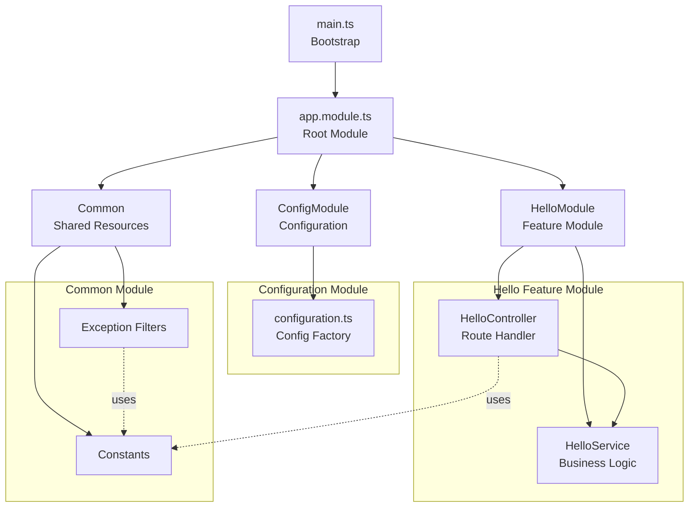

# NestJS Hello World Backend

<!-- 
  README.md - Documentation for the NestJS Hello World Backend
  
  This file provides comprehensive documentation for the NestJS-based backend
  implementation, including setup instructions, API documentation, and
  architecture overview.
  
  Last Updated: December 2024
  Framework: NestJS v11
-->

Backend implementation built with NestJS framework. This application exposes a REST endpoint `/hello` which returns "Hello world" to clients, demonstrating modern TypeScript-based server development with NestJS best practices.

## Overview

This directory contains the backend implementation of the Hello World application using the NestJS framework. It showcases enterprise-grade Node.js development with TypeScript, dependency injection, and modular architecture.

<!-- Key Features Section -->
Key features:
- **TypeScript-based NestJS implementation** - Full type safety and modern JavaScript features
- **Decorator-based routing** - Using `@Controller()` and `@Get()` decorators for clean route definitions
- **Dependency injection pattern** - Loosely coupled services with `@Injectable()` decorators
- **Modular architecture** - Feature modules encapsulating related functionality
- **Exception filters** - Centralized error handling with consistent response formatting
- **@nestjs/config integration** - Environment-based configuration management
- **Complete test coverage** - Unit and E2E tests using `@nestjs/testing` utilities
- **Comprehensive documentation** - TSDoc comments throughout the codebase

## Architecture

The backend follows NestJS's modular architecture with clear separation of concerns using the dependency injection pattern:

<!-- 
  Architecture Overview:
  
  1. Bootstrap (main.ts) - Application initialization and graceful shutdown
  2. Root Module (app.module.ts) - Imports all feature modules
  3. Hello Feature (hello/) - Feature module with controller and service
  4. Configuration (config/) - Environment-based configuration
  5. Common (common/) - Shared resources like filters and constants
-->

1. **Entry Point (`main.ts`)**: NestJS application bootstrap with graceful shutdown handling for SIGTERM and SIGINT signals
2. **Root Module (`app.module.ts`)**: Central application module that imports and configures all feature modules
3. **Hello Feature (`hello/`)**: Feature module encapsulating the HelloController and HelloService for the `/hello` endpoint
4. **Configuration (`config/`)**: `@nestjs/config` module setup with type-safe configuration factory
5. **Common (`common/`)**: Shared resources including exception filters for error handling and constants definitions



## Directory Structure

<!-- 
  Directory Structure:
  
  The NestJS project follows a standard structure with:
  - src/ containing TypeScript source files
  - test/ containing test files (unit and e2e)
  - Configuration files at the root level
-->

```
src/backend/
├── src/                           # NestJS source code (TypeScript)
│   ├── main.ts                    # Bootstrap entry point
│   ├── app.module.ts              # Root application module
│   ├── app.controller.ts          # Root controller (optional endpoints)
│   ├── app.service.ts             # Root service
│   │
│   ├── hello/                     # Hello feature module
│   │   ├── hello.module.ts        # Feature module definition
│   │   ├── hello.controller.ts    # HTTP route handlers for /hello
│   │   ├── hello.service.ts       # Business logic service
│   │   └── dto/                   # Data Transfer Objects
│   │       └── hello-response.dto.ts
│   │
│   ├── common/                    # Shared resources
│   │   ├── constants/             # Application constants
│   │   │   └── index.ts           # HTTP constants, messages, routes
│   │   └── filters/               # Exception filters
│   │       ├── http-exception.filter.ts    # HTTP exception handler
│   │       └── all-exceptions.filter.ts    # Catch-all exception handler
│   │
│   └── config/                    # Configuration module
│       ├── config.module.ts       # NestJS config module setup
│       └── configuration.ts       # Configuration factory
│
├── test/                          # Test files
│   ├── app.e2e-spec.ts            # End-to-end API tests
│   ├── jest-e2e.json              # E2E Jest configuration
│   └── unit/                      # Unit tests
│       ├── app.controller.spec.ts
│       ├── app.service.spec.ts
│       ├── hello/
│       │   ├── hello.controller.spec.ts
│       │   └── hello.service.spec.ts
│       └── common/
│           └── filters/
│               └── http-exception.filter.spec.ts
│
├── .env.example                   # Example environment variables
├── .eslintrc.js                   # ESLint configuration for TypeScript
├── .prettierrc                    # Prettier code formatting configuration
├── jest.config.js                 # Jest test configuration
├── nest-cli.json                  # NestJS CLI configuration
├── package.json                   # Dependencies and npm scripts
├── package-lock.json              # Locked dependency versions
├── tsconfig.json                  # TypeScript compiler configuration
├── tsconfig.build.json            # Production build TypeScript config
└── README.md                      # This documentation
```

## Setup and Installation

<!-- 
  Setup Instructions:
  
  The NestJS backend requires Node.js 18+ and npm 9+.
  TypeScript compilation is required before running in production.
-->

The backend can be run independently from the project root or directly from this directory.

### Prerequisites

- **Node.js 18.x or higher** (required for NestJS 11)
- **npm 9.x or higher** (included with Node.js)
- TypeScript knowledge helpful but not required

### Installation

```bash
# Navigate to the backend directory
cd src/backend

# Install dependencies
npm install

# Build the TypeScript source (required for production)
npm run build
```

Or from the project root:

```bash
# Install dependencies from project root
npm install --prefix src/backend

# Build from project root
npm run build --prefix src/backend
```

### Configuration

Create a `.env` file based on the provided `.env.example`:

```bash
# Copy the example file
cp .env.example .env

# Edit as needed
```

<!-- Configuration Options Table -->
Available configuration options:

| Variable    | Description                              | Default       |
|-------------|------------------------------------------|---------------|
| `PORT`      | The port on which the server will listen | `3000`        |
| `NODE_ENV`  | Environment mode (development/production)| `development` |
| `LOG_LEVEL` | Logging verbosity level                  | `log`         |

## Running the Server

<!-- 
  Running Modes:
  
  NestJS supports multiple running modes:
  - Development with hot reload (start:dev)
  - Production from compiled JavaScript (start:prod)
  - Debug mode for IDE integration (start:debug)
-->

### Development Mode (Hot Reload)

```bash
# Start with hot reload - automatically restarts on file changes
npm run start:dev
```

This mode uses `nest start --watch` to monitor file changes and automatically restart the server.

### Production Mode

```bash
# First, build the application
npm run build

# Then start the production server
npm run start:prod
```

Production mode runs the compiled JavaScript from the `dist/` directory for optimal performance.

### Debug Mode

```bash
# Start with debugging enabled
npm run start:debug
```

This enables Node.js inspector for debugging with VS Code or Chrome DevTools.

### Custom Port

```bash
# Using environment variable
PORT=3001 npm run start:dev

# Or with .env file
# Add PORT=3001 to .env file and run
npm run start:dev
```

### Startup Output

Once started, you should see output similar to:

```
[Nest] 12345  - 12/17/2024, 10:00:00 AM     LOG [NestFactory] Starting Nest application...
[Nest] 12345  - 12/17/2024, 10:00:00 AM     LOG [InstanceLoader] AppModule dependencies initialized
[Nest] 12345  - 12/17/2024, 10:00:00 AM     LOG [InstanceLoader] HelloModule dependencies initialized
[Nest] 12345  - 12/17/2024, 10:00:00 AM     LOG [RoutesResolver] HelloController {/hello}: +Xms
[Nest] 12345  - 12/17/2024, 10:00:00 AM     LOG [NestApplication] Nest application successfully started +Xms
Server is running on http://localhost:3000
```

The server will be available at `http://localhost:3000` (or your configured port).

## API Documentation

<!-- 
  API Contract:
  
  The API contract is preserved from the original implementation.
  GET /hello returns "Hello world" with 200 OK.
  Non-GET methods return 405 Method Not Allowed.
  Unknown routes return 404 Not Found.
-->

### GET /hello

Returns a simple "Hello world" text response.

**Request:**
- Method: `GET`
- Path: `/hello`
- Headers: None required
- Body: None

**Response:**
- Status: `200 OK`
- Content-Type: `text/plain`
- Body: `Hello world`

**Error Responses:**
- `405 Method Not Allowed`: If any HTTP method other than GET is used
- `404 Not Found`: If the path is not `/hello`

**Example:**

```bash
curl http://localhost:3000/hello
```

Expected response:
```
Hello world
```

### Error Response Format

All error responses follow a consistent JSON format:

```json
{
  "statusCode": 404,
  "message": "Cannot GET /unknown",
  "error": "Not Found"
}
```

**Common Error Codes:**

| Status Code | Description                           |
|-------------|---------------------------------------|
| `404`       | Route not found                       |
| `405`       | HTTP method not allowed for this route|
| `500`       | Internal server error                 |

## Development

### Available Scripts

<!-- 
  NPM Scripts:
  
  NestJS provides a comprehensive set of scripts for development,
  building, testing, and code quality.
-->

```bash
# Build the application (compile TypeScript to JavaScript)
npm run build

# Start the application (basic start)
npm run start

# Start with hot reload (development)
npm run start:dev

# Start in production mode (from dist/)
npm run start:prod

# Start with debugging enabled
npm run start:debug

# Run ESLint to check code quality
npm run lint

# Format code with Prettier
npm run format

# Run unit tests
npm test

# Run tests in watch mode
npm run test:watch

# Run tests with coverage report
npm run test:cov

# Run end-to-end tests
npm run test:e2e
```

### Code Style

This project uses ESLint and Prettier for code formatting and style enforcement, configured specifically for TypeScript and NestJS:

- `.eslintrc.js` - ESLint configuration with TypeScript and NestJS rules
- `.prettierrc` - Prettier configuration for consistent formatting

To ensure your code meets the style guidelines:

```bash
# Check for linting issues
npm run lint

# Format all TypeScript files
npm run format
```

## Testing

<!-- 
  Testing Strategy:
  
  The backend uses NestJS testing utilities (@nestjs/testing) for
  creating test modules and mocking dependencies.
  
  - Unit tests: Test individual components in isolation
  - E2E tests: Test the full application via HTTP requests
-->

The backend uses Jest for testing with NestJS's `@nestjs/testing` utilities for creating test modules and mocking dependencies.

### Running Tests

```bash
# Run all unit tests
npm test

# Run tests with coverage report
npm run test:cov

# Run tests in watch mode (re-run on file changes)
npm run test:watch

# Run end-to-end tests
npm run test:e2e
```

### Test Structure

Tests are organized in the `test/` directory with a clear separation between unit and e2e tests:

```
test/
├── app.e2e-spec.ts              # End-to-end API tests
├── jest-e2e.json                # E2E Jest configuration
└── unit/                        # Unit tests
    ├── app.controller.spec.ts   # Root controller tests
    ├── app.service.spec.ts      # Root service tests
    ├── hello/                   # Hello module tests
    │   ├── hello.controller.spec.ts
    │   └── hello.service.spec.ts
    └── common/                  # Common module tests
        └── filters/
            └── http-exception.filter.spec.ts
```

### NestJS Testing Patterns

<!-- 
  NestJS Testing Utilities:
  
  - Test.createTestingModule() - Creates isolated test modules
  - TestingModule.compile() - Compiles the module
  - testing.get() - Retrieves providers for testing
-->

Unit tests use NestJS's `Test.createTestingModule()` to create isolated test instances:

```typescript
// Example test pattern
import { Test, TestingModule } from '@nestjs/testing';
import { HelloController } from './hello.controller';
import { HelloService } from './hello.service';

describe('HelloController', () => {
  let controller: HelloController;

  beforeEach(async () => {
    const module: TestingModule = await Test.createTestingModule({
      controllers: [HelloController],
      providers: [HelloService],
    }).compile();

    controller = module.get<HelloController>(HelloController);
  });

  it('should return "Hello world"', () => {
    expect(controller.getHello()).toBe('Hello world');
  });
});
```

### Coverage Requirements

The project maintains high test coverage:

| Metric     | Target |
|------------|--------|
| Statements | 90%    |
| Branches   | 85%    |
| Functions  | 95%    |
| Lines      | 90%    |

View the coverage report:

```bash
npm run test:cov
# Report available in coverage/lcov-report/index.html
```

## Error Handling

<!-- 
  Exception Handling Strategy:
  
  NestJS uses exception filters to centralize error handling.
  Built-in exceptions (NotFoundException, MethodNotAllowedException) are used
  for common HTTP errors.
-->

The application implements comprehensive error handling using NestJS exception filters:

1. **HTTP Exceptions**: Handled by `HttpExceptionFilter` for consistent error responses
2. **Unhandled Exceptions**: Caught by `AllExceptionsFilter` to prevent server crashes
3. **Method Not Allowed**: Returns `405` with `Allow` header for unsupported methods
4. **Route Not Found**: Returns `404` for undefined routes

### Exception Filters

Exception filters are registered globally in `main.ts`:

```typescript
// Global exception filter registration
app.useGlobalFilters(
  new AllExceptionsFilter(),
  new HttpExceptionFilter(),
);
```

All errors are logged with appropriate context information using NestJS's built-in Logger.

## Logging

<!-- 
  Logging with NestJS:
  
  NestJS provides a built-in Logger class that supports:
  - Multiple log levels (log, error, warn, debug, verbose)
  - Context-based logging
  - Timestamp formatting
-->

The application uses NestJS's built-in `Logger` class for consistent, structured logging:

- **Request Logging**: Automatic request/response logging
- **Error Logging**: Exception details with stack traces
- **Server Events**: Startup, shutdown, and configuration logs
- **Context Logging**: Each module has its own logger context

Logger usage example:

```typescript
import { Logger } from '@nestjs/common';

@Injectable()
export class HelloService {
  private readonly logger = new Logger(HelloService.name);
  
  getHello(): string {
    this.logger.log('getHello() called');
    return 'Hello world';
  }
}
```

## Implementation Details

<!-- 
  NestJS Component Details:
  
  This section explains the key NestJS components and their responsibilities.
-->

### Core Components

#### Bootstrap (`main.ts`)
- Creates the NestJS application using `NestFactory.create()`
- Registers global exception filters
- Implements graceful shutdown handlers for SIGTERM and SIGINT
- Starts the HTTP server on the configured port

```typescript
// Bootstrap example
const app = await NestFactory.create(AppModule);
await app.listen(configService.get('port'));
```

#### App Module (`app.module.ts`)
- Root module that imports all feature modules
- Configures `ConfigModule.forRoot()` for environment configuration
- Imports `HelloModule` for the `/hello` endpoint

#### Hello Controller (`hello.controller.ts`)
- Decorated with `@Controller('hello')` to define the route prefix
- Uses `@Get()` decorator to handle GET requests
- Delegates business logic to `HelloService`

```typescript
@Controller('hello')
export class HelloController {
  constructor(private readonly helloService: HelloService) {}

  @Get()
  getHello(): string {
    return this.helloService.getHello();
  }
}
```

#### Hello Service (`hello.service.ts`)
- Decorated with `@Injectable()` for dependency injection
- Contains the business logic for generating responses
- Returns "Hello world" message

#### Exception Filters (`common/filters/`)
- `HttpExceptionFilter`: Handles HTTP exceptions with consistent formatting
- `AllExceptionsFilter`: Catches unhandled errors and returns 500 responses

#### Configuration (`config/`)
- Uses `@nestjs/config` module for type-safe configuration
- Configuration factory validates and provides environment values
- Supports default values when environment variables are not set

## Performance Considerations

<!-- 
  NestJS Performance:
  
  NestJS adds minimal overhead while providing enterprise features.
  The Express adapter is highly optimized for production use.
-->

The NestJS application maintains efficient performance:

- **Express Platform**: Uses the battle-tested Express HTTP adapter
- **Lazy Module Loading**: Modules are loaded efficiently at startup
- **Dependency Injection**: Singleton services by default reduce memory usage
- **Production Builds**: TypeScript compiled to optimized JavaScript

## Security Considerations

<!-- 
  Security Best Practices:
  
  NestJS provides built-in security features and integrates with
  popular security libraries.
-->

Security best practices implemented:

- **Input Validation**: HTTP method validation in controllers
- **Error Handling**: Prevents information disclosure in error messages
- **Type Safety**: TypeScript eliminates many runtime errors
- **Dependency Management**: Regular updates of npm packages

## Troubleshooting

### Common Issues

**Port already in use (EADDRINUSE)**

```bash
# Change the port
PORT=3001 npm run start:dev
```

**TypeScript compilation errors**

```bash
# Clean and rebuild
rm -rf dist/
npm run build
```

**Module not found errors**

```bash
# Reinstall dependencies
rm -rf node_modules/
npm install
```

**Permission denied errors**

```bash
# Check file permissions
chmod +x infrastructure/scripts/*.sh
```

### Debugging

For detailed debugging output:

```bash
# Start with debug mode
npm run start:debug
```

Connect VS Code or Chrome DevTools to the Node.js inspector for interactive debugging.

For verbose NestJS logging:

```bash
# Enable verbose logging
LOG_LEVEL=verbose npm run start:dev
```

## References

<!-- 
  External Resources:
  
  Official documentation and helpful resources for NestJS development.
-->

- [NestJS Documentation](https://docs.nestjs.com/) - Official NestJS documentation
- [TypeScript Documentation](https://www.typescriptlang.org/docs/) - TypeScript language reference
- [Jest Testing Framework](https://jestjs.io/docs/getting-started) - Jest testing documentation
- [Supertest Documentation](https://github.com/ladjs/supertest#readme) - HTTP testing library
- [Architecture Documentation](../architecture.md) - Project architecture decisions and design patterns

---

<!-- 
  Footer:
  
  This documentation is part of the NestJS Hello World project.
  See architecture.md for detailed design decisions.
-->

*For detailed architecture decisions and design patterns, see [architecture.md](../architecture.md) in the project root.*
