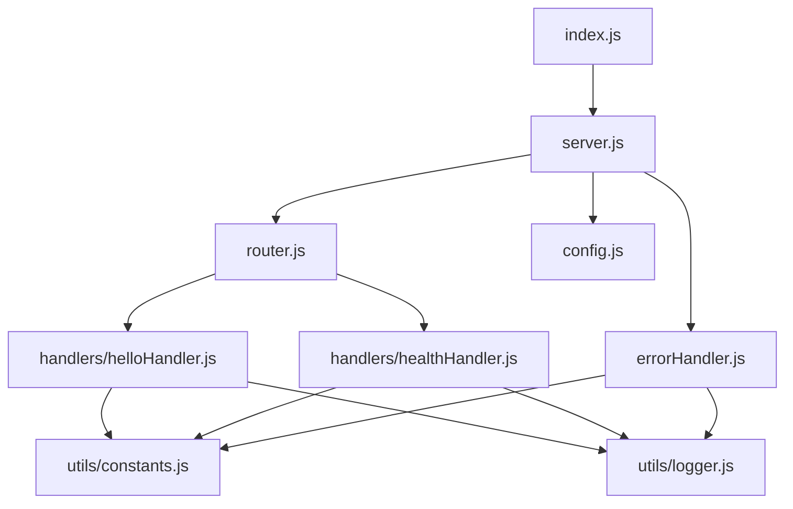

# Node.js Hello World Backend

Backend implementation of a simple Node.js HTTP server that exposes REST endpoints `/hello` which returns "Hello world" to clients and `/health` for server health checks.

## Overview

This directory contains the backend implementation of the Node.js Hello World application. It's designed as a minimal, dependency-free HTTP server that demonstrates fundamental Node.js concepts.

Key features:
- Pure Node.js implementation using only core modules
- `/hello` endpoint with proper HTTP method validation
- `/health` endpoint for server health checks
- Structured, modular codebase with separation of concerns
- Comprehensive error handling and logging
- Environment-based configuration
- Complete test coverage

## Architecture

The backend follows a modular architecture with clear separation of concerns:

1. **Entry Point (`index.js`)**: Application initialization and process management
2. **HTTP Server (`server.js`)**: Core server implementation and request handling
3. **Request Router (`router.js`)**: URL-based request routing
4. **Endpoint Handlers (`handlers/`)**: Individual endpoint implementations
5. **Configuration (`config.js`)**: Environment-based configuration management
6. **Error Handling (`errorHandler.js`)**: Centralized error processing
7. **Utilities (`utils/`)**: Shared constants and logging functionality



## Directory Structure

```
├── __tests__/           # Test files
│   ├── integration/     # Integration tests
│   │   └── api.test.js  # API endpoint tests
│   ├── utils/           # Utility tests
│   │   ├── constants.test.js
│   │   └── logger.test.js
│   ├── config.test.js   # Configuration tests
│   ├── errorHandler.test.js
│   ├── handlers/        # Handler tests
│   │   ├── helloHandler.test.js
│   │   └── healthHandler.test.js
│   ├── index.test.js    # Entry point tests
│   ├── router.test.js   # Router tests
│   ├── server.test.js   # Server tests
│   └── setup.js         # Test setup file
├── handlers/            # Request handlers
│   ├── helloHandler.js  # /hello endpoint handler
│   └── healthHandler.js # /health endpoint handler
├── utils/               # Utility modules
│   ├── constants.js     # Application constants
│   └── logger.js        # Logging functionality
├── .env.example         # Example environment variables
├── .eslintrc.js         # ESLint configuration
├── .prettierrc          # Prettier configuration
├── config.js            # Configuration management
├── errorHandler.js      # Error handling utilities
├── index.js             # Application entry point
├── jest.config.js       # Jest test configuration
├── nodemon.json         # Nodemon configuration
├── package.json         # Dependencies and scripts
├── README.md            # This documentation
├── router.js            # Request routing
└── server.js            # HTTP server implementation
```

## Setup and Installation

The backend can be run independently from the project root or directly from this directory.

### Prerequisites

- Node.js 18.x LTS or higher
- npm 8.x or higher (included with Node.js)

### Installation

```bash
# From the backend directory
npm install

# Or from the project root
npm install --prefix src/backend
```

### Configuration

Create a `.env` file based on the provided `.env.example`:

```bash
# Copy the example file
cp .env.example .env

# Edit as needed
```

Available configuration options:

| Variable | Description | Default |
|----------|-------------|---------|
| PORT | The port on which the server will listen | 3000 |

## Running the Server

### Development Mode

```bash
# Start with auto-restart on file changes
npm run dev
```

### Production Mode

```bash
# Start the server
npm start
```

### Custom Port

```bash
# Using environment variable
PORT=3001 npm start

# Or with .env file
# Add PORT=3001 to .env file and run
npm start
```

Once started, the server will be available at `http://localhost:3000` (or your configured port).

## API Documentation

### GET /hello

Returns a simple "Hello world" text response.

**Request:**
- Method: GET
- Path: `/hello`
- Headers: None required
- Body: None

**Response:**
- Status: 200 OK
- Content-Type: text/plain
- Body: "Hello world"

**Error Responses:**
- 405 Method Not Allowed: If any HTTP method other than GET is used
- 404 Not Found: If the path is not `/hello`

**Example:**

```bash
curl http://localhost:3000/hello
```

Expected response:
```
Hello world
```

### GET /health

Returns an empty response to indicate server health status.

**Request:**
- Method: GET
- Path: `/health`
- Headers: None required
- Body: None

**Response:**
- Status: 200 OK
- Content-Type: text/plain
- Body: (empty)

**Error Responses:**
- 405 Method Not Allowed: If any HTTP method other than GET is used

**Example:**

```bash
curl http://localhost:3000/health
```

Expected response: (empty)

## Development

### Available Scripts

```bash
# Start the server
npm start

# Start with auto-restart on file changes
npm run dev

# Run tests
npm test

# Run tests with coverage report
npm run test:coverage

# Run tests in watch mode
npm run test:watch

# Lint code
npm run lint

# Fix linting issues
npm run lint:fix
```

### Code Style

This project uses ESLint and Prettier for code formatting and style enforcement. Configuration files are included in the repository.

- `.eslintrc.js` - ESLint configuration
- `.prettierrc` - Prettier configuration

To ensure your code meets the style guidelines, run:

```bash
npm run lint
```

To automatically fix many style issues:

```bash
npm run lint:fix
```

## Testing

The backend uses Jest for unit and integration testing with Supertest for API testing.

### Running Tests

```bash
# Run all tests
npm test

# Run tests with coverage report
npm run test:coverage

# Run tests in watch mode
npm run test:watch
```

### Test Structure

Tests are organized in the `__tests__` directory, mirroring the structure of the source files:

- Unit tests for each module
- Integration tests for API endpoints
- Test utilities and mocks in `__tests__/setup.js`

### Coverage Requirements

The project aims for high test coverage:

- Statements: 90%
- Branches: 85%
- Functions: 95%
- Lines: 90%

View the coverage report after running:

```bash
npm run test:coverage
```

## Error Handling

The application implements comprehensive error handling:

1. **Server Startup Errors**: Logged with stack trace, process exits with non-zero code
2. **Request Processing Errors**: Caught and converted to appropriate HTTP status codes
3. **Route Not Found**: Returns 404 Not Found for undefined routes
4. **Method Not Allowed**: Returns 405 Method Not Allowed for unsupported HTTP methods
5. **Unhandled Exceptions**: Global handler prevents server crashes

All errors are logged with appropriate context information.

## Logging

The application uses a simple console-based logging system implemented in `utils/logger.js`:

- **Request Logging**: Logs incoming request method, path, and timestamp
- **Response Logging**: Logs response status code and processing time
- **Error Logging**: Logs errors with stack traces and context
- **Server Events**: Logs server startup, shutdown, and configuration

Log format includes timestamp, log level, and contextual information.

## Implementation Details

### Core Components

#### HTTP Server (`server.js`)
- Creates and manages the HTTP server using Node.js core `http` module
- Handles incoming connections and request processing
- Implements graceful shutdown on SIGINT and SIGTERM signals

#### Request Router (`router.js`)
- Parses incoming request URLs using Node.js core `url` module
- Routes requests to appropriate handlers based on path
- Returns 404 Not Found for undefined routes

#### Hello Handler (`handlers/helloHandler.js`)
- Processes requests to the `/hello` endpoint
- Validates HTTP method (accepts GET, rejects others)
- Returns "Hello world" with appropriate headers

#### Health Handler (`handlers/healthHandler.js`)
- Processes requests to the `/health` endpoint
- Validates HTTP method (accepts GET, rejects others)
- Returns empty response with 200 OK status for health checks

#### Configuration (`config.js`)
- Reads environment variables using `dotenv`
- Provides default values when configuration is not specified
- Validates configuration values

#### Error Handler (`errorHandler.js`)
- Centralizes error handling logic
- Generates appropriate HTTP error responses
- Logs error details for troubleshooting

## Performance Considerations

The application is designed for minimal resource usage:

- **Memory Footprint**: Low memory usage with no unnecessary buffers or caches
- **Startup Time**: Fast initialization with minimal dependencies
- **Request Processing**: Efficient routing and response generation
- **Concurrency**: Node.js event loop handles concurrent connections efficiently

For educational purposes, no specific performance optimizations are implemented beyond Node.js defaults.

## Security Considerations

Basic security practices implemented:

- **Input Validation**: Validates HTTP methods
- **Error Handling**: Prevents information disclosure in error messages
- **HTTP Headers**: Sets appropriate security headers
- **Dependency Management**: Uses only core Node.js modules to eliminate supply chain risks

Security headers set on responses:
- `X-Content-Type-Options: nosniff`
- `X-Frame-Options: DENY`
- `Content-Security-Policy: default-src 'none'`
- `Cache-Control: no-store`

## Troubleshooting

### Common Issues

**Port already in use (EADDRINUSE)**

```bash
# Change the port
PORT=3001 npm start
```

**Module not found errors**

```bash
# Ensure dependencies are installed
npm install
```

**Permission denied errors**

```bash
# Check file permissions
chmod +x infrastructure/scripts/*.sh
```

### Debugging

For detailed debugging output:

```bash
# Enable Node.js debug output
NODE_DEBUG=http,net npm start
```

For interactive debugging:

```bash
# Start with inspector
node --inspect src/backend/index.js
```

## References

- [Node.js Documentation](https://nodejs.org/docs/latest-v18.x/api/)
- [Node.js HTTP Module](https://nodejs.org/docs/latest-v18.x/api/http.html)
- [Jest Testing Framework](https://jestjs.io/docs/getting-started)
- [Supertest Documentation](https://github.com/visionmedia/supertest#readme)